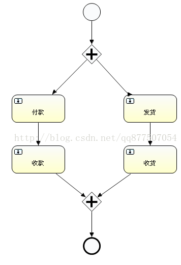
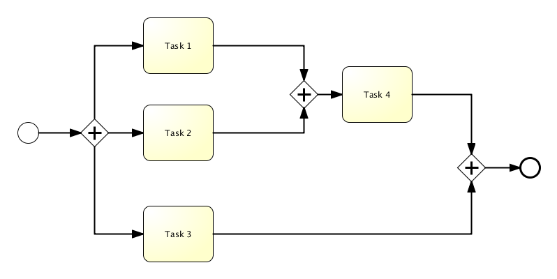
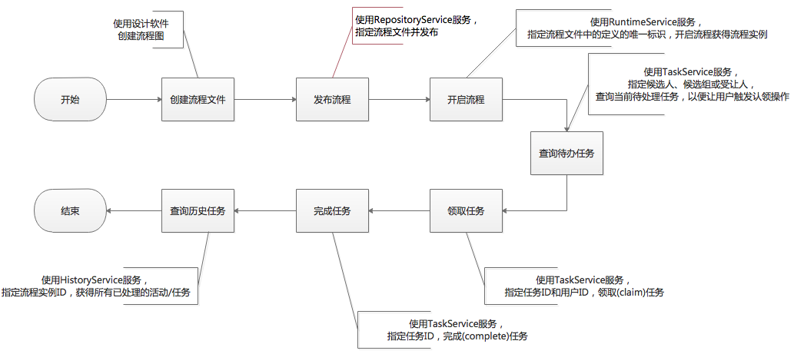
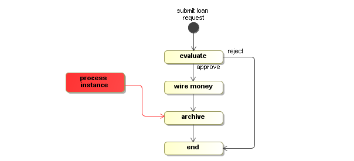
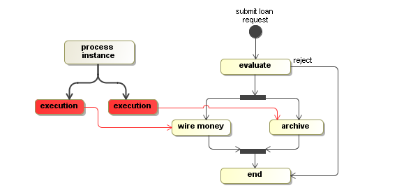
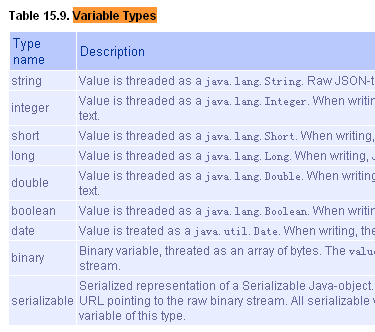
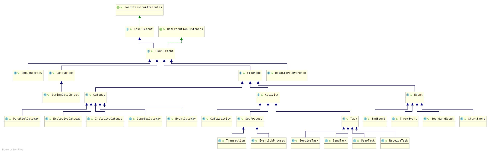
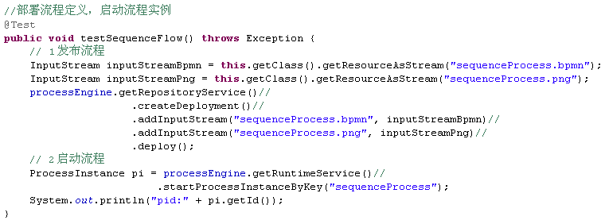
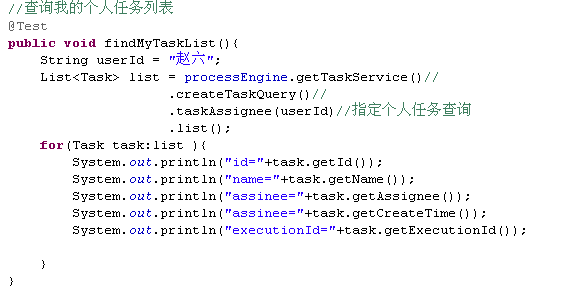
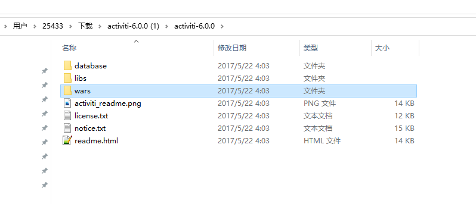

# activiti-6.0.0


## 基本概念


- 工作流(Workflow)，就是“业务过程的部分或整体在计算机应用环境下的自动化”，它主要解决的是“使在多个参与者之间按照某种预定义的规则传递文档、信息或任务的过程自动进行，从而实现某个预期的业务目标，或者促使此目标的实现”。

- BPMN2.0


- 并行网关(parallelGateWay)

  

  并行网关的功能是基于进入和外出的顺序流的：

  分支(fork)：并行后的所有外出顺序流，为每个顺序流都创建一个并发分支。

  汇聚(join)：所有到达并行网关，在此等待的进入分支，直到所有进入顺序流的分支都到达以后，流程就会通过汇聚网关。

  并行网关不会解析条件。即使顺序流中定义了条件，也会被忽略。

  并行网关不需要是“平衡的”（比如， 对应并行网关的进入和外出节点数目不一定相等）。如图中标示是合法的：

  


## activiti

### activiti核心API

| 名称              | 说明                                                         |
| ----------------- | ------------------------------------------------------------ |
| ProcessEngine     | 流程引擎，可以获得其他所有的Service。                        |
| RepositoryService | Repository中存储了流程定义文件、部署和支持数据等信息；RepositoryService提供了对repository的存取服务。 |
| RuntimeService    | 提供启动流程、查询流程实例、设置获取流程实例变量等功能。     |
| TaskService       | 提供运行时任务查询、领取、完成、删除以及变量设置等功能。     |
| HistoryService    | 用于获取正在运行或已经完成的流程实例的信息。                 |
| FormService       | 提供定制任务表单和存储表单数据的功能，注意存储表单数据可选的功能，也可以向自建数据表中提交数据。 |
| IdentityService   | 提供对内建账户体系的管理功能，注意它是可选的服务，可以是用外部账户体系。 |
| ManagementService | 较少使用，与流程管理无关，主要用于Activiti系统的日常维护。   |

完成一次流程的处理，常见步骤以及他们使用的Service如下图所示：


#### ProcessInstance 和 Execution 的区别

流程实例就表示一个流程从开始到结束的最大的流程分支，即一个流程中流程实例只有一个。

Activiti用 Execution 去描述流程执行的每一个节点。在没有并发的情况下，Execution就是同ProcessInstance。流程按照流程定义的规则执行一次的过程，就可以表示执行对象Execution。

从源代码中可以看出ProcessInstance就是Execution。但在现实意义上有所区别：



在单线流程中，如上图的贷款流程，ProcessInstance与Execution是一致的。



这个例子有一个特点：wire money(汇钱)和archive(存档)是并发执行的。这个时候，总线路代表ProcessInstance，而分线路中每个活动代表Execution。

 （1）如果是单例流程，执行对象ID就是流程实例ID

 （2）如果一个流程有分支和聚合，那么执行对象ID和流程实例ID就不相同

 （3）一个流程中，流程实例只有1个，执行对象可以存在多个。

#### 流程变量



在流程执行或者任务执行的过程中，用于设置和获取变量，使用流程变量在流程传递的过程中传递业务参数。

对应 act_ru_variable 和 act_hi_varinst 表。

Currently conditionalExpressions can **only be used with UEL**, detailed info about these can be found in section [Expressions](https://www.activiti.org/userguide/6.latest/index.html#apiExpressions). The expression used should resolve to a boolean value, otherwise an exception is thrown while evaluating the condition.

### 数据库相关

```
Activiti 工作流总共包含 23 张数据表（现在是25张，新增了 ACT_EVT_LOG 和 ACT_PROCDEF_INFO ）

Activiti的后台是有数据库的支持，所有的表都以ACT_开头。 第二部分是表示表的用途的两个字母标识。 用途也和服务的API对应。
ACT_RE_*: 'RE'表示repository。 这个前缀的表包含了流程定义和流程静态资源 （图片，规则，等等）。对应RepositoryService接口
ACT_RU_*: 'RU'表示runtime。 这些运行时的表，包含流程实例，任务，变量，异步任务，等运行中的数据。 Activiti只在流程实例执行过程中保存这些数据， 在流程结束时就会删除这些记录。 这样运行时表可以一直很小速度很快。对应RuntimeService接口和TaskService接口
ACT_ID_*: 'ID'表示identity。 这些表包含身份信息，比如用户，组等等。对应IdentityService接口
ACT_HI_*: 'HI'表示history。 这些表包含历史数据，比如历史流程实例， 变量，任务等等。对应HistoryService接口
ACT_GE_*: 'GE'表示general。通用数据， 用于不同场景下，如存放资源文件。

```

| 表分类       | 表名                | 解释                          |
| ------------ | ------------------- | ----------------------------- |
| 一般数据      | ACT_GE_BYTEARRAY    | 通用的流程定义和流程资源      |
|              | ACT_GE_PROPERTY     | 系统相关属性                  |
|流程定义表      | ACT_RE_MODEL        | 模型信息                      |
|              | ACT_RE_PROCDEF      | 已部署的流程定义              |
|              | ACT_RE_DEPLOYMENT   | 部署单元信息（和ACT_RE_PROCDEF配合使用） |
|运行实例表      | ACT_RU_EXECUTION    | 运行时流程执行实例            |
|              | ACT_RU_IDENTITYLINK | 运行时用户关系信息            |
|              | ACT_RU_TASK         | 运行时任务                    |
|              | ACT_RU_VARIABLE     | 运行时变量表                  |
|              | ACT_RU_JOB          | 运行时作业                    |
|    			| ACT_RU_EVENT_SUBSCR | 运行时事件                    |
| 流程历史记录   | ACT_HI_ACTINST      | 历史的流程实例                |
|              | ACT_HI_ATTACHMENT   | 历史的流程附件                |
|              | ACT_HI_COMMENT      | 历史的说明性信息              |
|              | ACT_HI_IDENTITYLINK | 历史的流程运行过程中用户关系  |
|              | ACT_HI_DETAIL       | 历史的流程运行中的细节信息    |
|              | ACT_HI_PROCINST     | 历史的流程实例                |
|              | ACT_HI_TASKINST     | 历史的任务实例                |
|              | ACT_HI_VARINST      | 历史的流程运行中的变量信息    |
| 用户用户组表 | ACT_ID_GROUP        | 身份信息-组信息               |
|              | ACT_ID_USER         | 身份信息-用户信息             |
|              | ACT_ID_MEMBERSHIP   | 身份信息-用户和组关系的中间表 |
|              | ACT_ID_INFO         | 身份信息-XXX               |


```sql
select * from act_ge_bytearray; -- -通用的流程定义和流程资源(一般数据)
select * from act_ge_property; -- -系统相关属性(一般数据)

select * from act_hi_actinst; -- -历史的流程实例(流程历史记录)
select * from act_hi_attachment; -- -历史的流程附件(流程历史记录)
select * from act_hi_comment; -- -历史的说明性信息(流程历史记录)
select * from act_hi_detail; -- -历史的流程运行中的细节信息(流程历史记录)
select * from act_hi_identitylink; -- -历史的流程运行过程中用户关系,包括提交人，候选人，参与者(流程历史记录)
select * from act_hi_procinst; -- -历史的流程实例(流程历史记录)
select * from act_hi_taskinst; -- -历史的任务实例(流程历史记录)
select * from act_hi_varinst; -- -历史的流程运行中的变量信息(流程历史记录)

select * from act_id_group; -- -身份信息-组信息(用户用户组表)
select * from act_id_info; -- -身份信息-组信息(用户用户组表)
select * from act_id_membership; -- -身份信息-用户和组关系的中间表(用户用户组表)
select * from act_id_user; -- -身份信息-用户信息(用户用户组表)

select * from act_re_deployment; -- -部署单元信息(流程定义表)
select * from act_re_model; -- -模型信息(流程定义表)
select * from ACT_DE_MODEL; -- -模型信息(流程定义表-sunway)
select * from act_re_procdef; -- -已部署的流程定义(流程定义表)
select * from act_ru_event_subscr; -- -运行时事件(运行实例表)
select * from act_ru_execution; -- -运行时流程执行实例(运行实例表)
select * from act_ru_identitylink; -- -运行时用户关系信息,包括提交人，候选人，参与者(运行实例表)
select * from act_ru_job; -- -运行时作业(运行实例表)
select * from act_ru_task; -- -运行时任务(运行实例表)
select * from act_ru_variable; -- -运行时变量表(运行实例表)
```

[表结构说明]:表结构说明

#### 表结构之ACT_XX_IDENTITYLINK

act_ru_identitylink和act_hi_identitylink

对应api：

```java
taskService.addCandidateUser(taskId,userId)
taskService.addCandidateGroup(taskId,groupId)
```

1. ID_： _
2.  REV_：版本号 
3. GROUP_ID_： 对应 act_id_group 中的ID_
4.  TYPE_：类型 
5. USER_ID_：对应 act_id_user 中的ID_
6. TASK_ID_：对应 act_ru_task 中的ID_
7. PROC_INST_ID_： 流程实例ID _
8.  PROC_DEF_ID_：部署流程版本号

**注意：**

- `ACT_HI_IDENTITYLINK`，所有的历史以及当前指派数据都存在这个表中。
- `ACT_RU_IDENTITYLINK`，流程结束以后，此流程对应的指派数据将清空。
- `ACT_RU_IDENTITYLINK`，多了两个字段 `REV_`：版本号，`PROC_DEF_ID_`：部署流程版本号，因为在运行过程中，任务需要知道发起是使用的是那一个流程版本。
- `ACT_RU_IDENTITYLINK`，运行中的任务，`TASK_ID_`字段不为空，`PROC_INST_ID_` 为空。
- `ACT_RU_IDENTITYLINK`，结束的任务，`TASK_ID_` 字段为空，`PROC_INST_ID_` 不为空。

最后，再来看看比较重要的`TYPE_`字段：

- `starter`，`USER_ID`与`PROC_INST_ID_`，记录流程的发起者
- `candidate`，`USER_ID_` 或 `GROUP_ID_` 其中一个必须有值、`TASK_ID_`有值，记录当前任务的指派人或指派组。指派人：类型为 participant，USER_ID_ 有值；指派组：类型为candidate，GROUP_ID_有值；
- `participant`， `USER_ID`与`PROC_INST_ID_`有值，记录流程任务的参与者。

### 流程节点抽象




## 画流程图

### 命名规范


## 技巧

### 获取当前活动任务节点

```java
//根据流程实例 ID 获取当前活动任务
Task  task = taskService.createTaskQuery().processInstanceId("流程实例ID").active().singleResult();
String taskId = task.getId();
System.out.println("任务ID"+taskId);
```

### 整合项目用户角色和工作流用户角色

```java
//项目中每创建一个新用户，对应的要创建一个Activiti用户
//两者的userId和userName一致
User admin=identityService.newUser("1");
admin.setLastName("admin");
identityService.saveUser(admin);

//项目中每创建一个角色，对应的要创建一个Activiti用户组
Group adminGroup=identityService.newGroup("1");
adminGroup.setName("admin");
identityService.saveGroup(adminGroup);

//用户与用户组关系绑定
identityService.createMembership("1","1");
```

### 部署流程定义+启动流程实例



### 查看指派人的任务节点



### 指派人分配方式
1. 在taskProcess.bpmn中直接写 assignee=“张三丰"
2. 在taskProcess.bpmn中写 assignee=“#{userID}”，变量的值要是String的。使用流程变量指定办理人
3. 使用TaskListener接口，要使类实现该接口，在类中定
`delegateTask.setAssignee(assignee);// 指定个人任务的办理人`    
4.  使用任务ID和办理人重新指定办理人：

`processEngine.getTaskService().setAssignee(taskId, userId);`


### 指派组分配方式

组任务及三种分配方式：

1. 在taskProcess.bpmn中直接写 candidate-users=“小A,小B,小C,小D"

2. 在taskProcess.bpmn中写 candidate-users =“#{userIDs}”，变量的值要是String的。

   使用流程变量指定办理人

Map<String, Object> variables = new HashMap<String, Object>();

variables.put("userIDs", "大大,小小,中中");

3. 使用TaskListener接口，使用类实现该接口，在类中定义：

```java
//添加组任务的用户
delegateTask.addCandidateUser(userId1);
delegateTask.addCandidateUser(userId2);
//组任务分配给个人任务（认领任务）
processEngine.getTaskService().claim(taskId, userId);
//个人任务分配给组任务
processEngine.getTaskService(). setAssignee(taskId, null);
//向组任务添加人员
processEngine.getTaskService().addCandidateUser(taskId, userId);
//向组任务删除人员
processEngine.getTaskService().deleteCandidateUser(taskId, userId);

// TaskServiceImpl 源码参考

  public void setAssignee(String taskId, String userId) {
    commandExecutor.execute(new AddIdentityLinkCmd(taskId, userId, AddIdentityLinkCmd.IDENTITY_USER, IdentityLinkType.ASSIGNEE));
  }

  public void setOwner(String taskId, String userId) {
    commandExecutor.execute(new AddIdentityLinkCmd(taskId, userId, AddIdentityLinkCmd.IDENTITY_USER, IdentityLinkType.OWNER));
  }

  public void addCandidateUser(String taskId, String userId) {
    commandExecutor.execute(new AddIdentityLinkCmd(taskId, userId, AddIdentityLinkCmd.IDENTITY_USER, IdentityLinkType.CANDIDATE));
  }

  public void addCandidateGroup(String taskId, String groupId) {
    commandExecutor.execute(new AddIdentityLinkCmd(taskId, groupId, AddIdentityLinkCmd.IDENTITY_GROUP, IdentityLinkType.CANDIDATE));
  }

  public void addUserIdentityLink(String taskId, String userId, String identityLinkType) {
    commandExecutor.execute(new AddIdentityLinkCmd(taskId, userId, AddIdentityLinkCmd.IDENTITY_USER, identityLinkType));
  }

  public void addGroupIdentityLink(String taskId, String groupId, String identityLinkType) {
    commandExecutor.execute(new AddIdentityLinkCmd(taskId, groupId, AddIdentityLinkCmd.IDENTITY_GROUP, identityLinkType));
  }

  public void deleteCandidateGroup(String taskId, String groupId) {
    commandExecutor.execute(new DeleteIdentityLinkCmd(taskId, null, groupId, IdentityLinkType.CANDIDATE));
  }

  public void deleteCandidateUser(String taskId, String userId) {
    commandExecutor.execute(new DeleteIdentityLinkCmd(taskId, userId, null, IdentityLinkType.CANDIDATE));
  }

  public void deleteGroupIdentityLink(String taskId, String groupId, String identityLinkType) {
    commandExecutor.execute(new DeleteIdentityLinkCmd(taskId, null, groupId, identityLinkType));
  }

  public void deleteUserIdentityLink(String taskId, String userId, String identityLinkType) {
    commandExecutor.execute(new DeleteIdentityLinkCmd(taskId, userId, null, identityLinkType));
  }

  public List<IdentityLink> getIdentityLinksForTask(String taskId) {
    return commandExecutor.execute(new GetIdentityLinksForTaskCmd(taskId));
  }

// DelegateTask 源码参考
  /** Adds the given user as a candidate user to this task. */
  void addCandidateUser(String userId);
```

`


### 查询指派人任务和指派组任务

```java
// 查询指派人任务节点
List<Task> list = processEngine.getTaskService()
                .createTaskQuery()
                .taskAssignee(userId)
                .list();
// 查看指派组任务节点
List<Task> list = processEngine.getTaskService()
                .createTaskQuery()//
                .taskCandidateUser(userId)
                .list();
// 查看节点指派组人员列表
List<IdentityLink> list = processEngine.getTaskService()
                .getIdentityLinksForTask(taskId);
```

### 认领任务与指派人回退到指派组

```java
// 将指派组的任务指派给个人处理
processEngine.getTaskService().claim(taskId, userId);

// 将指派组的任务指派给个人后，又取消指派，由原来的指派组处理
processEngine.getTaskService().setAssignee(taskId, null);

```

### 向指派组中添加额外审核人

```java
processEngine.getTaskService().addCandidateUser(taskId, userId);
processEngine.getTaskService().deleteCandidateUser(taskId, userId);
```

### 改派

流程流转时，某个环节的任务处理人变更（即**改派**）是一种非常常见的需求，本来任务处理人可能是A，但是A因为有事处理不了，管理员需要将该单子改派给B临时处理下。

其实改派的实现很简单，就是为当前任务重新设置处理人，调用如下方法即可：

```java
// 方式一
taskService.setAssignee("taskId", "userId");
// 方式二，该方式与上面的主要区别是，claim方法会去检查当前是否已经有处理人，如果有则会抛错，需要先调用 unclaim 方法。
taskService.unclaim("taskId");
taskService.claim("taskId", "userId");
```

### 自由跳转

#### 思路

##### 思路一

在运行过程中，动态修改Activiti的流程定义，修改领导审批环节的出线，使之流转到审批信息填写，在流转完成后再恢领导审批原先的出线（即结束环节），该方式虽然也能实现自由跳转，但是存在并发的问题，假设A点击回退，此时流程定义已经被修改，领导审批的出线已经变为审批信息填写，同时B点击提交，却发现流程流转到了审批信息填写...B说简直见了鬼。因此不可取。

##### 思路二

使用执行计划直接指定当前流程实例执行所选环节，由于在并发情况下当前任务的执行id是唯一的，因此该方式也没有带来不安全性，下面基于此实现贴代码：

```java
/**
 * 继承NeedsActiveTaskCmd主要是为了在跳转时要求当前任务不能是挂起状态，也可以直接实现Command接口
 * Created by xujia on 2020/2/10
 */
public class DeleteTaskCmd extends NeedsActiveTaskCmd<String> {
 
    public DeleteTaskCmd(String taskId){
        super(taskId);
    }
 
    public String execute(CommandContext commandContext, TaskEntity currentTask){
        TaskEntityManagerImpl taskEntityManager = (TaskEntityManagerImpl)commandContext.getTaskEntityManager();
        // 获取当前任务的执行对象实例
        ExecutionEntity executionEntity = currentTask.getExecution();
        // 删除当前任务,来源任务
        taskEntityManager.deleteTask(currentTask, "jumpReason", false, false);
        // 返回当前任务的执行对象id
        return executionEntity.getId();
    }
    public String getSuspendedTaskException() {
        return "挂起的任务不能跳转";
    }
}
 
/**
 * 执行自由跳转命令
 * Created by xujia on 2020/2/10
 */
public class SetFLowNodeAndGoCmd implements Command<Void> {
 
    /**
     * 目标节点对象
     */
    private FlowNode flowElement;
    /**
     * 当前任务执行id
     */
    private String executionId;
 
    public SetFLowNodeAndGoCmd(FlowNode flowElement,String executionId){
        this.flowElement = flowElement;
        this.executionId = executionId;
    }
 
    public Void execute(CommandContext commandContext){
        // 获取目标节点的来源连线
        List<SequenceFlow> flows = flowElement.getIncomingFlows();
        if(flows==null || flows.size()<1){
            throw new ActivitiException("回退错误，目标节点没有来源连线");
        }
        // 随便选一条目标节点的入线来执行，使当前执行计划为：从所选择的流程线流转到目标节点，实现跳转
        ExecutionEntity executionEntity = commandContext.getExecutionEntityManager().findById(executionId);
        executionEntity.setCurrentFlowElement(flows.get(0));
        commandContext.getAgenda().planTakeOutgoingSequenceFlowsOperation(executionEntity, true);
        return null;
    }
}

// 调用测试
@Test
    public void listTaskTest() {
        // 获取当前任务
        Task currentTask = taskService.createTaskQuery().taskId("132502").singleResult();
        BpmnModel bpmnModel = repositoryService.getBpmnModel(currentTask.getProcessDefinitionId());
        // 获取流程定义
        Process process = bpmnModel.getMainProcess();
        // 获取目标节点定义
        FlowNode targetNode = (FlowNode) process.getFlowElement("sid-C24BA4F5-F744-4DD7-8D51-03C3698044D2");
 
        // 删除当前运行任务，同时返回执行id，该id在并发情况下也是唯一的
        String executionEntityId = managementService.executeCommand(new DeleteTaskCmd(currentTask.getId()));
        // 流程执行到来源节点
        managementService.executeCommand(new SetFLowNodeAndGoCmd(targetNode, executionEntityId));
    }
```


### 下一环节未审批，本环节可撤回

#### 实现思路

1. 获取当前任务所在的节点 （FlowNode）
2. 获取所在节点的流出方向 （SequenceFlow1）
3. 记录所在节点的流出方向，并将所在节点的流出方向清空 
4. 获取目标节点 （要撤回到的节点）
5. 创建新的方向 （SequenceFlow2）
6. 用新的流出方向连接当前节点和目标节点（SequenceFlow2）
7. 完成当前任务 
8. 还原当前节点的流出方向（SequenceFlow1）

#### 参考示例

```java
public void revoke(String objId) throws Exception {
		
		Task task = taskService.createTaskQuery().processInstanceBusinessKey(objId).singleResult();
		if(task==null) {
			throw new ServiceException("流程未启动或已执行完成，无法撤回");
		}
		
		LoginUser loginUser = SessionContext.getLoginUser();
		List<HistoricTaskInstance> htiList = historyService.createHistoricTaskInstanceQuery()
				.processInstanceBusinessKey(objId)
				.orderByTaskCreateTime()
				.asc()
				.list();
		String myTaskId = null;
		HistoricTaskInstance myTask = null;
		for(HistoricTaskInstance hti : htiList) {
			if(loginUser.getUsername().equals(hti.getAssignee())) {
				myTaskId = hti.getId();
				myTask = hti;
				break;
			}
		}
		if(null==myTaskId) {
			throw new ServiceException("该任务非当前用户提交，无法撤回");
		}
		
		String processDefinitionId = myTask.getProcessDefinitionId();
		ProcessDefinitionEntity processDefinitionEntity = (ProcessDefinitionEntity) repositoryService.createProcessDefinitionQuery().processDefinitionId(processDefinitionId).singleResult();
		BpmnModel bpmnModel = repositoryService.getBpmnModel(processDefinitionId);
		
		//变量
//		Map<String, VariableInstance> variables = runtimeService.getVariableInstances(currentTask.getExecutionId());
		String myActivityId = null;
		List<HistoricActivityInstance> haiList = historyService.createHistoricActivityInstanceQuery()
				.executionId(myTask.getExecutionId()).finished().list();
		for(HistoricActivityInstance hai : haiList) {
			if(myTaskId.equals(hai.getTaskId())) {
				myActivityId = hai.getActivityId();
				break;
			}
		}
		FlowNode myFlowNode = (FlowNode) bpmnModel.getMainProcess().getFlowElement(myActivityId);
		
		
		Execution execution = runtimeService.createExecutionQuery().executionId(task.getExecutionId()).singleResult();
		String activityId = execution.getActivityId();
		logger.warn("------->> activityId:" + activityId);
		FlowNode flowNode = (FlowNode) bpmnModel.getMainProcess().getFlowElement(activityId);
		
		//记录原活动方向
		List<SequenceFlow> oriSequenceFlows = new ArrayList<SequenceFlow>();
		oriSequenceFlows.addAll(flowNode.getOutgoingFlows());
		
		//清理活动方向
		flowNode.getOutgoingFlows().clear();
		//建立新方向
		List<SequenceFlow> newSequenceFlowList = new ArrayList<SequenceFlow>();
		SequenceFlow newSequenceFlow = new SequenceFlow();
		newSequenceFlow.setId("newSequenceFlowId");
		newSequenceFlow.setSourceFlowElement(flowNode);
		newSequenceFlow.setTargetFlowElement(myFlowNode);
		newSequenceFlowList.add(newSequenceFlow);
		flowNode.setOutgoingFlows(newSequenceFlowList);
		
		Authentication.setAuthenticatedUserId(loginUser.getUsername());
		taskService.addComment(task.getId(), task.getProcessInstanceId(), "撤回");
		
		Map<String,Object> currentVariables = new HashMap<String,Object>();
		currentVariables.put("applier", loginUser.getUsername());
		//完成任务
		taskService.complete(task.getId(),currentVariables);
		//恢复原方向
		flowNode.setOutgoingFlows(oriSequenceFlows);
	}
```


### 数据库设计

建议数据库冗余设计：在业务表设计的时候添加一列：PROCESS_INSTANCE_ID varchar2(64)，在流程启动之后把

    流程ID更新到业务表中，这样不管从业务还是流程都可以查询到对方！
    特别说明： 此方法启动时自动选择最新版本的流程定义
    
    数据库：ACT_RE_PROCDEF；每次部署一次流程定义就会添加一条数据，同名的版本号累加。
    特别说明： 此可以指定不同版本的流程定义，让用户多一层选择

## 部署示例

1. [下载](https://github.com/Activiti/Activiti/releases/download/activiti-6.0.0/activiti-6.0.0.zip)



2. 配置

```properties
#datasource.driver=org.h2.Driver
#datasource.url=jdbc:h2:mem:activiti;DB_CLOSE_DELAY=-1

# 配置连接MySQL，Activiti Explorer默认运行在H2内存数据库上
datasource.driver=com.mysql.jdbc.Driver
datasource.url=jdbc:mysql://127.0.0.1:3306/activiti6ui?serverTimezone=Asia/Shanghai&characterEncoding=utf8

datasource.username=root
datasource.password=root

#hibernate.dialect=org.hibernate.dialect.H2Dialect
hibernate.dialect=org.hibernate.dialect.MySQLDialect
#hibernate.dialect=org.hibernate.dialect.Oracle10gDialect
#hibernate.dialect=org.hibernate.dialect.SQLServerDialect
#hibernate.dialect=org.hibernate.dialect.DB2Dialect
#hibernate.dialect=org.hibernate.dialect.PostgreSQLDialect

```

3. 将3个war包拷贝到tomcat的webapps目录下，启动tomat
4. 登录验证 [默认访问地址](http://localhost:8080/activiti-app) 默认用户名/密码：admin/test


## 参考

[流程引擎表结构]:(https://docs.awspaas.com/reference-guide/aws-paas-process-reference-guide/appendix/tables.html)
[表结构说明]:(https://www.jianshu.com/p/f9fd1cc02eae)	"表结构"
[E-R图]:(https://www.cnblogs.com/zjfjava/p/7110484.html)

[开发文档](https://www.activiti.org/userguide/)

[github](https://github.com/Activiti/Activiti)

[Activiti6.0（十）任务处理人变更（改派）、自由跳转（回退）](https://blog.csdn.net/m0_38001814/article/details/104253357?spm=1001.2101.3001.6650.10&utm_medium=distribute.pc_relevant.none-task-blog-2%7Edefault%7ECTRLIST%7Edefault-10.pc_relevant_paycolumn_v2&depth_1-utm_source=distribute.pc_relevant.none-task-blog-2%7Edefault%7ECTRLIST%7Edefault-10.pc_relevant_paycolumn_v2&utm_relevant_index=14)

[bpmn2.0规范](https://www.omg.org/spec/BPMN/)

[bpmn2.0小本本](https://cloud.trisotech.com/bpmnquickguide/)

[bpmn2.0pdf](https://www.omg.org/spec/BPMN/2.0.2/PDF)

## 问题

- Activiti 6.0 MySql db configuration. Error:Could not create connection to database server

We configured the hibernate.dialect=org.hibernate.dialect.MySQLInnoDBDialect

and upgraded the jar to mysql-connector-java-8.0.11.jar

Thanks.

- Error querying database.  Cause: java.sql.SQLSyntaxErrorException: Table 'activiti6ui.act_ge_property' doesn't exist

需要初始化库，并创建好activiti的表结构

