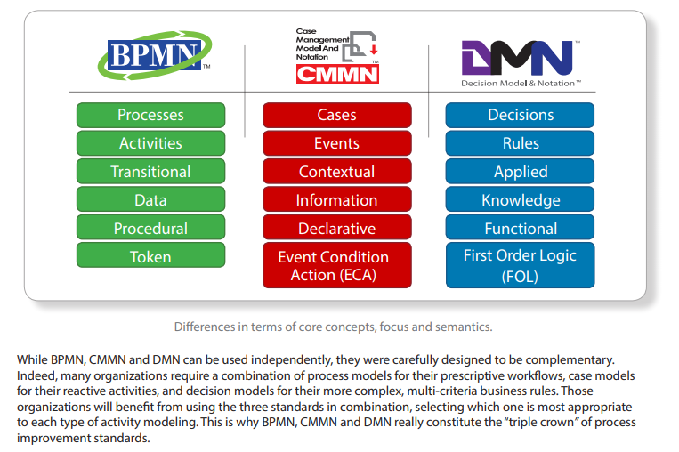
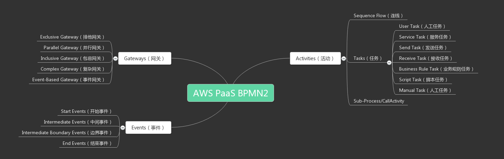
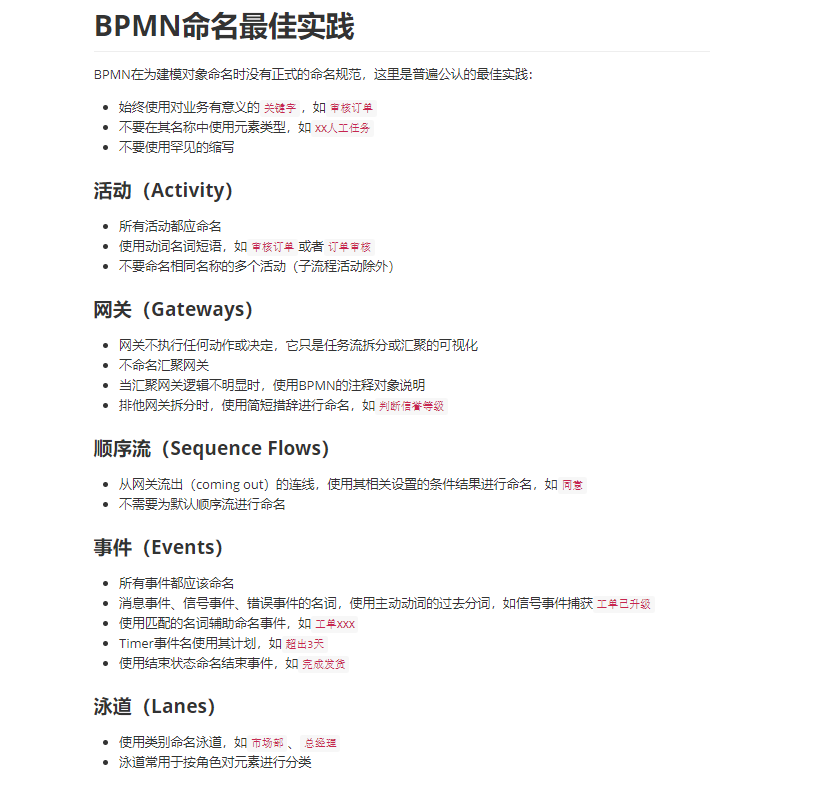

# activiti-6.0.0


## 基本概念

- BPMN2.0






## activiti

### activiti核心API

| 名称              | 说明                                                         |
| ----------------- | ------------------------------------------------------------ |
| ProcessEngine     | 流程引擎，可以获得其他所有的Service。                        |
| RepositoryService | Repository中存储了流程定义文件、部署和支持数据等信息；RepositoryService提供了对repository的存取服务。 |
| RuntimeService    | 提供启动流程、查询流程实例、设置获取流程实例变量等功能。     |
| TaskService       | 提供运行时任务查询、领取、完成、删除以及变量设置等功能。     |
| HistoryService    | 用于获取正在运行或已经完成的流程实例的信息。                 |
| FormService       | 提供定制任务表单和存储表单数据的功能，注意存储表单数据可选的功能，也可以向自建数据表中提交数据。 |
| IdentityService   | 提供对内建账户体系的管理功能，注意它是可选的服务，可以是用外部账户体系。 |
| ManagementService | 较少使用，与流程管理无关，主要用于Activiti系统的日常维护。   |

完成一次流程的处理，常见步骤以及他们使用的Service如下图所示：


### 数据库相关

```
Activiti 工作流总共包含 23 张数据表（现在是25张，新增了 ACT_EVT_LOG 和 ACT_PROCDEF_INFO ）

Activiti的后台是有数据库的支持，所有的表都以ACT_开头。 第二部分是表示表的用途的两个字母标识。 用途也和服务的API对应。
ACT_RE_*: 'RE'表示repository。 这个前缀的表包含了流程定义和流程静态资源 （图片，规则，等等）。
ACT_RU_*: 'RU'表示runtime。 这些运行时的表，包含流程实例，任务，变量，异步任务，等运行中的数据。 Activiti只在流程实例执行过程中保存这些数据， 在流程结束时就会删除这些记录。 这样运行时表可以一直很小速度很快。
ACT_ID_*: 'ID'表示identity。 这些表包含身份信息，比如用户，组等等。
ACT_HI_*: 'HI'表示history。 这些表包含历史数据，比如历史流程实例， 变量，任务等等。
ACT_GE_*: 'GE'表示general。通用数据， 用于不同场景下，如存放资源文件。

```

| 表分类       | 表名                | 解释                          |
| ------------ | ------------------- | ----------------------------- |
| 一般数据     | ACT_GE_BYTEARRAY    | 通用的流程定义和流程资源      |
|              | ACT_GE_PROPERTY     | 系统相关属性                  |
| 流程历史记录 | ACT_HI_ACTINST      | 历史的流程实例                |
|              | ACT_HI_ATTACHMENT   | 历史的流程附件                |
|              | ACT_HI_COMMENT      | 历史的说明性信息              |
|              | ACT_HI_DETAIL       | 历史的流程运行中的细节信息    |
|              | ACT_HI_IDENTITYLINK | 历史的流程运行过程中用户关系  |
|              | ACT_HI_PROCINST     | 历史的流程实例                |
|              | ACT_HI_TASKINST     | 历史的任务实例                |
|              | ACT_HI_VARINST      | 历史的流程运行中的变量信息    |
| 用户用户组表 | ACT_ID_GROUP        | 身份信息-组信息               |
|              | ACT_ID_INFO         | 身份信息-组信息               |
|              | ACT_ID_MEMBERSHIP   | 身份信息-用户和组关系的中间表 |
|              | ACT_ID_USER         | 身份信息-用户信息             |
| 流程定义表   | ACT_RE_DEPLOYMENT   | 部署单元信息                  |
|              | ACT_RE_MODEL        | 模型信息                      |
|              | ACT_RE_PROCDEF      | 已部署的流程定义              |
| 运行实例表   | ACT_RU_EVENT_SUBSCR | 运行时事件                    |
|              | ACT_RU_EXECUTION    | 运行时流程执行实例            |
|              | ACT_RU_IDENTITYLINK | 运行时用户关系信息            |
|              | ACT_RU_JOB          | 运行时作业                    |
|              | ACT_RU_TASK         | 运行时任务                    |
|              | ACT_RU_VARIABLE     | 运行时变量表                  |

```sql
select * from act_ge_bytearray; -- -通用的流程定义和流程资源(一般数据)
select * from act_ge_property; -- -系统相关属性(一般数据)

select * from act_hi_actinst; -- -历史的流程实例(流程历史记录)
select * from act_hi_attachment; -- -历史的流程附件(流程历史记录)
select * from act_hi_comment; -- -历史的说明性信息(流程历史记录)
select * from act_hi_detail; -- -历史的流程运行中的细节信息(流程历史记录)
select * from act_hi_identitylink; -- -历史的流程运行过程中用户关系(流程历史记录)
select * from act_hi_procinst; -- -历史的流程实例(流程历史记录)
select * from act_hi_taskinst; -- -历史的任务实例(流程历史记录)
select * from act_hi_varinst; -- -历史的流程运行中的变量信息(流程历史记录)

select * from act_id_group; -- -身份信息-组信息(用户用户组表)
select * from act_id_info; -- -身份信息-组信息(用户用户组表)
select * from act_id_membership; -- -身份信息-用户和组关系的中间表(用户用户组表)
select * from act_id_user; -- -身份信息-用户信息(用户用户组表)

select * from act_re_deployment; -- -部署单元信息(流程定义表)
select * from act_re_model; -- -模型信息(流程定义表)
select * from ACT_DE_MODEL; -- -模型信息(流程定义表-sunway)
select * from act_re_procdef; -- -已部署的流程定义(流程定义表)
select * from act_ru_event_subscr; -- -运行时事件(运行实例表)
select * from act_ru_execution; -- -运行时流程执行实例(运行实例表)
select * from act_ru_identitylink; -- -运行时用户关系信息(运行实例表)
select * from act_ru_job; -- -运行时作业(运行实例表)
select * from act_ru_task; -- -运行时任务(运行实例表)
select * from act_ru_variable; -- -运行时变量表(运行实例表)
```

[表结构说明]:表结构说明


## 画流程图

### 命名规范




## 参考

[流程引擎表结构]:(https://docs.awspaas.com/reference-guide/aws-paas-process-reference-guide/appendix/tables.html)
[表结构说明]:(https://www.jianshu.com/p/f9fd1cc02eae)	"表结构"
[E-R图]:(https://www.cnblogs.com/zjfjava/p/7110484.html)

