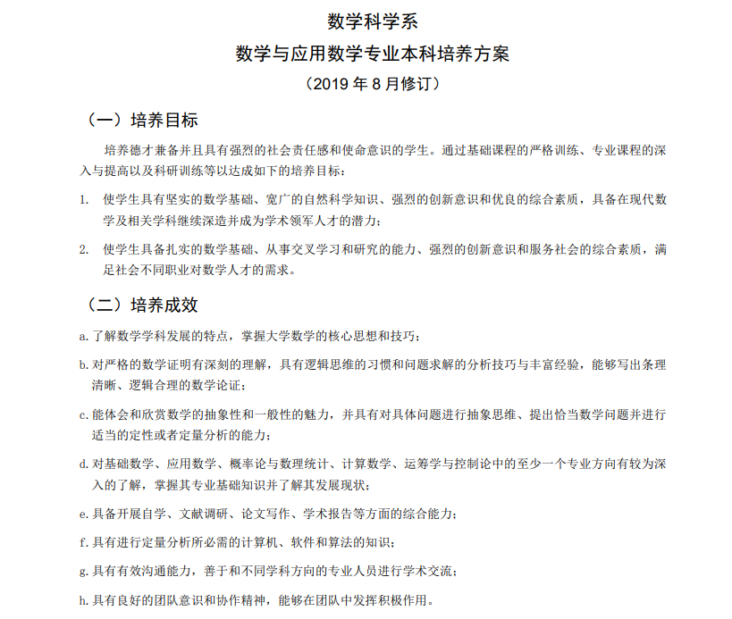
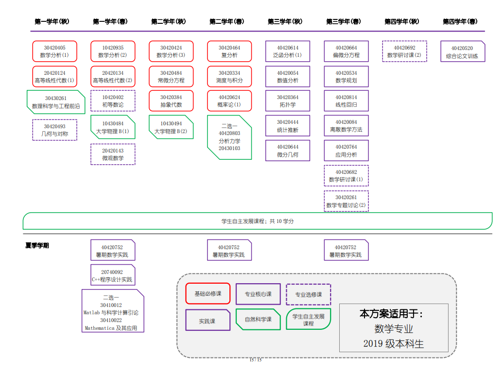

## 清华大学数学系本科培养方案

### 培养目标及培养结果

### 课程安排

| [数学基础](https://zh.wikipedia.org/wiki/%E6%95%B0%E5%AD%A6%E5%9F%BA%E7%A1%80 "数学基础") | *[范畴论](https://zh.wikipedia.org/wiki/%E8%8C%83%E7%95%B4%E8%AE%BA "范畴论")* [集合论](https://zh.wikipedia.org/wiki/%E9%9B%86%E5%90%88%E8%AE%BA "集合论")* [数理逻辑](https://zh.wikipedia.org/wiki/%E6%95%B0%E7%90%86%E9%80%BB%E8%BE%91 "数理逻辑")* [数学哲学](https://zh.wikipedia.org/wiki/%E6%95%B0%E5%AD%A6%E5%93%B2%E5%AD%A6 "数学哲学")                                                                                                                                                                                                                                                                                                                                                                                                                                                                                                                              |
| ----------------------------------------------------------------------------------- | ------------------------------------------------------------------------------------------------------------------------------------------------------------------------------------------------------------------------------------------------------------------------------------------------------------------------------------------------------------------------------------------------------------------------------------------------------------------------------------------------------------------------------------------------------------------------------------------------------------------------------------------------------------------------------------------------------------------------------------------------------------------------------------------------------------------------------------------------------ |
|                                                                                     |                                                                                                                                                                                                                                                                                                                                                                                                                                                                                                                                                                                                                                                                                                                                                                                                                                                        |
| [代数](https://zh.wikipedia.org/wiki/%E4%BB%A3%E6%95%B0 "代数")                           | *[抽象代数](https://zh.wikipedia.org/wiki/%E6%8A%BD%E8%B1%A1%E4%BB%A3%E6%95%B0 "抽象代数")* [初等代数](https://zh.wikipedia.org/wiki/%E5%88%9D%E7%AD%89%E4%BB%A3%E6%95%B0 "初等代数")* [线性代数](https://zh.wikipedia.org/wiki/%E7%BA%BF%E6%80%A7%E4%BB%A3%E6%95%B0 "线性代数")* [多重线性代数](https://zh.wikipedia.org/wiki/%E5%A4%9A%E9%87%8D%E7%BA%BF%E6%80%A7%E4%BB%A3%E6%95%B0 "多重线性代数")* [泛代数](https://zh.wikipedia.org/wiki/%E6%B3%9B%E4%BB%A3%E6%95%B0 "泛代数")                                                                                                                                                                                                                                                                                                                                                                                                  |
|                                                                                     |                                                                                                                                                                                                                                                                                                                                                                                                                                                                                                                                                                                                                                                                                                                                                                                                                                                        |
| [数学分析](https://zh.wikipedia.org/wiki/%E6%95%B0%E5%AD%A6%E5%88%86%E6%9E%90 "数学分析") | *[微积分](https://zh.wikipedia.org/wiki/%E5%BE%AE%E7%A7%AF%E5%88%86 "微积分")* [实变函数](https://zh.wikipedia.org/wiki/%E5%AE%9E%E5%8F%98%E5%87%BD%E6%95%B0 "实变函数")* [复变函数](https://zh.wikipedia.org/wiki/%E5%A4%8D%E5%8F%98%E5%87%BD%E6%95%B0 "复变函数")* [微分方程](https://zh.wikipedia.org/wiki/%E5%BE%AE%E5%88%86%E6%96%B9%E7%A8%8B "微分方程")* [泛函分析](https://zh.wikipedia.org/wiki/%E6%B3%9B%E5%87%BD%E5%88%86%E6%9E%90 "泛函分析")* [调和分析](https://zh.wikipedia.org/wiki/%E8%AA%BF%E5%92%8C%E5%88%86%E6%9E%90 "调和分析")                                                                                                                                                                                                                                                                                                                                       |
|                                                                                     |                                                                                                                                                                                                                                                                                                                                                                                                                                                                                                                                                                                                                                                                                                                                                                                                                                                        |
| [离散数学](https://zh.wikipedia.org/wiki/%E7%A6%BB%E6%95%A3%E6%95%B0%E5%AD%A6 "离散数学") | *[组合数学](https://zh.wikipedia.org/wiki/%E7%BB%84%E5%90%88%E6%95%B0%E5%AD%A6 "组合数学")* [图论](https://zh.wikipedia.org/wiki/%E5%9B%BE%E8%AE%BA "图论")* [序理论](https://zh.wikipedia.org/wiki/%E5%BA%8F%E7%90%86%E8%AE%BA "序理论")* [博弈论](https://zh.wikipedia.org/wiki/%E5%8D%9A%E5%BC%88%E8%AE%BA "博弈论")                                                                                                                                                                                                                                                                                                                                                                                                                                                                                                                                                        |
|                                                                                     |                                                                                                                                                                                                                                                                                                                                                                                                                                                                                                                                                                                                                                                                                                                                                                                                                                                        |
| [几何](https://zh.wikipedia.org/wiki/%E5%87%A0%E4%BD%95 "几何")                           | *[代数几何](https://zh.wikipedia.org/wiki/%E4%BB%A3%E6%95%B0%E5%87%A0%E4%BD%95 "代数几何")* [解析几何](https://zh.wikipedia.org/wiki/%E8%A7%A3%E6%9E%90%E5%87%A0%E4%BD%95 "解析几何")* [微分几何](https://zh.wikipedia.org/wiki/%E5%BE%AE%E5%88%86%E5%87%A0%E4%BD%95 "微分几何")* [离散几何学](https://zh.wikipedia.org/wiki/%E7%A6%BB%E6%95%A3%E5%87%A0%E4%BD%95%E5%AD%A6 "离散几何学")* [欧几里得几何](https://zh.wikipedia.org/wiki/%E6%AC%A7%E5%87%A0%E9%87%8C%E5%BE%97%E5%87%A0%E4%BD%95 "欧几里得几何")* [非欧几何](https://zh.wikipedia.org/wiki/%E9%9D%9E%E6%AC%A7%E5%87%A0%E4%BD%95 "非欧几何")* [有限几何学](https://zh.wikipedia.org/wiki/%E6%9C%89%E9%99%90%E5%B9%BE%E4%BD%95%E5%AD%B8 "有限几何学")                                                                                                                                                                                 |
|                                                                                     |                                                                                                                                                                                                                                                                                                                                                                                                                                                                                                                                                                                                                                                                                                                                                                                                                                                        |
| [数论](https://zh.wikipedia.org/wiki/%E6%95%B0%E8%AE%BA "数论")                           | *[算术](https://zh.wikipedia.org/wiki/%E7%AE%97%E6%9C%AF "算术")* [代数数论](https://zh.wikipedia.org/wiki/%E4%BB%A3%E6%95%B0%E6%95%B0%E8%AE%BA "代数数论")* [解析数论](https://zh.wikipedia.org/wiki/%E8%A7%A3%E6%9E%90%E6%95%B0%E8%AE%BA "解析数论")* [几何数论](https://zh.wikipedia.org/wiki/%E5%87%A0%E4%BD%95%E6%95%B0%E8%AE%BA "几何数论")* [丢番图几何](https://zh.wikipedia.org/wiki/%E4%B8%A2%E7%95%AA%E5%9B%BE%E5%87%A0%E4%BD%95 "丢番图几何")                                                                                                                                                                                                                                                                                                                                                                                                                            |
|                                                                                     |                                                                                                                                                                                                                                                                                                                                                                                                                                                                                                                                                                                                                                                                                                                                                                                                                                                        |
| [拓扑学](https://zh.wikipedia.org/wiki/%E6%8B%93%E6%89%91%E5%AD%A6 "拓扑学")              | *[代数拓扑](https://zh.wikipedia.org/wiki/%E4%BB%A3%E6%95%B0%E6%8B%93%E6%89%91 "代数拓扑")* [微分拓扑](https://zh.wikipedia.org/wiki/%E5%BE%AE%E5%88%86%E6%8B%93%E6%89%91 "微分拓扑")* [几何拓扑](https://zh.wikipedia.org/wiki/%E5%87%A0%E4%BD%95%E6%8B%93%E6%89%91 "几何拓扑")                                                                                                                                                                                                                                                                                                                                                                                                                                                                                                                                                                                         |
|                                                                                     |                                                                                                                                                                                                                                                                                                                                                                                                                                                                                                                                                                                                                                                                                                                                                                                                                                                        |
| [统计学](https://zh.wikipedia.org/wiki/%E7%BB%9F%E8%AE%A1%E5%AD%A6 "统计学")              | *[测度与概率](https://zh.wikipedia.org/wiki/%E6%B5%8B%E5%BA%A6 "测度")* [数理统计学](https://zh.wikipedia.org/wiki/%E6%95%B0%E7%90%86%E7%BB%9F%E8%AE%A1%E5%AD%A6 "数理统计学")* [数据科学](https://zh.wikipedia.org/wiki/%E6%95%B0%E6%8D%AE%E7%A7%91%E5%AD%A6 "数据科学")* [统计推断](https://zh.wikipedia.org/wiki/%E7%BB%9F%E8%AE%A1%E6%8E%A8%E6%96%AD "统计推断")* [回归分析](https://zh.wikipedia.org/wiki/%E5%9B%9E%E5%BD%92%E5%88%86%E6%9E%90 "回归分析")* [统计学习理论](https://zh.wikipedia.org/wiki/%E7%BB%9F%E8%AE%A1%E5%AD%A6%E4%B9%A0%E7%90%86%E8%AE%BA "统计学习理论")* [机器学习](https://zh.wikipedia.org/wiki/%E6%9C%BA%E5%99%A8%E5%AD%A6%E4%B9%A0 "机器学习")* [人工智能](https://zh.wikipedia.org/wiki/%E4%BA%BA%E5%B7%A5%E6%99%BA%E8%83%BD "人工智能")* [数据结构与算法](https://zh.wikipedia.org/wiki/%E6%95%B0%E6%8D%AE%E7%BB%93%E6%9E%84%E4%B8%8E%E7%AE%97%E6%B3%95 "数据结构与算法") |
|                                                                                     |                                                                                                                                                                                                                                                                                                                                                                                                                                                                                                                                                                                                                                                                                                                                                                                                                                                        |
| [计算数学](https://zh.wikipedia.org/wiki/%E8%AE%A1%E7%AE%97%E6%95%B0%E5%AD%A6 "计算数学") | *[计算机科学](https://zh.wikipedia.org/wiki/%E8%AE%A1%E7%AE%97%E6%9C%BA%E7%A7%91%E5%AD%A6 "计算机科学")* [计算理论](https://zh.wikipedia.org/wiki/%E8%AE%A1%E7%AE%97%E7%90%86%E8%AE%BA "计算理论")* [数值分析](https://zh.wikipedia.org/wiki/%E6%95%B0%E5%80%BC%E5%88%86%E6%9E%90 "数值分析")* [最优化](https://zh.wikipedia.org/wiki/%E6%9C%80%E4%BC%98%E5%8C%96 "最优化")* [计算机代数](https://zh.wikipedia.org/wiki/%E8%A8%88%E7%AE%97%E6%A9%9F%E4%BB%A3%E6%95%B8 "计算机代数")                                                                                                                                                                                                                                                                                                                                                                                                  |
|                                                                                     |                                                                                                                                                                                                                                                                                                                                                                                                                                                                                                                                                                                                                                                                                                                                                                                                                                                        |
| [应用数学](https://zh.wikipedia.org/wiki/%E5%BA%94%E7%94%A8%E6%95%B0%E5%AD%A6 "应用数学") | *[控制论](https://zh.wikipedia.org/wiki/%E6%8E%A7%E5%88%B6%E8%AE%BA "控制论")* [信息论](https://zh.wikipedia.org/wiki/%E4%BF%A1%E6%81%AF%E8%AE%BA "信息论")* [计算化学](https://zh.wikipedia.org/wiki/%E8%AE%A1%E7%AE%97%E5%8C%96%E5%AD%A6 "计算化学")* [数理生物学](https://zh.wikipedia.org/wiki/%E6%95%B8%E7%90%86%E7%94%9F%E7%89%A9%E5%AD%B8 "数理生物学")* [数理经济学](https://zh.wikipedia.org/wiki/%E6%95%B0%E7%90%86%E7%BB%8F%E6%B5%8E%E5%AD%A6 "数理经济学")* [计量经济学](https://zh.wikipedia.org/wiki/%E8%AE%A1%E9%87%8F%E7%BB%8F%E6%B5%8E%E5%AD%A6 "计量经济学")* [数理金融学](https://zh.wikipedia.org/wiki/%E6%95%B0%E7%90%86%E9%87%91%E8%9E%8D%E5%AD%A6 "数理金融学")* [数学心理学](https://zh.wikipedia.org/wiki/%E6%95%B0%E5%AD%A6%E5%BF%83%E7%90%86%E5%AD%A6 "数学心理学")* [数学物理学](https://zh.wikipedia.org/wiki/%E6%95%B8%E5%AD%B8%E7%89%A9%E7%90%86%E5%AD%B8 "数学物理学")       |
