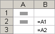
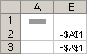
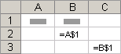
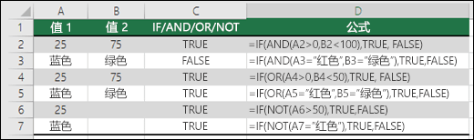
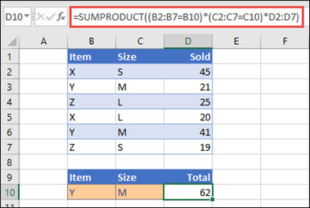
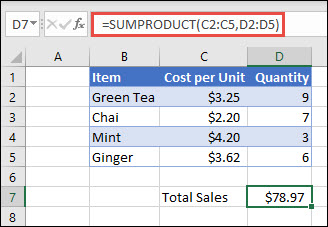
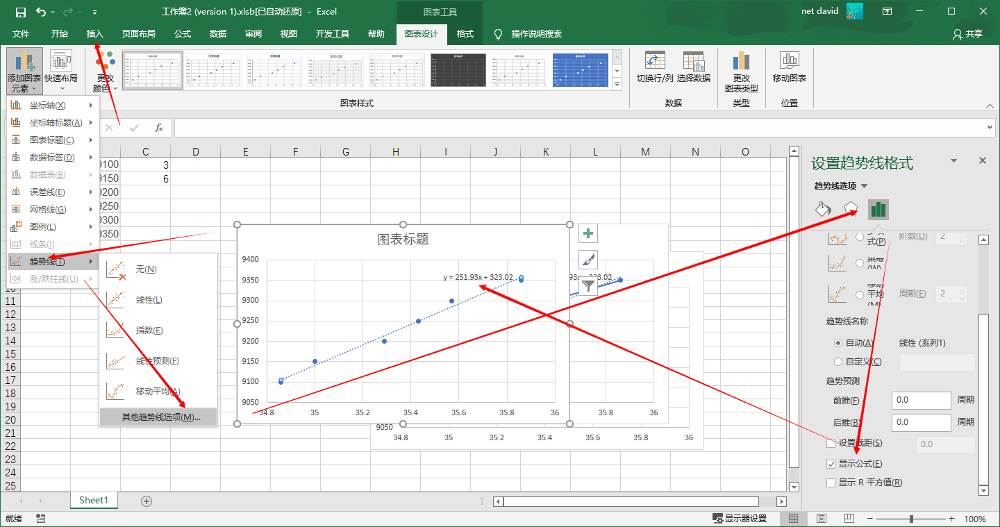
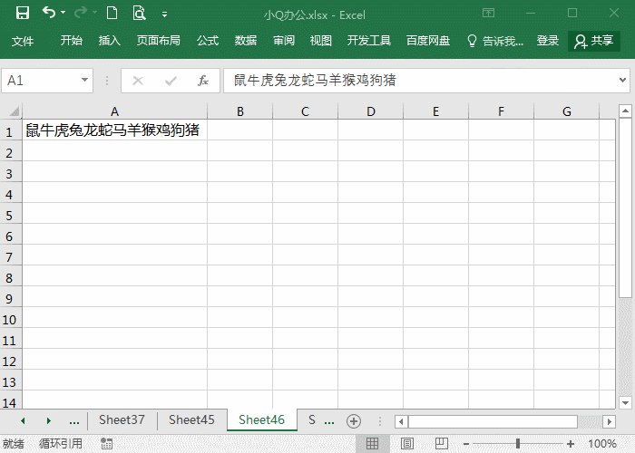
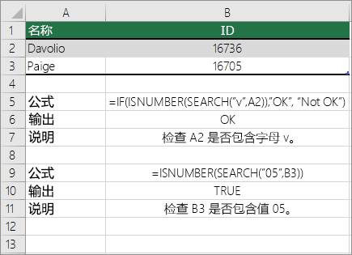

# excel

## 公式和函数

### 引用

引用的作用在于标识工作表上的单元格或单元格区域，并告知 Excel 在何处查找要在公式中使用的值或数据。 你可以使用引用在一个公式中使用工作表不同部分中包含的数据，或者在多个公式中使用同一个单元格的值。 还可以引用同一个工作簿中其他工作表上的单元格和其他工作簿中的数据。 引用其他工作簿中的单元格被称为链接或外部引用。

#### A1 引用样式

默认情况下，Excel 使用 A1 引用样式，此样式引用字母标识列（从 A 到 XFD，共 16,384 列）以及数字标识行（从 1 到 1,048,576）。 这些字母和数字被称为行号和列标。 要引用某个单元格，请输入列标，后跟行号。 例如，B2 引用列 B 和行 2 交叉处的单元格。

| **若要引用**                                 | **用途** |
  | :------------------------------------------- | :------- |
  | 列 A 和行 10 交叉处的单元格                  | A10      |
  | 在列 A 和行 10 到行 20 之间的单元格区域      | A10:A20  |
  | 在行 15 和列 B 到列 E 之间的单元格区域       | B15:E15  |
  | 行 5 中的全部单元格                          | 5:5      |
  | 行 5 到行 10 之间的全部单元格                | 5:10     |
  | 列 H 中的全部单元格                          | H:H      |
  | 列 H 到列 J 之间的全部单元格                 | H:J      |
  | 列 A 到列 E 和行 10 到行 20 之间的单元格区域 | A10:E20  |

  #### 绝对引用、相对引用和混合引用之间的区别

**相对引用**  公式中的相对单元格引用（如 A1）是基于包含公式和单元格引用的单元格的相对位置。 如果公式所在单元格的位置改变，引用也随之改变。 如果多行或多列地复制或填充公式，引用会自动调整。 默认情况下，新公式使用相对引用。 例如，如果将单元格 B2 中的相对引用复制或填充到单元格 B3，将自动从 =A1 调整到 =A2。

**复制的公式具有相对引用**  

**绝对引用**  公式中的绝对单元格引用（如 $A$1）总是在特定位置引用单元格。 如果公式所在单元格的位置改变，绝对引用将保持不变。 如果多行或多列地复制或填充公式，绝对引用将不作调整。 默认情况下，新公式使用相对引用，因此您可能需要将它们转换为绝对引用。 例如，如果将单元格 B2 中的绝对引用复制或填充到单元格 B3，则该绝对引用在两个单元格中一样，都是 =$A$1。

**复制的公式具有绝对引用**  

**混合引用**  混合引用具有绝对列和相对行或绝对行和相对列。 绝对引用列采用 $A1、$B1 等形式。 绝对引用行采用 A$1、B$1 等形式。 如果公式所在单元格的位置改变，则相对引用将改变，而绝对引用将不变。 如果多行或多列地复制或填充公式，相对引用将自动调整，而绝对引用将不作调整。 例如，如果将一个混合引用从单元格 A2 复制到 B3，它将从 =A$1 调整到 =B$1。

**复制的公式具有混合引用**  

### 最常用的10个函数

#### 日期和时间函数

##### workday

只计算工作日。excel 加天数 如果为周末顺延

###### 语法

WORKDAY(start_date, days, [holidays])

WORKDAY 函数语法具有下列参数：

- **Start_date**  必需。 一个代表开始日期的日期。
- **Days**  必需。 start_date 之前或之后不含周末及节假日的天数。 Days 为正值将生成未来日期；为负值生成过去日期。
- **Holidays**  可选。 一个可选列表，其中包含需要从工作日历中排除的一个或多个日期，例如各种省/市/自治区和国家/地区的法定假日及非法定假日。 该列表可以是包含日期的单元格区域，也可以是由代表日期的序列号所构成的数组常量。

###### 备注

- Microsoft Excel 可将日期存储为可用于计算的序列号。 默认情况下，1900 年 1 月 1 日的序列号是 1，而 2008 年 1 月 1 日的序列号是 39448，这是因为它距 1900 年 1 月 1 日有 39448 天。
- 如果任一参数不是有效日期，则 WORKDAY 返回#VALUE！ 错误值。
- 如果start_date加上天生成无效日期，则 WORKDAY 返回#NUM！ 错误值。
- 如果 days 不是整数，将截尾取整。

#### 逻辑函数

##### 将 IF 函数与 AND、OR 以及 NOT 函数配合使用

IF 函数允许通过测试某个条件并返回该条件为 True 或 False 的结果，从而对某个值和预期值进行逻辑对比。

- =IF（内容为 True，则执行某些操作，否则就执行其他操作）

但如果需要测试多个条件，例如我们假设所有条件都需要为 True 或 False (**AND**)，或只有一个条件需要为 True 或 False (**OR**)，或者如果想要检查某个条件是否不 (**NOT**) 符合你的条件，这时该怎么做呢？ 这三个函数均可以单独使用，但它们更常见于与 IF 函数成对使用。

###### 技术细节

将 IF 函数与 AND、OR 和 NOT 配合使用以执行条件是否为 True 或 False 的多项计算。

###### 语法

- IF(AND()) - IF(AND(logical1, [logical2], ...), value_if_true, [value_if_false]))
- IF(OR()) - IF(OR(logical1, [logical2], ...), value_if_true, [value_if_false]))
- IF(NOT()) - IF(NOT(logical1), value_if_true, [value_if_false]))

| **参数名称**               | **说明**                                       |      |
| -------------------------- | ---------------------------------------------- | ---- |
| **logical_test**（必需）   | 要测试的条件。                                 |      |
| **value_if_true**（必需）  | logical_test 的结果为 TRUE 时你希望返回的值。  |      |
| **value_if_false**（可选） | logical_test 的结果为 FALSE 时你希望返回的值。 |      |

下面是如何分别构造 [AND](https://support.microsoft.com/zh-cn/office/and-函数-5f19b2e8-e1df-4408-897a-ce285a19e9d9)、[OR](https://support.microsoft.com/zh-cn/office/or-函数-7d17ad14-8700-4281-b308-00b131e22af0) 和 [NOT](https://support.microsoft.com/zh-cn/office/not-函数-9cfc6011-a054-40c7-a140-cd4ba2d87d77) 函数的概述。 当将它们分别与 IF 语句组合使用时，应按如下方式表达：

- **AND** – =IF(AND(Something is True, Something else is True), Value if True, Value if False)
- **OR** – =IF(OR(Something is True, Something else is True), Value if True, Value if False)
- **NOT** – =IF(NOT(Something is True), Value if True, Value if False)

###### 示例

下面是一些常见的嵌套 IF(AND())、IF(OR()) 和 IF(NOT()) 语句的示例。 AND 和 OR 函数最多可支持 255 个单独条件，但并不建议使用多个条件，因为构建、测试和维护复杂的嵌套公式是非常难的。 NOT 函数仅采用一个条件。

下面是根据它们的逻辑写出的公式：

| **公式**                                 | **说明**                                                     |
| :--------------------------------------- | :----------------------------------------------------------- |
| =IF(AND(A2>0,B2<100),TRUE, FALSE)        | 如果 A2 (25) 大于 0，并且 B2 (75) 小于 100，则返回 TRUE，否则返回 FALSE。 在本例中，两个条件都为 TRUE，因此返回 TRUE。 |
| =IF(AND(A3="Red",B3="Green"),TRUE,FALSE) | 如果 A3（“蓝色”）=“红色”，并且 B3（“绿色”）等于“绿色”，则返回 TRUE，否则返回 FALSE。 在本例中，只有第一个条件为 TRUE，因此返回 FALSE。 |
| =IF(OR(A5="Red",B5="Green"),TRUE,FALSE)  | 如果 A5（“蓝色”）=“红色”，或者 B5（“绿色”）等于“绿色”，则返回 TRUE，否则返回 FALSE。 在本例中，第二个参数为 TRUE，因此公式返回 TRUE。 |
| =IF(NOT(A6>50),TRUE,FALSE)               | 如果 A6 (25) 不大于 50，则返回 TRUE，否则返回 FALSE。 在本例中，25 不大于 50，因此公式返回 TRUE。 |
| =IF(NOT(A7="Red"),TRUE,FALSE)            | 如果 A7（“蓝色”）不等于“红色”，则返回 TRUE，否则返回 FALSE。 |

请注意，在所有示例中，输入各自的条件后都加了右括号。 其余 True/False 参数将作为外部 IF 语句的一部分。 你也可以将“文本”或“数字”值替换为示例中返回的 TRUE/FALSE 值。

### 文本函数

#### 统计函数

### SUMPRODUCT 函数-取单元格第一列之和

**SUMPRODUCT**函数返回相应范围或数组的个数之和。 默认操作是乘法，但也可以执行加减除运算。

本示例使用 SUMPRODUCT 返回给定项和大小的总销售额：

SUMPRODUCT 匹配项 Y/大小 M 的所有实例并求和，因此对于此示例，21 加 41 等于 62。

#### 语法

若要使用默认操作 (乘法) ：

**=SUMPRODUCT (array1， [array2]， [array3]， ...)**

SUMPRODUCT 函数语法具有下列参数：

| 参数                              | 说明                                                |
| :-------------------------------- | :-------------------------------------------------- |
| **array1**  必需                  | 其相应元素需要进行相乘并求和的第一个数组参数。      |
| **[array2]， [array3],...**  可选 | 2 到 255 个数组参数，其相应元素需要进行相乘并求和。 |

**执行其他算术运算**

像往常一样使用 SUMPRODUCT，但请将分隔数组参数的逗号替换为所需的算术运算符 (*、/、+、-) 。 执行所有操作后，结果将像往常一样进行求和。

**注意:** 如果使用算术运算符，请考虑将数组参数括在括号中，并使用括号对数组参数进行分组以控制算术运算的顺序。

#### 备注

数组参数必须具有相同的维数。 否则，函数 SUMPRODUCT 将返回 #VALUE! 错误值 #REF!。 例如，=SUMPRODUCT (C2：C10，D2：D5) 将返回错误，因为范围的大小不同。

SUMPRODUCT 将非数值数组条目视为零。

为获得最佳性能，SUMPRODUCT 不应与完整列引用一同使用。 请考虑 =SUMPRODUCT (A：A，B：B) ，在此函数将 A 列中的 1，048，576 个单元格乘以 B 列中的 1，048，576 个单元格，然后再添加它们。 

#### 示例 1

若要使用上面的示例列表创建公式，请键入 =SUMPRODUCT (C2：C5，D2：D5) 并**按 Enter。** 列 C 中的每个单元格乘以 D 列中同一行中的对应单元格，结果将相加。 杂货的总量为 $78.97。

若要编写提供相同结果的较长公式，请键入 =C2*D2+C3*D3+C4*D4+C5*D5，然后**按 Enter。** 按 Enter 后，结果相同：$78.97。 单元格 C2 乘以 D2，其结果将添加到单元格 C3 乘以单元格 D3 的结果，以此类比。

#### 数学和三角函数

#### 查找引用函数

#### 财务函数

## 图表

### 根据散点找公式

## 技巧

### 录入相同内容

按住Ctrl键选中要填充内容的单元格，输入对应的内容后，按下Ctrl+回车组合键，批量完毕相同内容填充。

### 快速合并多行数据

先把列宽调整到可以放下合并的所有内容大小，接着选中数据，点击开始-编辑-填充-两端对齐，就能快速合并。

### 文本分多行

一个单元格有很多内容，如果分布多个单元格中？将单元格宽度调整到要分列的字符大小宽度，然后点击开始-编辑-填充-两端对齐，就能将内容分布多行。

#### 单元格添加下拉选

#### [excel单元格怎么添加百分比进度条](https://link.zhihu.com/?target=https%3A//www.jiachong.com/excel/7545.html)

1. 打开Excel表格，选择要设置进度条的单元格，展开条件格式
2. 展开数据条，选择进度条颜色，就可以实现百分比进度条展示了

#### 检查单元格的一部分是否与特定文本匹配

若要执行此任务，请使用**IF、SEARCH**和**ISNUMBER**函数。

**注意:** **SEARCH**函数不区分大小写。

## 参考资料

[excel技巧-全](https://zh-cn.extendoffice.com/documents/excel)

[excel教程](https://www.xqppt.com/article/1202.html)

