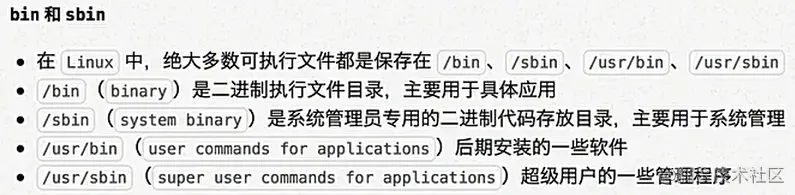
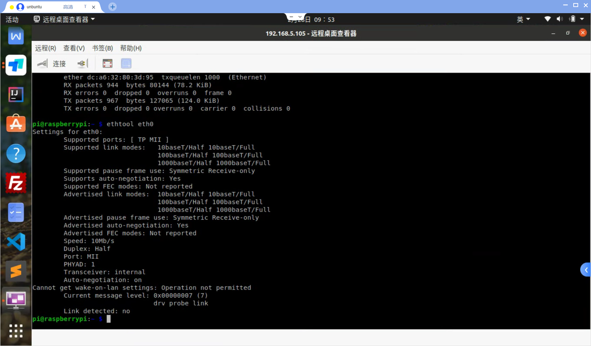
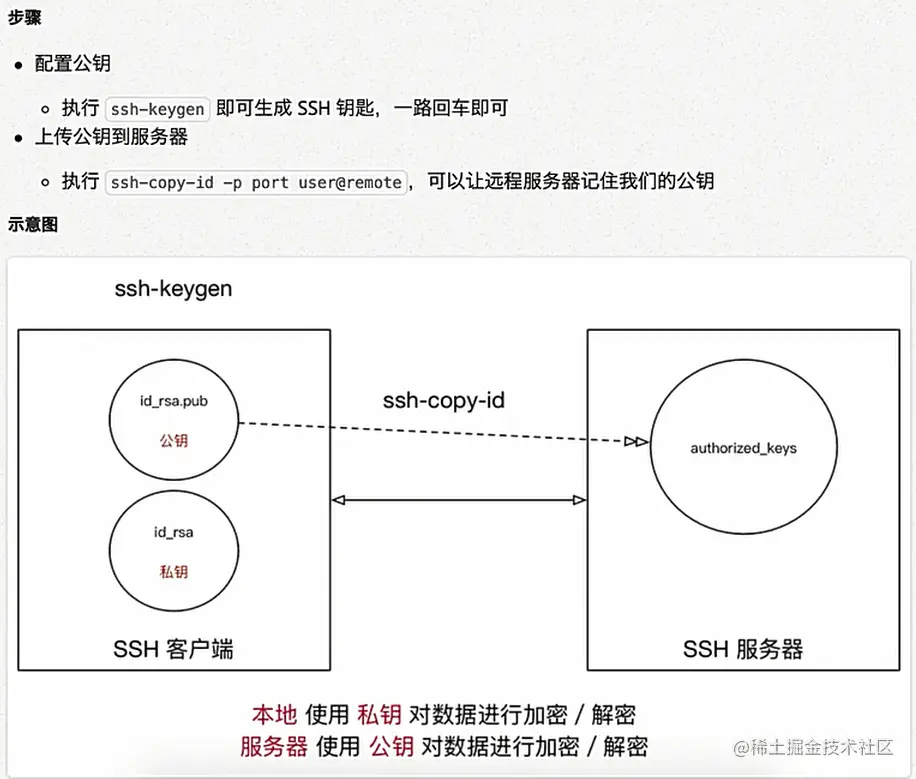

# Linux 运维

## 常识

### 语法

Linux命令格式: `command [-options] [parameter1] …` 命令 选项 参数 说明： command: 命令名,相应功能的英文单词或单词的缩写 [-options]：选项,可用来对命令进行控制，也可以省略，[]代表可选 parameter1 …：传给命令的参数：可以是零个一个或多个.

### 文件

#### 目录

### 文件树



#### 绝对路径与相对路径

- 绝对路径：从/目录开始描述的路径为绝对路径，如：/home 
- 相对路径：从当前位置开始描述的路径为相对路径，如：../../ 。.和.. ：
- 每个目录下都有.和..（可用`ls -a`查看）；. 表示当前目录；.. 表示上一级目录，即父目录；根目录下的.和..都表示当前目录。

#### 访问权限

用户能够控制一个给定的文件或目录的访问程度，一个文件或目录可能有读、写及执行权限： 

- 读权限（r） 对文件而言，具有读取文件内容的权限；对目录来说，具有浏览目录的权限。 

- 写权限（w） 对文件而言，具有新增、修改文件内容的权限；对目录来说，具有删除、移动目录内文件的权限。 

- 可执行权限（x） 对文件而言，具有执行文件的权限；对目录了来说该用户具有进入目录的权限。 

  注意：通常，Unix/Linux系统只允许文件的属主(所有者)或超级用户改变文件的读写权限

## 基本命令

### 查看历史命令-history

#### 基本原理


Linux 命令的历史记录，会持久化存储，默认位置是当前用户家目录的 `.bash_history` 文件。

当 Linux 系统启动一个 Shell 时，Shell 会从 `.bash_history` 文件中，读取历史记录，存储在相应内存的缓冲区中。

当我们退出 Shell，比如按下 `Ctrl+D` 时，Shell 进程会把历史记录缓冲区的内容，写回到 *.bash\_history* 文件中去

我们平时所操作的 Linux 命令，都会记录在_缓冲区_中。包括 `history` 命令所执行的历史命令管理，都是在操作_缓冲区_，而不是直接操作 *.bash\_history* 文件。

#### 基本用法

```bash
# 最近操作命令列表
[demo@localhost ~]$ history
   10  cat application.properties
   11  cat ../hqcec_demo/application.properties
   12  tail -500f logs/9001.log
   13  tail -f logs/9001.log
   14  cp -R files/* ../hqcec_demo/files/
   15  ps -ef|grep 9001
# 显示最近N条历史命令
[demo@localhost ~]$ history 10
 1001  history
 1002  ll
 1003  history
 1004  ll
 1005  vi application.properties
 1006  history | grep vi
 1007  history | grep hhhh
 1008  history | grep wwww
 1009  history
 1010  history 10
[demo@localhost ~]$
# 重复指定第N条历史命令
[demo@localhost ~]$ !1007
history | grep hhhh
 1007  history | grep hhhh
 1011  history | grep hhhh
# 重复执行上一条命令
[demo@localhost ~]$ !!
history | grep hhhh
 1007  history | grep hhhh
 1011  history | grep hhhh
[demo@localhost ~]$
# 交互式搜索历史命令
# 在命令行输入 Ctrl+R 后，进入交互界面，键入需要搜索的关键字，如果匹配到多条命令，可以多次键入 Ctrl+R 来切换上一条匹配的命令。符合后，按下回车就可以执行该命令。
[demo@localhost ~]$
(reverse-i-search)`vi': vi start.sh
# 从历史命令中获取参数。例如：^代表首参数，$代表尾参数
[test@localhost ~]$ history 10
   51  history
   52  ll -h
   53  ll
   54  rm 9002.log
   55  touch 9002.log
   56  ll
   57  ps -ef | grep java
   58  touch java
   59  ll
   60  history 10
[test@localhost ~]$ ll
总用量 0
-rw-rw-r-- 1 test test 0 10月 22 21:17 9002.log
-rw-rw-r-- 1 test test 0 10月 22 21:18 java
[test@localhost ~]$ rm !55:$
rm 9002.log
[test@localhost ~]$ ll
总用量 0
-rw-rw-r-- 1 test test 0 10月 22 21:18 java
[test@localhost ~]$ touch !60:$
touch 10
[test@localhost ~]$ ll
总用量 0
-rw-rw-r-- 1 test test 0 10月 22 21:21 10
-rw-rw-r-- 1 test test 0 10月 22 21:18 java
[test@localhost ~]$ touch !58:^
touch java
[test@localhost ~]$
[test@localhost ~]$ touch a b c
[test@localhost ~]$ ll
总用量 0
-rw-rw-r-- 1 test test 0 10月 22 21:21 10
-rw-rw-r-- 1 test test 0 10月 22 21:25 a
-rw-rw-r-- 1 test test 0 10月 22 21:25 b
-rw-rw-r-- 1 test test 0 10月 22 21:25 c
-rw-rw-r-- 1 test test 0 10月 22 21:22 java
[test@localhost ~]$ history 5
   73  ll
   74  rm a c
   75  touch a b c
   76  ll
   77  history 5
[test@localhost ~]$ rm !75:2
rm b
[test@localhost ~]$ ll
总用量 0
-rw-rw-r-- 1 test test 0 10月 22 21:21 10
-rw-rw-r-- 1 test test 0 10月 22 21:25 a
-rw-rw-r-- 1 test test 0 10月 22 21:25 c
-rw-rw-r-- 1 test test 0 10月 22 21:22 java
[test@localhost ~]$
# 历史命令列表显示时间戳
[demo@localhost ~]$ export HISTTIMEFORMAT='%F %T'
[demo@localhost ~]$ history 5
 1018  2021-10-22 21:00:57history 10
 1019  2021-10-22 21:03:45 ps -ef | grep java
 1020  2021-10-22 21:03:50history 10
 1021  2021-10-22 21:09:20export HISTTIMEFORMAT='%F %T'
 1022  2021-10-22 21:09:26history 5
[demo@localhost ~]$
# 禁用历史记录
echo "export HISTSIZE=0" >> ~/.bash_profile
echo "export HISTFILESIZE=0" >> ~/.bash_profile
source ~/.bash_profile


#合适使用几个相关的环境变量，让你的 Linux 系统更安全：
#HISTSIZE：控制缓冲区历史记录的最大个数
#HISTFILESIZE：控制历史记录文件中的最大个数
#HISTIGNORE：设置哪些命令不记录到历史记录
#HISTTIMEFORMAT：设置历史命令显示的时间格式
#HISTCONTROL：扩展的控制选项

#如果在生产环境，这些环境变量需要持久化到配置文件 ~/.bash_profile
export HISTCONTROL=ignoreboth
# ignorespace: 忽略空格开头的命令
# ignoredups: 忽略连续重复命令
# ignoreboth: 表示上述两个参数都设置
# 设置追加而不是覆盖
shopt -s histappend
export HISTSIZE=1000
export HISTFILESIZE=200000
export HISTTIMEFORMAT="%F %T "
export HISTIGNORE="ls:history"
```


### 查看系统,CPU信息

```bash
# 查看系统版本
[root@localhost download]# cat /etc/system-release
CentOS Linux release 7.9.2009 (Core)

# 查看系统内核信息
uname -a

# 查看系统内核版本
cat /proc/version

# 查看当前用户环境变量
env

cat /proc/cpuinfo

# 查看有几个逻辑cpu, 包括cpu型号
cat /proc/cpuinfo | grep name | cut -f2 -d: | uniq -c

# 查看有几颗cpu,每颗分别是几核
cat /proc/cpuinfo | grep physical | uniq -c

# 查看当前CPU运行在32bit还是64bit模式下, 如果是运行在32bit下也不代表CPU不支持64bit
getconf LONG_BIT

# 结果大于0, 说明支持64bit计算. lm指long mode, 支持lm则是64bit
cat /proc/cpuinfo | grep flags | grep ' lm ' | wc -l
```

### 后台运行命令-nohup

```bash
# 后台运行,并且有nohup.out输出
nohup xxx &

# 后台运行, 不输出任何日志
nohup xxx > /dev/null &

# 后台运行, 并将错误信息做标准输出到日志中 
nohup xxx >out.log 2>&1 &
```

### 进程查看

```bash
#查看进程所有打开最大fd数
ulimit -n
#查看命令路径
which <命令>
#查看进程内加载的环境变量
# 也可以去 cd /proc 目录下, 查看进程内存中加载的东西
ps -ef | grep java
ps eww -p  XXXXX(进程号)
ps aux|grep xxx | grep -v grep | awk '{print $2}' | xargs kill -9


```

### 用户相关

```bash
# 新增用户
useradd 用户名
passwd 用户名

#增加sudo权限
vim /etc/sudoers
# 修改文件里面的
# root    ALL=(ALL)       ALL
# 用户名 ALL=(ALL)       ALL
```

### 文件相关

```bash
[hqc@testserver hqcec_test]$ stat tomcat/
  File: ‘tomcat/’
  Size: 47              Blocks: 0          IO Block: 4096   directory
Device: fd02h/64770d    Inode: 108478460   Links: 5
Access: (0775/drwxrwxr-x)  Uid: ( 1001/     hqc)   Gid: ( 1001/     hqc)
Context: unconfined_u:object_r:user_home_t:s0
Access: 2022-01-10 18:51:26.596807729 +0800
Modify: 2021-10-08 11:52:16.183331973 +0800
Change: 2021-10-08 11:52:16.220331972 +0800
 Birth: -
[hqc@testserver hqcec_test]$ stat --help
Usage: stat [OPTION]... FILE...
Display file or file system status.

Mandatory arguments to long options are mandatory for short options too.
  -L, --dereference     follow links
  -f, --file-system     display file system status instead of file status
  -c  --format=FORMAT   use the specified FORMAT instead of the default;
                          output a newline after each use of FORMAT
      --printf=FORMAT   like --format, but interpret backslash escapes,
                          and do not output a mandatory trailing newline;
                          if you want a newline, include \n in FORMAT
  -t, --terse           print the information in terse form
      --help     display this help and exit
      --version  output version information and exit
```


### 网络相关

```bash
#查看什么进程使用了该端口
lsof -i:port


#获取本机IP地址
/sbin/ifconfig -a|grep inet|grep -v 127.0.0.1|grep -v inet6|awk '{print $2}'|tr -d "addr:"


# nc命令, tcp调试利器
#给某一个endpoint发送TCP请求,就将data的内容发送到对端
nc 192.168.0.11 8000 < data.txt

#nc可以当做服务器，监听某个端口号,把某一次请求的内容存储到received_data里
nc -l 8000 > received_data
#上边只监听一次，如果多次可以加上-k参数
nc -lk 8000

# dump出本机12301端口的tcp包
tcpdump -i em1 tcp port 12301 -s 1500 -w abc.pcap

#netstat
# 输出每个ip的连接数，以及总的各个状态的连接数
netstat -n | awk '/^tcp/ {n=split($(NF-1),array,":");if(n<=2)++S[array[(1)]];else++S[array[(4)]];++s[$NF];++N} END {for(a in S){printf("%-20s %s\n", a, S[a]);++I}printf("%-20s %s\n","TOTAL_IP",I);for(a in s) printf("%-20s %s\n",a, s[a]);printf("%-20s %s\n","TOTAL_LINK",N);}'

# 统计所有连接状态, 
# CLOSED：无连接是活动的或正在进行
# LISTEN：服务器在等待进入呼叫
# SYN_RECV：一个连接请求已经到达，等待确认
# SYN_SENT：应用已经开始，打开一个连接
# ESTABLISHED：正常数据传输状态
# FIN_WAIT1：应用说它已经完成
# FIN_WAIT2：另一边已同意释放
# ITMED_WAIT：等待所有分组死掉
# CLOSING：两边同时尝试关闭
# TIME_WAIT：主动关闭连接一端还没有等到另一端反馈期间的状态
# LAST_ACK：等待所有分组死掉
netstat -n | awk '/^tcp/ {++state[$NF]} END {for(key in state) print key,"\t",state[key]}'

# 查找较多time_wait连接
netstat -n|grep TIME_WAIT|awk '{print $5}'|sort|uniq -c|sort -rn|head -n20
```

#### linux系统查看网卡是否支持WOL网络唤醒并开启WOL唤醒功能

首先需要看电脑的主板是否支持，进入BIOS，一般有两种。

一是在开机启动项里是否有Lan启动的选项，有的话就调成优先启动

二是在电源里，有的直接有WOL选项，开启即可。

硬件开启了网络唤醒功能，接下来就需要在系统里设置了。

**检查是否开启WOL唤醒功能**

linux检查网卡是否支持唤醒功能，输入命令命令打印出网卡的信息。

```javascript
ethtool eth0 
```

其中eth0是一般服务器，默认的网卡，但是也有例外，所以先用命令 **ifconfig** 查看下所有网络设备，找到你的电脑的网卡，像我的就是eno1。



其中先看Supports Wake-on的字段，会输出现在网卡支持哪些功能，若为d，则不支持。

- d -- 禁用
- p -- 物理活动唤醒
- u -- 单播消息唤醒
- m -- 多播（组播）消息唤醒
- b -- 广播消息唤醒
- a -- ARP 唤醒
- g -- 特定数据包magic packet唤醒
- s -- 设有密码的特定数据包magic packet唤醒

然后看Wake-on的值，若为g，表示网卡已开启远程唤醒功能；

**开启WOL唤醒功能**

若为d，则需要输入命令开启。记得将网卡改成自己电脑的。

```javascript
ethtool -s eth0 wol g
```

命令执行后，再次输入ethtool eth0，检测是否成功开启wake on lan功能。

为什么这里选择的g，因为其他只是单纯的唤醒，并没有验证，可能路由器的一个广播操作都会将电脑给唤醒，g为特定数据包magic packet唤醒，唤醒的时候是发送一段特殊的代码，进行操作。

> 幻数据包（Magic Packet） 由 AMD 公司提出，幻数据包是一个广播帧，包含待唤醒计算机的MAC地址。完成的幻数据包最简单的构成是6字节的255（FF FF FF FF FF FF FF），紧接着为48位MAC地址，重复16次，数据包共计102字节。通常数据包含在 UDP协议中。

**重启后自动开启WOL唤醒**

每次重启完，网卡的Wake-on属性又会恢复到d的关闭状态，所以每次开机需要再开启，两种方法：

1、加入开机启动项。将以下代码添加至/etc/rc.local

```javascript
/sbin/ethtool -s eth0 wol g
```

2、修改网卡属性。编辑/etc/sysconfig/network-scripts/ifcfg-eth0，添加以下代码

```javascript
ETHTOOL_OPTS=”wol g”
```

 *PS：要注意将eth0换成自己的网卡*

**系统日志**

```bash
dmesg
```


### 文本搜索-grep

Linux系统中grep命令是一种强大的文本搜索工具，grep允许对文本文件进行模式查找。如果找到匹配模式， grep打印包含模式的所有行。 grep一般格式为：`grep [-选项] ‘搜索内容串’文件名` 在grep命令中输入字符串参数时，最好引号或双引号括起来。例如：grep‘a ’1.txt。

```bash
# 反向匹配, 查找不包含xxx的内容
grep -v xxx

# 排除所有空行
grep -v '^/pre>

# 返回结果 2,则说明第二行是空行
grep -n “^$” 111.txt    

# 查询以abc开头的行
grep -n “^abc” 111.txt 

# 同时列出该词语出现在文章的第几行
grep 'xxx' -n xxx.log

# 计算一下该字串出现的次数
grep 'xxx' -c xxx.log

# 比对的时候，不计较大小写的不同
grep 'xxx' -i xxx.log
```


### 查找文件-find

find支持文件名的正则表达式查找，按文件修改时间查找，按文件大小查找，按文件权限查找，按文件类型查找等，查找到以后还支持直接对查找到的文件使用命令，功能非常强大。

典型的find命令的写法是：`find 查找路径 查找的标准 查找到之后的动作`。 比如: `find /home -type d -ls`，意思是: 找出/home/下所有的目录,并显示目录的详细信息。

```bash
# 在目录下找后缀是.mysql的文件
find /home/eagleye -name '*.mysql' -print

# 会从 /usr 目录开始往下找，找最近3天之内存取过的文件。
find /usr -atime 3 –print

# 会从 /usr 目录开始往下找，找最近5天之内修改过的文件。
find /usr -ctime 5 –print

# 会从 /doc 目录开始往下找，找jacky 的、文件名开头是 j的文件。  
find /doc -user jacky -name 'j*' –print

# 会从 /doc 目录开始往下找，找寻文件名是 ja 开头或者 ma开头的文件。
find /doc \( -name 'ja*' -o- -name 'ma*' \) –print

#  会从 /doc 目录开始往下找，找到凡是文件名结尾为 bak的文件，把它删除掉。-exec 选项是执行的意思，rm 是删除命令，{ } 表示文件名，“\;”是规定的命令结尾。 
find /doc -name '*bak' -exec rm {} \;
```


### 归档管理-tar

```bash
#文件打包
tar -cvf ***.tar 1.py 2.py 3.txt *.c
#文件解包
tar -xvf ***.tar -C ~/Desktop
#压缩用法
tar -zcvf 压缩包包名 文件1 文件2 ... -z ：指定压缩包的格式为：file.tar.gz
#解压用法
tar -zxvf 压缩包包名 解压到指定目录：-C （大写字母“C”）
#压缩用法
tar jcvf 压缩包包名 文件...(tar jcvf bk.tar.bz2 *.c)
#解压用法
tar jxvf 压缩包包名 (tar jxvf bk.tar.bz2)
```

### 文件压缩-zip/unzip

```bash
#压缩文件
zip [-r] 目标文件(没有扩展名) 源文件
#解压文件
unzip -d 解压后目录文件 压缩文件
```


### 修改文件权限-chmod

chmod 修改文件权限有两种使用格式：字母法与数字法。 **字母法**：chmod u/g/o/a +/-/= rwx 文件

注意要递归修改权限的话，需要加上`-R`。


### 当前日历-cal

`cal`（calendar）命令用于查看当前日历，`-y`显示整年日历

### 磁盘空间查看-df

`df`（disk free）命令用于检测文件系统的磁盘空间占用和空余情况，可以显示所有文件系统对节点和磁盘块的使用情况。

```shell
[hqc@localhost hqctest]$ df -h
Filesystem               Size  Used Avail Use% Mounted on
devtmpfs                 7.8G     0  7.8G   0% /dev
tmpfs                    7.8G     0  7.8G   0% /dev/shm
tmpfs                    7.8G  820M  7.0G  11% /run
tmpfs                    7.8G     0  7.8G   0% /sys/fs/cgroup
/dev/mapper/centos-root   50G  4.8G   46G  10% /
/dev/vda1               1014M  220M  795M  22% /boot
/dev/mapper/centos-home  142G  7.2G  134G   6% /home
tmpfs                    1.6G   16K  1.6G   1% /run/user/42
tmpfs                    1.6G     0  1.6G   0% /run/user/1001

```


### 目录所占磁盘空间-du

du（disk usage）命令用于统计目录或文件所占磁盘空间的大小，该命令的执行结果与`df`类似，`du`更侧重于磁盘的使用状况。 `du`命令的使用格式如下： `du [选项] 目录或文件名

```shell
[hqc@localhost hqctest]$ du -h -c -d 1
89M     ./logs
217M    ./spire-html2pdf-plugins
2.1G    ./files
135M    ./tomcat
157M    ./gikamlib
240M    ./thirdlib
191M    ./finelib
3.3G    .
3.3G    total
[hqc@localhost hqctest]$ du -h -c -d 2
89M     ./logs
22M     ./spire-html2pdf-plugins/translations
18M     ./spire-html2pdf-plugins/resources
2.6M    ./spire-html2pdf-plugins/plugins
16K     ./spire-html2pdf-plugins/libexec
174M    ./spire-html2pdf-plugins/lib
692K    ./spire-html2pdf-plugins/doc
217M    ./spire-html2pdf-plugins
6.4M    ./files/temp
2.1G    ./files/secure
188K    ./files/finereport
2.1G    ./files
18M     ./tomcat/WEB-INF
117M    ./tomcat/logs
160K    ./tomcat/backup
135M    ./tomcat
157M    ./gikamlib
240M    ./thirdlib
191M    ./finelib
3.3G    .
3.3G    total

# 查看当前目录下各个文件, 文件夹占了多少空间, 不会递归
[hqc@localhost hqctest]$ du -sh *
4.0K    application.properties
36K     EcApiMidMrServiceImpl.java
2.1G    files
191M    finelib
13M     gikam-escm-hqcec-0.10.0.jar
15M     gikam-escm-hqcec-1.1.0.jar
14M     gikam-escm-hqcec-1.1.0.jar.20210922
14M     gikam-escm-hqcec-1.1.0.jar.20211014
15M     gikam-escm-hqcec-1.1.0.jar.2021101501
157M    gikamlib
95M     logs
18M     simsun.ttc
217M    spire-html2pdf-plugins
4.0K    start.sh
120K    sunway-app.so
240M    thirdlib
139M    tomcat
18M     tools.jar
38M     wkhtmltopdf
[hqc@localhost hqctest]$ du -sh
3.3G    .
[hqc@localhost hqctest]$

```

### 内存查看-free

```bash
free -m

eg:

     total       used       free     shared    buffers     cached
Mem:          1002        769        232          0         62        421
-/+ buffers/cache:          286        715
Swap:          1153          0       1153

第一部分Mem行:
total 内存总数: 1002M
used 已经使用的内存数: 769M
free 空闲的内存数: 232M
shared 当前已经废弃不用,总是0
buffers Buffer 缓存内存数: 62M
cached Page 缓存内存数:421M

关系：total(1002M) = used(769M) + free(232M)

第二部分(-/+ buffers/cache):
(-buffers/cache) used内存数：286M (指的第一部分Mem行中的used – buffers – cached)
(+buffers/cache) free内存数: 715M (指的第一部分Mem行中的free + buffers + cached)

可见-buffers/cache反映的是被程序实实在在吃掉的内存,而+buffers/cache反映的是可以挪用的内存总数.

第三部分是指交换分区
```


## vi技巧

### 基础

#### 光标移动

#####  行内移动

| 命令 | 英文 | 功能                           |
| ---- | ---- | ------------------------------ |
| w    | word | 向后移动一个单词               |
| b    | back | 向前移动一个单词               |
| 0    |      | 行首                           |
| ^    |      | 行首，第一个不是空白字符的位置 |
| $    |      | 行尾                           |

##### 行数移动

| 命令   | 英文 | 功能                 |
| ------ | ---- | -------------------- |
| gg     | go   | 文件顶部             |
| G      | go   | 文件末尾             |
| 数字gg | go   | 移动到 数字 对应行数 |
| 数字G  | go   | 移动到 数字 对应行数 |
| :数字  |      | 移动到 数字 对应行数 |

##### 屏幕移动

| 命令     | 英文    | 功能     |
| -------- | ------- | -------- |
| Ctrl + b | back    | 向上翻页 |
| Ctrl + f | forward | 向下翻页 |
| H        | Head    | 屏幕顶部 |
| M        | Middle  | 屏幕中间 |
| L        | Low     | 屏幕底部 |

##### 段落移动

- `vi` 中使用 空行 来区分段落
- 在程序开发时，通常 **一段功能相关的代码会写在一起** —— 之间没有空行

| 命令 | 功能   |
| ---- | ------ |
| {    | 上一段 |
| }    | 下一段 |

##### 括号匹配

- 在程序世界中，`()`、`[]`、`{}` 使用频率很高，而且 **都是成对出现的**

| 命令 | 功能           |
| ---- | -------------- |
| %    | 括号匹配及切换 |

#### 文本编辑

##### 插入命令

- 在 `vi` 中除了常用的 `i` 进入 **编辑模式** 外，还提供了以下命令同样可以进入编辑模式：

| 命令 | 英文   | 功能                   | 常用   |
| ---- | ------ | ---------------------- | ------ |
| i    | insert | 在当前字符前插入文本   | 常用   |
| I    | insert | 在行首插入文本         | 较常用 |
| a    | append | 在当前字符后添加文本   |        |
| A    | append | 在行末添加文本         | 较常用 |
| o    |        | 在当前行后面插入一空行 | 常用   |
| O    |        | 在当前行前面插入一空行 | 常用   |

##### 撤销和恢复撤销

- 在学习编辑命令之前，先要知道怎样撤销之前一次 **错误的** 编辑动作！

| 命令     | 英文 | 功能           |
| -------- | ---- | -------------- |
| u        | undo | 撤销上次命令   |
| CTRL + r | redo | 恢复撤销的命令 |

##### 缩排和重复执行

| 命令 | 功能         |
| ---- | ------------ |
| >>   | 向右增加缩进 |
| <<   | 向左减少缩进 |
| .    | 重复上次命令 |

##### 替换

| 命令 | 英文    | 功能                   | 工作模式 |
| ---- | ------- | ---------------------- | -------- |
| r    | replace | 替换当前字符           | 命令模式 |
| R    | replace | 替换当前行光标后的字符 | 替换模式 |

- `R` 命令可以进入 **替换模式**，替换完成后，按下 `ESC` 可以回到 **命令模式**
- **替换命令** 的作用就是不用进入 **编辑模式**，对文件进行 **轻量级的修改**

#### 查找替换

##### 常规查找

| 命令 | 功能        |
| ---- | ----------- |
| /str | 查找 str    |
| ?str | 反向查找str |

- 查找下一个出现的位置：
  - `n`: 查找下一个
  - `N`: 查找上一个
- 如果不想看到高亮显示，可以随便查找一个文件中不存在的内容即可

##### 单词快速匹配

| 命令 | 功能                     |
| ---- | ------------------------ |
| *    | 向后查找当前光标所在单词 |
| #    | 向前查找当前光标所在单词 |

在开发中，通过单词快速匹配，可以快速看到这个单词在其他什么位置使用过

##### 查找并替换

- 在 `vi` 中查找和替换命令需要在 **末行模式** 下执行
- 记忆命令格式：

```
:%s///g
```

##### 1) 全局替换

- **一次性**替换文件中的 **所有出现的旧文本**
- 命令格式如下：

```
:%s/旧文本/新文本/g
```

##### 2) 可视区域替换

- **先选中** 要替换文字的 **范围**
- 命令格式如下：

```
:s/旧文本/新文本/g
```

##### 3) 确认替换

- 如果把末尾的 `g` 改成 `gc` 在替换的时候，会有提示！**推荐使用！**

> c表示conform。

```
:%s/旧文本/新文本/gc
```

1. `y` - `yes` 替换
2. `n` - `no` 不替换
3. `a` - `all` 替换所有
4. `q` - `quit` 退出替换
5. `l` - `last` 最后一个，并把光标移动到行首
6. `^E` 向下滚屏
7. `^Y` 向上滚屏


### 场景

##### 演练 1 —— 编辑命令和数字连用

- 在开发中，可能会遇到连续输入 `N` 个同样的字符

> 在 `Python` 中有简单的方法，但是其他语言中通常需要自己输入

- 例如：`**********` 连续 10 个星号

要实现这个效果可以在 **命令模式** 下

1. 输入 `10`，表示要重复 10 次
2. 输入 `i` 进入 **编辑模式**
3. 输入 `*` 也就是重复的文字
4. 按下 `ESC` 返回到 **命令模式**，返回之后 `vi` 就会把第 `2、3` 两步的操作重复 `10` 次

> 提示：正常开发时，在 **进入编辑模式之前，不要按数字**

##### 演练 2 —— 利用 可视块 给多行代码增加注释

- 在开发中，可能会遇到一次性给多行代码 **增加注释** 的情况

> 在 `Python` 中，要给代码增加注释，可以在代码前增加一个 `#`

要实现这个效果可以在 **命令模式** 下

1. 移动到要添加注释的 **第 1 行代码**，按 `^` 来到行首
2. 按 `CTRL + v` 进入 **可视块** 模式
3. 使用 `j` 向下连续选中要添加的代码行
4. 输入 `I` 进入 **编辑模式**，并在 **行首插入**，注意：一定要使用 **I**
5. 输入 `#` 也就是注释符号
6. 按下 `ESC` 返回到 **命令模式**，返回之后 `vi` 会在之前选中的每一行代码 **前** 插入 `#`

## linux 日常运维

### ssh登录

`ssh [-p port] user@remote`命令中有三个要素：

- `user`是远程机器上的用户名，如果不指定的话默认为当前用户。
- `remote`是远程机器的地址，可以是 **IP** 或 **域名** ，或者是后面会提到的 **别名**。
- `port`是**SSH Server**监听的端口，如果不指定，就为默认值`22`

> 有关ssh配置的信息都放在用户家目录下`.ssh`目录下。

#### 免密码登录

```shell
[root@testserver system]# ssh-keygen
Generating public/private rsa key pair.
Enter file in which to save the key (/root/.ssh/id_rsa):
Enter passphrase (empty for no passphrase):
Enter same passphrase again:
Your identification has been saved in /root/.ssh/id_rsa.
Your public key has been saved in /root/.ssh/id_rsa.pub.
The key fingerprint is:
SHA256:Y+9vfKv86U6FiCURQv80QFywIrW+FK4VXNj8PdQXjvw root@testserver
The key's randomart image is:
+---[RSA 2048]----+
|       .+*B+.  o.|
|       o.=++. + o|
|      . * +.+= ..|
|       + + *.o+. |
|        S . o .E.|
|       = +     . |
|      . . ..  .  |
|         . .o... |
|          .o+**. |
+----[SHA256]-----+
[root@testserver system]#
[root@testserver system]#
[root@testserver system]#
[root@testserver system]# ssh-copy-id root@10.115.13.137
/usr/bin/ssh-copy-id: INFO: Source of key(s) to be installed: "/root/.ssh/id_rsa.pub"
/usr/bin/ssh-copy-id: INFO: attempting to log in with the new key(s), to filter out any that are already installed
/usr/bin/ssh-copy-id: INFO: 1 key(s) remain to be installed -- if you are prompted now it is to install the new keys
root@10.115.13.137's password:

Number of key(s) added: 1

Now try logging into the machine, with:   "ssh 'root@10.115.13.137'"
and check to make sure that only the key(s) you wanted were added.

[root@testserver system]#
```




#### 配置别名

每次都输入`ssh -p port user@remote`，时间久了会觉得很麻烦，特别是当`user`, `remote`和`port`都得输入，而且还不好记忆，而** 配置别名 **可以让我们进一步偷懒，譬如用：`ssh mac`来替代上面这么一长串，那么就在`~/.ssh/config`里面追加以下内容：

```properties
Host hqc-dev-root
    HostName 10.115.13.137
    User root
    Port 22
~
```

### 远程拷贝文件-scp

scp` 就是 secure copy，是一个在Linux下来进行远程拷贝文件的命令。 它的地址格式与ssh基本相同，需要注意的是，在指定端口时用的是大写的`-P.

```shell
# 复制本机单个文件到目标主机，目标主机需要指定已存在文件夹或指定文件名（类似重命名）
[hqc@localhost hqctest]$  scp application.properties test@172.16.29.61:/home/test/
[hqc@localhost hqctest]$  scp application.properties test@172.16.29.61:/home/test/application.properties2
# 复制本机多个文件到目标主机，目标主机需要指定已存在文件夹
[hqc@localhost hqctest]$  scp application.properties start.sh  test@172.16.29.61:/home/test
# 复制本机指定文件夹下多个文件到目标主机，目标主机需要指定已存在文件夹
# 目标主机文件夹加不加最后的斜杠，两者效果一样
[hqc@localhost hqctest]$  scp logs/*  test@172.16.29.61:/home/test
[hqc@localhost hqctest]$  scp logs/*  test@172.16.29.61:/home/test/

# 估值本机指定文件夹到目标主机，目标主机需要指定已存在文件夹.本机主机文件夹加不加最后的斜杠，两者效果一样，在复制目录时，会将源路径的最后一级目录全部复制过去，包括它本身.
[hqc@localhost hqctest]$  scp -r gikamlib  test@172.16.29.61:/home/test
[hqc@localhost hqctest]$  scp -r gikamlib/  test@172.16.29.61:/home/test
test@172.16.29.61's password:
gikam-core-fr-interface-1.1.0.jar                                                                                                                         100%   11KB   6.2MB/s   00:00
gikam-core-common-1.1.6.jar                                                                                                                               100%   66MB  86.9MB/s   00:00
[hqc@localhost hqctest]$

#在两台remote主机之间复制文件
scp 192.168.1.88:/root/something.tar.gz  lisi@192.168.1.99:/home/lisi/
#通过本地主机中转，在两台remote主机之间复制文件夹
scp -3 -r zhangsan@192.168.1.88:/home/zhangsan/docs/  lisi@192.168.1.99:/home/lisi/docs/


# 复制目标主机到本机同理
```

### 安装软件包

#### yum

```bash
# 语法
yum(选项)(参数)
选项
-h：显示帮助信息；
-y：对所有的提问都回答“yes”；
-c：指定配置文件；
-q：安静模式；
-v：详细模式；
-d：设置调试等级（0-10）；
-e：设置错误等级（0-10）；
-R：设置yum处理一个命令的最大等待时间；
-C：完全从缓存中运行，而不去下载或者更新任何头文件。
# 参数
install：安装rpm软件包；
update：更新rpm软件包；
check-update：检查是否有可用的更新rpm软件包；
remove：删除指定的rpm软件包；
list：显示软件包的信息；
search：检查软件包的信息；
info：显示指定的rpm软件包的描述信息和概要信息；
clean：清理yum过期的缓存；
shell：进入yum的shell提示符；
resolvedep：显示rpm软件包的依赖关系；
localinstall：安装本地的rpm软件包；
localupdate：显示本地rpm软件包进行更新；
deplist：显示rpm软件包的所有依赖关系。
# 实例
部分常用的命令包括：
自动搜索最快镜像插件：yum install yum-fastestmirror
安装yum图形窗口插件：yum install yumex
查看可能批量安装的列表：yum grouplist

# 安装
yum install              #全部安装
yum install package1     #安装指定的安装包package1
yum groupinsall group1   #安装程序组group1

# 更新和升级
yum update               #全部更新
yum update package1      #更新指定程序包package1
yum check-update         #检查可更新的程序
yum upgrade package1     #升级指定程序包package1
yum groupupdate group1   #升级程序组group1

# 查找和显示
# 检查 MySQL 是否已安装
yum list installed | grep mysql
yum list installed mysql*

yum info package1      #显示安装包信息package1
yum list               #显示所有已经安装和可以安装的程序包
yum list package1      #显示指定程序包安装情况package1
yum groupinfo group1   #显示程序组group1信息yum search string 根据关键字string查找安装包

# 删除程序
yum remove &#124; erase package1   #删除程序包package1
yum groupremove group1             #删除程序组group1
yum deplist package1               #查看程序package1依赖情况

# 清除缓存
yum clean packages       #清除缓存目录下的软件包
yum clean headers        #清除缓存目录下的 headers
yum clean oldheaders     #清除缓存目录下旧的 headers

# 配置yum源
/etc/yum.repos.d/       yum 源配置文件
vi /etc/yum.repos.d/nginx.repo # 举个栗子: nginx yum源
[nginx]
name=nginx repo
baseurl=http://nginx.org/packages/centos/6/$basearch/
gpgcheck=0
enabled=1

# yum mirror
mv /etc/yum.repos.d/CentOS-Base.repo /etc/yum.repos.d/CentOS-Base.repo.bak
wget https://mirror.tuna.tsinghua.edu.cn/help/centos/
yum makecache

# 添加中文语言支持
LANG=C # 原始语言
LANG=zh_CN.utf8 # 切换到中文
yum groupinstall "Chinese Support" # 添加中文语言支持
```


### [Yum自动下载RPM包及其所有依赖的包](https://www.cnblogs.com/guigujun/p/7868748.html)

```bash
yum install --downloadonly --downloaddir=/root/mypackages/  nginx
```

### 时间设置

#### 概念

##### 时区

整个地球分为二十四时区，每个时区都有自己的本地时间。在国际无线电通信场合，为了统一起见，使用一个统一的时间，称为通用协调时间(UTC, Universal Time Coordinated)。

格林威治标准时间 (GMT, Greenwich Mean Time)指位于英国伦敦郊区的皇家格林尼治天文台的标准时间，因为本初子午线被定义在通过那里的经线。

中国标准时间 (China Standard Time)

GMT + 8 = UTC + 8 = CST

##### 系统时间与硬件时间

在Windwos中，系统时间的设置很简单，界面操作，通俗易懂。而且设置后，重启，关机都没关系。系统时间会自动保存在Bios的时钟里面，启动计算机的时候，系统会自动在Bios里面取硬件时间，以保证时间的不间断。

但在Linux下，默认情况下，系统时间和硬件时间，并不会自动同步。在Linux运行过程中，系统时间和硬件时间以异步的方式运行，互不干扰。硬件时间的运行，是靠Bios电池来维持，而系统时间，是用CPU tick来维持的。

在系统开机的时候，会自动从Bios中取得硬件时间，设置为系统时间

一台Linux服务器有两个时间源，一个是硬件时间，即服务器硬件CMOS维护的时间，还有一个是软件时间，即操作系统维护的时间，前者通过hwclock命令来访问，后者则主要通过date命令来访问。


#### 修改linux服务器时区

```bash
# 查看时间
[test@localhost ~]$ date -R
Thu, 21 Oct 2021 10:07:56 +0800
[test@localhost ~]$ date
2021年 10月 21日 星期四 10:08:02 CST

# 查看时区
[test@localhost ~]$ ll /etc/localtime
lrwxrwxrwx. 1 root root 35 3月  16 2020 /etc/localtime -> ../usr/share/zoneinfo/Asia/Shanghai
[test@localhost ~]$
##### 针对当前用户
# 使用tzselect指引，用于生产修改指引，命令本身并不会修改系统时间。
[test@localhost ~]$ tzselect
Please identify a location so that time zone rules can be set correctly.
Please select a continent or ocean.
 1) Africa
 2) Americas
 3) Antarctica
 4) Arctic Ocean
 5) Asia
 6) Atlantic Ocean
 7) Australia
 8) Europe
 9) Indian Ocean
10) Pacific Ocean
11) none - I want to specify the time zone using the Posix TZ format.
#? 5
Please select a country.
 1) Afghanistan           18) Israel                35) Palestine
 2) Armenia               19) Japan                 36) Philippines
 3) Azerbaijan            20) Jordan                37) Qatar
 4) Bahrain               21) Kazakhstan            38) Russia
 5) Bangladesh            22) Korea (North)         39) Saudi Arabia
 6) Bhutan                23) Korea (South)         40) Singapore
 7) Brunei                24) Kuwait                41) Sri Lanka
 8) Cambodia              25) Kyrgyzstan            42) Syria
 9) China                 26) Laos                  43) Taiwan
10) Cyprus                27) Lebanon               44) Tajikistan
11) East Timor            28) Macau                 45) Thailand
12) Georgia               29) Malaysia              46) Turkmenistan
13) Hong Kong             30) Mongolia              47) United Arab Emirates
14) India                 31) Myanmar (Burma)       48) Uzbekistan
15) Indonesia             32) Nepal                 49) Vietnam
16) Iran                  33) Oman                  50) Yemen
17) Iraq                  34) Pakistan
#? 9
Please select one of the following time zone regions.
1) Beijing Time
2) Xinjiang Time
#? 1

The following information has been given:

        China
        Beijing Time

Therefore TZ='Asia/Shanghai' will be used.
Local time is now:      Thu Oct 21 10:09:38 CST 2021.
Universal Time is now:  Thu Oct 21 02:09:38 UTC 2021.
Is the above information OK?
1) Yes
2) No
#? 1

You can make this change permanent for yourself by appending the line
        TZ='Asia/Shanghai'; export TZ
to the file '.profile' in your home directory; then log out and log in again.

Here is that TZ value again, this time on standard output so that you
can use the /usr/bin/tzselect command in shell scripts:
Asia/Shanghai
[test@localhost ~]$

##### 针对所有用户，永久生效
#如果想针对所有用户生效，修改/etc/localtime，/etc/localtime是一个链接文件，指向时区文件存放的位置/usr/share/zoneinfo/XXX/YYY
#强制/etc/localtime软链接到/usr/share/zoneinfo/Asia/Shanghai
[test@localhost ~]$ ll /etc/localtime
lrwxrwxrwx. 1 root root 35 3月  16 2020 /etc/localtime -> ../usr/share/zoneinfo/Asia/Shanghai
[test@localhost ~]$ ln -sf /usr/share/zoneinfo/Asia/Shanghai /etc/localtime
ln: 无法删除"/etc/localtime": 权限不够
[test@localhost ~]$


```

#### 修改Linux时间

##### 修改系统时间

```bash
# 需要注意的是设置时间需要root的权限。
# 将系统时间设定成2010年4月5日
[root@rhel ~]# date -s 20100405
# 将系统时间设定成14点31分0秒
[root@rhel ~]# date -s 14:31:00
# 以上日期和时间也可以一次输入完成：(此时日期和时间用双引号引起来)
[root@rhel ~]# date -s "20100405 14:31:00"
```

##### 修改硬件时间

hwclock命令用于访问服务器的硬件CMOS时间，无论读取还是设置都需要root权限。

```bash
# 获取系统硬件时间
$ sudo hwclock
Fri 23 Jan 2015 03:33:17 PM CST  -0.567492 seconds

# 设置操作系统的软件时间，与系统硬件时间同步
$ sudo hwclock -s

# 设置系统硬件时间，与操作系统的软件时间同步
$ sudo hwclock -w
```


从CentOS 7开始，使用了一个新的时间工具timedatectl

```bash
#使用timedatectl读取时间
[root@zcwyou ~]# timedatectl
[root@zcwyou ~]# timedatectl list-timezones

#使用timedatectl设置时间
[root@zcwyou ~]# timedatectl set-time "2018-11-24 12:00:30"
[root@zcwyou ~]# timedatectl set-timezone Asia/Shanghai
[root@zcwyou ~]# timedatectl set-ntp yes
```


### [多台linux服务器时间同步](https://www.cnblogs.com/js1314/p/11457950.html)

#### CentOS6-ntpd

NTP是网络时间协议(Network Time Protocol)的缩写，它是用来同步网络上的各台计算机的时间的协议。它是美国David L. Mills博士设计实现的。

Linux操作系统维护的软件时间随着服务器的长时间运行会出现漂移，最终会越来越不准确。不准确的系统时间会对依赖时间的服务带来影响，例如数据库，认证等，因此需要维持一个相对准确的服务器时间。

目前，一般通过ntp服务来将本地时间和线上的时间服务保持同步，维护一个相对准确的系统时间

##### ntpd与ntpdate的区别

ntpd在实际同步时间时是一点点的校准过来时间的，最终把时间慢慢的校正对。而ntpdate不会考虑其他程序是否会阵痛，直接调整时间。

理想的做法是：
使用ntpd来校准时钟，而不是调整计算机时钟上的时间。
在计算机刚刚启动，但还没有启动很多服务的那个时候可以使用ntpdate同步时间。

##### 直接用命令与时间服务器进行同步

```bash
ntpdate [-nv] [ IP/hostname]
# ntpdate -u 192.168.0.2
# ntpdate -u 10.11.0.35
# ntpdate -u time.ntp.org
# ntpdate -u ntp.sjtu.edu.cn >>/var/log/ntp.log 2>&1;hwclock -w  
 
 注意：若不加上-u参数， 会出现以下提示：no server suitable for synchronization found
-u：指定使用无特权的端口发送数据包,可以越过防火墙与主机同步；

阿里云时间服务器，授时信号来自GPS、北斗两套卫星信号，并配备原子钟守时，
以下7个域名提供服务，大家可以直接使用。
http://time1.aliyun.com
http://time2.aliyun.com
http://time3.aliyun.com
http://time4.aliyun.com
http://time5.aliyun.com
http://time6.aliyun.com
http://time7.aliyun.com

或者直接访问这个地址  time.pool.aliyun.com
# ntpdate -u time.pool.aliyun.com

可以加一个定时计划，定时同步
1. crontab -e  
2. */5 * * * * /usr/sbin/ntpdate -u x.x.x.x
3. /etc/init.d/crond restart 
```


##### 自建ntpd 时间同步服务器

###### NTP通信协议原理

1. 首先主机启动NTP。
2. 客户端会向NTP服务器发送调整时间的message。
3. 然后NTP server会送出当前的标准时间给client
4. client接受来自server的时间后，会根据这个信息来调整自己的时间。这样就实现了网络对时。

NTP这个deamon采用了UDP 123端口。

远程服务器的层级（stratum）：
由于NTP是层型结构,有顶端的服务器,多层的Relay Server再到客户端.
所以服务器从高到低级别可以设定为1-16.
为了减缓负荷和网络堵塞,原则上应该避免直接连接到级别为1的服务器的.

###### 配置文件解析ntp.conf

```properties
# For more information about this file, see the man pages
# ntp.conf(5), ntp_acc(5), ntp_auth(5), ntp_clock(5), ntp_misc(5), ntp_mon(5).
#系统时间与BIOS事件的偏差记录
driftfile /var/lib/ntp/drift

# Permit time synchronization with our time source, but do not
# permit the source to query or modify the service on this system.
restrict default nomodify notrap nopeer noquery

# Permit all access over the loopback interface.  This could
# be tightened as well, but to do so would effect some of
# the administrative functions.
restrict 127.0.0.1
restrict ::1

# Hosts on local network are less restricted.
#restrict 192.168.1.0 mask 255.255.255.0 nomodify notrap

# Use public servers from the pool.ntp.org project.
# Please consider joining the pool (http://www.pool.ntp.org/join.html).
server 0.centos.pool.ntp.org iburst
server 1.centos.pool.ntp.org iburst
server 2.centos.pool.ntp.org iburst
server 3.centos.pool.ntp.org iburst

#broadcast 192.168.1.255 autokey        # broadcast server
#broadcastclient                        # broadcast client
#broadcast 224.0.1.1 autokey            # multicast server
#multicastclient 224.0.1.1              # multicast client
#manycastserver 239.255.254.254         # manycast server
#manycastclient 239.255.254.254 autokey # manycast client

#当外部时间不可用时，以本地（本机）时间作为服务时间
#本地时间以 127.127.1.0 表示  级别为10
# Undisciplined Local Clock. This is a fake driver intended for backup
# and when no outside source of synchronized time is available.
#server 127.127.1.0     # local clock
#fudge  127.127.1.0 stratum 10

# Enable public key cryptography.
#crypto

includefile /etc/ntp/crypto/pw

# Key file containing the keys and key identifiers used when operating
# with symmetric key cryptography.
keys /etc/ntp/keys

# Specify the key identifiers which are trusted.
#trustedkey 4 8 42

# Specify the key identifier to use with the ntpdc utility.
#requestkey 8

# Specify the key identifier to use with the ntpq utility.
#controlkey 8

# Enable writing of statistics records.
#statistics clockstats cryptostats loopstats peerstats

# Disable the monitoring facility to prevent amplification attacks using ntpdc
# monlist command when default restrict does not include the noquery flag. See
# CVE-2013-5211 for more details.
# Note: Monitoring will not be disabled with the limited restriction flag.
disable monitor
```

配置文件说明

restrict 控制相关权限。

语法为：  **restrict [ 客户端IP ]  mask  [ IP掩码 ]  [参数]**

其中IP地址也可以是default ，default 就是指所有的IP

参数有以下几个：

**nomodify：客户端不能更改服务端的时间参数，但是客户端可以通过服务端进行网络校时。**

**notrust ：拒絕沒有認證的用戶端**

**noquery ：客户端不能使用ntpq，ntpc来查询ntp服务器，等于不提供校对时间服务**

**notrap ：**不提供trap远程登录功能，trap服务是一种远程时间日志服务

**拒绝为匹配的主机提供模式 6 控制消息陷阱服务。陷阱服务是 ntpdq 控制消息协议的子系统，用于远程事件日志记录程序。**

**nopeer ：用于阻止主机尝试与服务器对等**

kod ： 访问违规时发送 KoD 包，向不安全的访问者发送Kiss-Of-Death报文。

restrict -6 表示IPV6地址的权限设置


设定NTP主机来源（其中prefer表示优先主机）

语法为：server host  [ key n ] [ version n ] [ prefer ] [ mode n ] [ minpoll n ] [ maxpoll n ] [ iburst ]

其中host是上层NTP服务器的IP地址或域名，随后所跟的参数解释如下所示：

◆ key： 表示所有发往服务器的报文包含有秘钥加密的认证信息，n是32位的整数，表示秘钥号。

◆ version： 表示发往上层服务器的报文使用的版本号，n默认是3，可以是1或者2。

◆ prefer： 优先使用。

◆ mode： 指定数据报文mode字段的值。

◆ minpoll： 指定与查询该服务器的最小时间间隔为2的n次方秒，n默认为6，范围为4-14。

◆ maxpoll：  指定与查询该服务器的最大时间间隔为2的n次方秒，n默认为10，范围为4-14。

◆ iburst： 当初始同步请求时，采用突发方式接连发送8个报文，时间间隔为2秒。


###### 总体配置

注意 所有配置操作必须是root用户 。

在局域网内：

 node21作为NTP Server；

node22，node23作为NTP Client与服务器进行时钟同步；

ntpd Server，用于和外部公共ntpd同步标准时间，同时作为内网的Server；

ntpd Client，用于与ntpd Server同步时间；

| node21 | 192.168.100.21 |
| ------ | -------------- |
| node22 | 192.168.100.22 |
| node23 | 192.168.100.23 |

###### 具体步骤

1. ###### 检查ntp是否安装

```bash
[root@node21 ~]# rpm -qa|grep ntp
如果已安装显示
ntp-4.2.6p5-10.el6.centos.x86_64
fontpackages-filesystem-1.41-1.1.el6.noarch
ntpdate-4.2.6p5-10.el6.centos.x86_64
```

2. 安装并配置自启动

```bash
yum -y install ntp
#启动ntp服务
systemctl start ntpd
#设置开机启动服务
systemctl enable ntpd.service
```

3. 升版

```shell
#第一步：卸载老版本NTP，查找NTP安装包
rpm -qa | grep ntp

#第二步：卸载安装包
yum erase ntp-4.2.6p5-25.el7.centos.x86_64
yum erase ntpdate-4.2.6p5-25.el7.centos.x86_64

#第三步：安装新版本ntp-4.2.8p15（源码安装）
wget https://www.eecis.udel.edu/~ntp/ntp_spool/ntp4/ntp-4.2/ntp-4.2.8p15.tar.gz
tar -zxvf ntp-4.2.8p15.tar.gz
cd cd ntp-4.2.8p15
./configure
# Tip: echo $? 用来确认上一步是否成功执行
echo $?
make 
echo $?
# 注意：make install 可能会覆盖一些文件，所以这一步要非常小心，默认会生成在 /usr/local/bin 中
make install 
echo $?


#NTP安装过程如果报错，可以尝试执行下面的命令
rm –rf /usr/lib64/libssl.so
rm –rf /usr/lib64/libcrypto.so
ln -sv /usr/lib64/libssl.so.6   /usr/lib64/libssl.so
ln -sv /usr/lib64/libcrypto.so.1.0.1e  /usr/lib64/libcrypto.so
```

4. 防火墙配置

由于NTP服务需要使用到UDP端口号123，所以当系统的防火墙（Iptables）启动的情况下，必须开放UDP端口号123.

```bash
firewall-cmd --zone=public --add-port=123/udp --permanent
firewall-cmd --reload
```

5. 配置ntp内网服务器

6. 配置前先使用命令：`ntpdate -u cn.pool.ntp.org`，同步服务器
7. ntpd Server:192.168.100.21 修改/etc/ntp.conf文件.源码安装的ntp服务/etc/下是没有ntp.conf配置文件的，需要先yum安装ntp服务把/etc/ntp.conf文件备份后，在yum –y remove ntp*删除掉安装的ntp

```properties
# For more information about this file, see the man pages
# ntp.conf(5), ntp_acc(5), ntp_auth(5), ntp_clock(5), ntp_misc(5), ntp_mon(5).
driftfile /var/lib/ntp/drift 
# Permit time synchronization with our time source, but do not
# permit the source to query or modify the service on this system.
restrict default nomodify notrap nopeer noquery

# Permit all access over the loopback interface.  This could
# be tightened as well, but to do so would effect some of
# the administrative functions.
restrict 127.0.0.1
restrict ::1

# Hosts on local network are less restricted.
#restrict 192.168.1.0 mask 255.255.255.0 nomodify notrap
#### 添加部分-1###
# 允许内网其他机器同步时间，如果不添加该约束默认允许所有IP访问本机同步服务
restrict 192.168.100.0 mask 255.255.255.0 nomodify notrap
#### 添加部分-1###
# Use public servers from the pool.ntp.org project.
# Please consider joining the pool (http://www.pool.ntp.org/join.html).
#server 0.centos.pool.ntp.org iburst
#server 1.centos.pool.ntp.org iburst
#server 2.centos.pool.ntp.org iburst
#server 3.centos.pool.ntp.org iburst

#### 添加部分-2###
# 配置和上游标准时间同步
server 210.72.145.44  # 中国国家授时中心
server 133.100.11.8  #日本[福冈大学]
server 0.cn.pool.ntp.org
server 1.cn.pool.ntp.org
server 2.cn.pool.ntp.org
server 3.cn.pool.ntp.org

# 配置允许上游时间服务器主动修改本机(内网ntp Server)的时间
restrict 210.72.145.44 nomodify notrap noquery
restrict 133.100.11.8 nomodify notrap noquery
restrict 0.cn.pool.ntp.org nomodify notrap noquery
restrict 1.cn.pool.ntp.org nomodify notrap noquery
restrict 2.cn.pool.ntp.org nomodify notrap noquery
restrict 3.cn.pool.ntp.org nomodify notrap noquery

# 确保localhost有足够权限，使用没有任何限制关键词的语法。
# 外部时间服务器不可用时，以本地时间作为时间服务。
# 注意：这里不能改，必须使用127.127.1.0，否则会导致无法
#在ntp客户端运行ntpdate serverIP，出现no server suitable for synchronization found的错误。
#在ntp客户端用ntpdate –d serverIP查看，发现有“Server dropped: strata too high”的错误，并且显示“stratum 16”。而正常情况下stratum这个值得范围是“0~15”。
#这是因为NTP server还没有和其自身或者它的server同步上。
#以下的定义是让NTP Server和其自身保持同步，如果在ntp.conf中定义的server都不可用时，将使用local时间作为ntp服务提供给ntp客户端。
#下面这个配置，建议NTP Client关闭，建议NTP Server打开。因为Client如果打开，可能导致NTP自动选择合适的最近的NTP Server、也就有可能选择了LOCAL作为Server进行同步，而不与远程Server进行同步。

server 127.127.1.0  # local clock
fudge 127.127.1.0  stratum 10

#### 添加部分-2###
#broadcast 192.168.1.255 autokey        # broadcast server
#broadcastclient                        # broadcast client
#broadcast 224.0.1.1 autokey            # multicast server
#multicastclient 224.0.1.1              # multicast client
#manycastserver 239.255.254.254         # manycast server
#manycastclient 239.255.254.254 autokey # manycast client

# Enable public key cryptography.
#crypto

includefile /etc/ntp/crypto/pw

# Key file containing the keys and key identifiers used when operating
# with symmetric key cryptography. 
keys /etc/ntp/keys

# Specify the key identifiers which are trusted.
#trustedkey 4 8 42

# Specify the key identifier to use with the ntpdc utility.
#requestkey 8

# Specify the key identifier to use with the ntpq utility.
#controlkey 8

# Enable writing of statistics records.
#statistics clockstats cryptostats loopstats peerstats

# Disable the monitoring facility to prevent amplification attacks using ntpdc
# monlist command when default restrict does not include the noquery flag. See
# CVE-2013-5211 for more details.
# Note: Monitoring will not be disabled with the limited restriction flag.
disable monitor
```

6. 重启服务端ntpd服务并查看同步状态

```bash
[root@node21 ~]# systemctl restart ntpd
[root@node21 ~]# ntpq -p
     remote           refid      st t when poll reach   delay   offset  jitter
==============================================================================
 210.72.145.44   .INIT.          16 u    -   64    0    0.000    0.000   0.000
 clock.tl.fukuok .INIT.          16 u    -   64    0    0.000    0.000   0.000
 gus.buptnet.edu 10.3.8.150       5 u   53   64    7  113.234  -29.011   5.500
 cn.ntp.faelix.n 185.134.196.169  2 u   54   64    7  154.859  -67.243  18.652
 static-5-103-13 .GPS.            1 u   53   64    7  406.416  -92.420  21.929
*LOCAL(0)        .LOCL.          10 l   60   64    7    0.000    0.000   0.000
[root@node21 ~]# ntpstat
synchronised to NTP server (5.103.139.163) at stratum 2 
   time correct to within 456 ms
   polling server every 64 s
```

7. 配置客户端

node22，node23为客户端。

1. 检查ntp是否安装，以及是否设置了自启动，参考ntpd Server的ntp安装检查。
2. 修改/etc/ntp.conf文件:

```properties
# For more information about this file, see the man pages
# ntp.conf(5), ntp_acc(5), ntp_auth(5), ntp_clock(5), ntp_misc(5), ntp_mon(5).

driftfile /var/lib/ntp/drift

# Permit time synchronization with our time source, but do not
# permit the source to query or modify the service on this system.
restrict default nomodify notrap nopeer noquery

# Permit all access over the loopback interface.  This could
# be tightened as well, but to do so would effect some of
# the administrative functions.
restrict 127.0.0.1
restrict ::1

# Hosts on local network are less restricted.
#restrict 192.168.1.0 mask 255.255.255.0 nomodify notrap
###### 修改部分 #########
# Use public servers from the pool.ntp.org project.
# Please consider joining the pool (http://www.pool.ntp.org/join.html).
#server 0.centos.pool.ntp.org iburst
#server 1.centos.pool.ntp.org iburst
#server 2.centos.pool.ntp.org iburst
#server 3.centos.pool.ntp.org iburst

#配置上游时间服务器为本地的ntpd Server服务器
server 192.168.100.21

# 配置允许上游时间服务器主动修改本机的时间
restrict 192.168.100.21 nomodify notrap noquery

#下面这个配置，建议NTP Client关闭，建议NTP Server打开。因为Client如果打开，可能导致NTP自动选择合适的最近的NTP Server、也就有可能选择了LOCAL作为Server进行同步，而不与远程Server进行同步。
#server 127.127.1.0  # local clock
#fudge 127.127.1.0  stratum 10

###### 修改部分 #########

#broadcast 192.168.1.255 autokey        # broadcast server
#broadcastclient                        # broadcast client
#broadcast 224.0.1.1 autokey            # multicast server
#multicastclient 224.0.1.1              # multicast client
#manycastserver 239.255.254.254         # manycast server
#manycastclient 239.255.254.254 autokey # manycast client

# Enable public key cryptography.
#crypto
includefile /etc/ntp/crypto/pw
    
# Key file containing the keys and key identifiers used when operating
# with symmetric key cryptography. 
keys /etc/ntp/keys 
    
# Specify the key identifiers which are trusted.
#trustedkey 4 8 42

# Specify the key identifier to use with the ntpdc utility.
#requestkey 8

# Specify the key identifier to use with the ntpq utility.
#controlkey 8

# Enable writing of statistics records.
#statistics clockstats cryptostats loopstats peerstats

# Disable the monitoring facility to prevent amplification attacks using ntpdc
# monlist command when default restrict does not include the noquery flag. See
# CVE-2013-5211 for more details.
# Note: Monitoring will not be disabled with the limited restriction flag.
disable monitor
```

8. 重启客户端ntpd服务并查看状态

```bash
[root@node22 ~]# systemctl restart ntpd
[root@node22 ~]# ntpq -p
     remote           refid      st t when poll reach   delay   offset  jitter
==============================================================================
 node21          LOCAL(0)        11 u    2   64    0    0.000    0.000   0.000
```

[中国时间服务器]:(https://www.pool.ntp.org/zone/cn)

[linux - How to keep the time on multiple servers in sync - Server Fault](https://serverfault.com/questions/625072/how-to-keep-the-time-on-multiple-servers-in-sync/625696)

#### CentOS7-Chrony

 **chrony是CentOS7.x上自带的时间同步软件**

CentOS 7版本中使用Chrony工具实现本地时间与标准时间同步。与CentOS 6版本中的NTP服务不同，Chrony可以更快更准确地同步系统时钟，最大程度的减少时间和频率误差。Chrony包含了两个核心程序：

- chronyd是后台运行的守护进程。用于调整内核中运行的系统时钟和时钟服务器同步。它确定计算机增减时间的比率，并对此进行修正。
- chronyc提供了一个用户界面，用于监控性能并进行多样化的配置。它可以在chronyd控制的服务器上工作；也可以在一台不同的远程服务器上工作

##### chrony的优势

 　 更快的同步只需要数分钟而非数小时时间，从而最大程度减少了时间和频率误差，这对于并非全天 24 小时运行的台式计算机或系统而言非常有用。

 　　能够更好地响应时钟频率的快速变化，这对于具备不稳定时钟的虚拟机或导致时钟频率发生变化的节能技术而言非常有用。

 　　在初始同步后，它不会停止时钟，以防对需要系统时间保持单调的应用程序造成影响。

 　　在应对临时非对称延迟时（例如，在大规模下载造成链接饱和时）提供了更好的稳定性。

 　 无需对服务器进行定期轮询，因此具备间歇性网络连接的系统仍然可以快速同步时钟。

##### 操作

```bash
# yum install -y chrony     -->安装服务
# systemctl start chronyd.service   -->启动服务
# systemctl enable chronyd.service   -->设置开机自启动，默认是enable的

$ firewall-cmd --add-service=ntp --permanent
$ firewall-cmd --reload

# 运行以下命令查看本机时间同步状态，用于验证服务是否已启动。
chronyc tracking


#检查ntp源服务器状态 查看同步状态
[root@localhost ~]# chronyc sourcestats
210 Number of sources = 4
Name/IP Address            NP  NR  Span  Frequency  Freq Skew  Offset  Std Dev
==============================================================================
time.cloudflare.com        15  10   27h     +0.042      0.026  -7204us  1032us
tock.ntp.infomaniak.ch     14   7  224m     +0.024      0.706  -4643us  2638us
ntp1.flashdance.cx         49  25   14h     +0.039      0.136    -19ms  3702us
111.230.189.174            30  18   10h     +0.001      0.080   +302ns  1200us
[root@localhost ~]#
#查看ntp详细的同步状态
[root@localhost ~]#  chronyc sources -v
210 Number of sources = 4

  .-- Source mode  '^' = server, '=' = peer, '#' = local clock.
 / .- Source state '*' = current synced, '+' = combined , '-' = not combined,
| /   '?' = unreachable, 'x' = time may be in error, '~' = time too variable.
||                                                 .- xxxx [ yyyy ] +/- zzzz
||      Reachability register (octal) -.           |  xxxx = adjusted offset,
||      Log2(Polling interval) --.      |          |  yyyy = measured offset,
||                                \     |          |  zzzz = estimated error.
||                                 |    |           \
MS Name/IP address         Stratum Poll Reach LastRx Last sample
===============================================================================
^- time.cloudflare.com           3  10   377  396m  -5932us[-4919us] +/-  104ms
^- tock.ntp.infomaniak.ch        1  10   377   509   -297us[ -206us] +/-   70ms
^- ntp1.flashdance.cx            2  10   377   522    -32ms[  -32ms] +/-  183ms
^* 111.230.189.174               2  10   175   466   -239us[ -148us] +/-   52ms
[root@localhost ~]#

##设置时区
[root@testserver ~]# timedatectl
      Local time: Mon 2021-10-25 14:09:44 CST
  Universal time: Mon 2021-10-25 06:09:44 UTC
        RTC time: Mon 2021-10-25 06:09:44
       Time zone: Asia/Shanghai (CST, +0800)
     NTP enabled: yes
NTP synchronized: yes
 RTC in local TZ: no
      DST active: n/a
[root@testserver ~]#
[root@testserver ~]# timedatectl list-timezones |  grep  -E "Asia/S.*"
Asia/Sakhalin
Asia/Samarkand
Asia/Seoul
Asia/Shanghai
Asia/Singapore
Asia/Srednekolymsk
[root@testserver ~]# timedatectl set-timezone Asia/Shanghai
[root@testserver ~]#
#设置完时区后，强制同步下系统时钟：
[root@testserver ~]#chronyc -a makestep
200 OK
```

##### 配置文件

chrony服务使用的配置文件为/etc/chrony.conf.其配置内容格式和ntpd服务基本相似

```properties
[root@localhost ~]# cat /etc/chrony.conf
# Use public servers from the pool.ntp.org project.
# Please consider joining the pool (http://www.pool.ntp.org/join.html).
server 0.centos.pool.ntp.org iburst
server 1.centos.pool.ntp.org iburst
server 2.centos.pool.ntp.org iburst
server 3.centos.pool.ntp.org iburst

# Record the rate at which the system clock gains/losses time.
# 根据实际时间计算出服务器增减时间的比率，然后记录到一个文件中，在系统重启后为系统做出最佳时间补偿调整。
driftfile /var/lib/chrony/drift

# Allow the system clock to be stepped in the first three updates
# if its offset is larger than 1 second.
# chronyd根据需求减慢或加速时间调整，
# 在某些情况下系统时钟可能漂移过快，导致时间调整用时过长。
# 该指令强制chronyd调整时期，大于某个阀值时步进调整系统时钟。
# 只有在因chronyd启动时间超过指定的限制时（可使用负值来禁用限制）没有更多时钟更新时才生效。
makestep 1.0 3

# Enable kernel synchronization of the real-time clock (RTC).
# 将启用一个内核模式，在该模式中，系统时间每11分钟会拷贝到实时时钟（RTC）。
rtcsync

# Enable hardware timestamping on all interfaces that support it.
# 通过使用hwtimestamp指令启用硬件时间戳
#hwtimestamp *

# Increase the minimum number of selectable sources required to adjust
# the system clock.
#minsources 2

# Allow NTP client access from local network.
# 指定一台主机、子网，或者网络以允许或拒绝NTP连接到扮演时钟服务器的机器
#allow 192.168.0.0/16
#deny 192.168/16

# Serve time even if not synchronized to a time source.
#local stratum 10

# Specify file containing keys for NTP authentication.
#keyfile /etc/chrony.keys

# Specify directory for log files.
logdir /var/log/chrony

# Select which information is logged.
#log measurements statistics tracking
[root@localhost ~]#
```

###### 配置参数说明

| 参数             | 参数说明                                                     |
| :--------------- | :----------------------------------------------------------- |
| server           | 该参数可以多次用于添加时钟服务器，必须以"server "格式使用。一般而言，你想添加多少服务器，就可以添加多少服务器 |
| stratumweight    | stratumweight指令设置当chronyd从可用源中选择同步源时，每个层应该添加多少距离到同步距离。默认情况下，CentOS中设置为0，让chronyd在选择源时忽略源的层级 |
| driftfile        | chronyd程序的主要行为之一，就是根据实际时间计算出计算机增减时间的比率，将它记录到一个文件中是最合理的，它会在重启后为系统时钟作出补偿，甚至可能的话，会从时钟服务器获得较好的估值 |
| rtcsync          | rtcsync指令将启用一个内核模式，在该模式中，系统时间每11分钟会拷贝到实时时钟（RTC） |
| allow/deny       | 这里你可以指定一台主机、子网，或者网络以允许或拒绝NTP连接到扮演时钟服务器的机器 |
| cmdallow/cmddeny | 跟上面相类似，只是你可以指定哪个IP地址或哪台主机可以通过chronyd使用控制命令 |
| bindcmdaddress   | 该指令允许你限制chronyd监听哪个网络接口的命令包（由chronyc执行）。该指令通过cmddeny机制提供了一个除上述限制以外可用的额外的访问控制等级 |
| makestep         | 通常，chronyd将根据需求通过减慢或加速时钟，使得系统逐步纠正所有时间偏差。在某些特定情况下，系统时钟可能会漂移过快，导致该调整过程消耗很长的时间来纠正系统时钟。该指令强制chronyd在调整期大于某个阀值时步进调整系统时钟，但只有在因为chronyd启动时间超过指定限制（可使用负值来禁用限制），没有更多时钟更新时才生效 |

##### 服务器集群之间的系统时间同步

在生产环境中，其网络都是内网结构，那么内网如何保证服务器之间的时间同步呢？其实这个问题很简单，只需要搭建一台内网时间服务器，然后让所有计算机都到服务端（10.28.204.66）去同步时间即可。

具体操作：在服务端注释以下内容：

```properties
#server 0.centos.pool.ntp.org iburst
#server 1.centos.pool.ntp.org iburst
#server 2.centos.pool.ntp.org iburst
#server 3.centos.pool.ntp.org iburst

#并添加以下内容：（表示与本机同步时间,IP与服务器本机地址相同）
server 10.28.204.66 iburst
#这样我们需求的一台内网时间服务器已经配置完毕
```

具体操作：在客户端注释以下内容：

```properties
#同样在客户端注释掉其他server，并在客户端（10.28.204.65）添加以下：
server 10.28.204.66 iburst
```

到此已经完成系统时间的同步。如有多台机器，操作也是如此。

最后需要注意的是，配置完/etc/chrony.conf后，需重启chrony服务，否则可能会不生效。

### 定时任务

#### crond与crontab

cron是任务的意思，tab 表示table。crontab 可以理解为，任务时间表。 crontab 命令是用来让计算机替我们执行周期性任务，比如要在每周二的凌晨五点重启服务器，每天凌晨执行一次备份任务。主要管理以分钟、小时、日、月、周，为周期来执行定期任务。守护进程 crond 为 crontab 命令提供服务。

crond 是linux下用来周期性的执行某种任务或等待处理某些事件的一个守护进程，与windows下的计划任务类似，当安装完成操作系统后，默认会安装此服务 工具，并且会自动启动crond进程，crond进程每分钟会定期检查是否有要执行的任务，如果有要执行的任务，则自动执行该任务。

#### crontab 的白名单与黑名单

在系统的 /etc目录下可能会有两个使用 crontab 的限制文件。

- 白名单/etc/cron.allow，用来记录那些用户可以使用 crontab
- 黑名单 /ect/cron.deny，用来限制那些不用户不能使用 crontab,黑名单对root 是无效的。

当两个文件都存在时，以 白名单为准。当两个文件都不存在时，只有root可以。一般系统中只有黑名单文件，因为每个用户所执行的定时任务都与他自身的用户权限有关

#### 任务调度

Linux下的任务调度分为两类，系统任务调度和用户任务调度。

- 系统任务调度：系统周期性所要执行的工作，比如写缓存数据到硬盘、日志清理等。在/etc目录下有一个crontab文件，这个就是系统任务调度的配置文件

```bash
[hqc@localhost hqctest]$ cat /etc/crontab
SHELL=/bin/bash
PATH=/sbin:/bin:/usr/sbin:/usr/bin
# MAILTO变量指定了crond的任务执行信息将通过电子邮件发送给root用户，如果MAILTO变量的值为空，则表示不发送任务 执行信息给用户
MAILTO=root

# For details see man 4 crontabs

# Example of job definition:
# .---------------- minute (0 - 59)
# |  .------------- hour (0 - 23)
# |  |  .---------- day of month (1 - 31)
# |  |  |  .------- month (1 - 12) OR jan,feb,mar,apr ...
# |  |  |  |  .---- day of week (0 - 6) (Sunday=0 or 7) OR sun,mon,tue,wed,thu,fri,sat
# |  |  |  |  |
# *  *  *  *  * user-name  command to be executed
```

- 用户任务调度：用户定期要执行的工作，比如用户数据备份、定时邮件提醒等。用户可以使用 crontab 工具来定制自己的计划任务。所有用户定义的crontab 文件都被保存在 /var/spool/cron目录中。其文件名与用户名一致。

#### cron表达式

```properties
# Example of job definition:
# .---------------- minute (0 - 59)
# |  .------------- hour (0 - 23)
# |  |  .---------- day of month (1 - 31)
# |  |  |  .------- month (1 - 12) OR jan,feb,mar,apr ...
# |  |  |  |  .---- day of week (0 - 6) (Sunday=0 or 7) OR sun,mon,tue,wed,thu,fri,sat
# |  |  |  |  |
# *  *  *  *  * user-name  command to be executed
```


|  符号   |          含义          |                             举例                             |
| :-----: | :--------------------: | :----------------------------------------------------------: |
|    *    |   表示任意时间的意思   |          比如 “* * * * * 任务” 就代表每分钟执行一次          |
| 逗号“,” |    代表不连续的时间    | 比如 “ 0 1,3 * * * 任务” 就代表每天的1点整，3点整分别都执行一次 |
| 短杠“-” |   代表连续的时间范围   | 比如 “0 2 * * 1-3 任务” 就代表每周一到周三的凌晨2点0分执行任务 |
|   */n   | 代表每隔多久执行一次。 |    比如 “*/30 * * * * 任务” 就代表每三十分钟执行一次任务     |

#### crontab 时间的练习

1、 30 21 * * * 任务 是什么意思？

答：每天的 21 点 30 执行任务。

2、0 20 * * 1 任务是什么意思？

答：每周一的 20 点 00 分执行任务。

3、0 8 1,15,25 * * 任务是什么意思？

答：每月1 号 ，15 号，25号的8 点 00 分 执行任务。

4、 */10 3 * * * 任务 是什么意思？

答：每天凌晨 3 点钟 每个十分钟执行一次任务。

5、0 1 1,10 * 2 任务 是什么意思？

答：每月的周二或每月的 1号 ，10号 的凌晨 1点00分执行任务。这里并不是每月的1号 ，10号并且还要是周二才执行。


实例1：每1分钟执行一次command
命令：
\* * * * * command

实例2：每小时的第3和第15分钟执行
命令：
3,15 * * * * command

实例3：在上午8点到11点的第3和第15分钟执行
命令：
3,15 8-11 * * * command

实例4：每隔两天的上午8点到11点的第3和第15分钟执行
命令：
3,15 8-11 */2 * * command

实例5：每个星期一的上午8点到11点的第3和第15分钟执行
命令：
3,15 8-11 * * 1 command

实例6：每晚的21:30重启smb 
命令：
30 21 * * * /etc/init.d/smb restart


实例7：每月1、10、22日的4 : 45重启smb 
命令：
45 4 1,10,22 * * /etc/init.d/smb restart


实例8：每周六、周日的1 : 10重启smb
命令：
10 1 * * 6,0 /etc/init.d/smb restart


实例9：每天18 : 00至23 : 00之间每隔30分钟重启smb 
命令：
0,30 18-23 * * * /etc/init.d/smb restart


实例10：每星期六的晚上11 : 00 pm重启smb 
命令：
0 23 * * 6 /etc/init.d/smb restart


实例11：每一小时重启smb 
命令：
\* */1 * * * /etc/init.d/smb restart


实例12：晚上11点到早上7点之间，每隔一小时重启smb 
命令：
\* 23-7/1 * * * /etc/init.d/smb restart

实例13：每月的4号与每周一到周三的11点重启smb 
命令：
0 11 4 * mon-wed /etc/init.d/smb restart

实例14：一月一号的4点重启smb 
命令：
0 4 1 jan * /etc/init.d/smb restart


实例15：每小时执行/etc/cron.hourly目录内的脚本
命令：
01 * * * * root run-parts /etc/cron.hourly
说明：
run-parts这个参数了，如果去掉这个参数的话，后面就可以写要运行的某个脚本名，而不是目录名了

#### 创建过程

- 创建文件，写入cron表达式，然后执行`crontab rootcron`. 将新创建文件的一个副本已经被放在/var/spool/cron目录中，文件名就是用户名(即root)
- 直接执行`crontab -e`直接vi编辑cron表达式。如果修改了某些条目或添加了新的条目，那么在保存该文件时， cron会对其进行必要的完整性检查。如果其中的某个域出现了超出允许范围的值，它会提示你

#### cron 注意事项

- 六个选项都不能为空，必须填写，如果不确定可以使用 * 表示任意时间。

- crontab 定时任务，最小时间是分钟，最大是月，不能指定多少秒或多少年。

- 在写时间时，尽量不要把日期和星期写在一起，都是用天表示单位，容易混乱。

- 定时任务中，最好使用绝对路径，因为 进程可能有自己的环境变量。

- 脚本执行要用到java或其他环境变量时，通过source命令引入环境变量

- 新创建的cron job，不会马上执行，至少要过2分钟才执行。如果重启cron则马上执行。

- 当crontab突然失效时，可以尝试/etc/init.d/crond restart解决问题。或者查看日志看某个job有没有执行/报错tail -f /var/log/cron。

- 千万别乱运行crontab -r。它从Crontab目录（/var/spool/cron）中删除用户的Crontab文件。删除了该用户的所有crontab都没了。

  

#### crond服务

```bash
安装crontab：

yum install crontabs

服务操作说明：

/sbin/service crond start //启动服务

/sbin/service crond stop //关闭服务

/sbin/service crond restart //重启服务

/sbin/service crond reload //重新载入配置

/sbin/service crond status //启动服务


查看crontab服务是否已设置为开机启动，执行命令：

ntsysv

加入开机自动启动：

chkconfig –level 35 crond on
```

### 设置防火墙

```bash
firewall-cmd --zone=public --add-port=3306/tcp --permanent
## 开启3306端口后，workbench或naivcat 就能连接到MySQL数据库了
firewall-cmd --reload

firewall-cmd --state                           ##查看防火墙状态，是否是running
firewall-cmd --reload                          ##重新载入配置，比如添加规则之后，需要执行此命令
firewall-cmd --get-zones                       ##列出支持的zone
firewall-cmd --get-services                    ##列出支持的服务，在列表中的服务是放行的
firewall-cmd --query-service ftp               ##查看ftp服务是否支持，返回yes或者no
firewall-cmd --add-service=ftp                 ##临时开放ftp服务
firewall-cmd --add-service=ftp --permanent     ##永久开放ftp服务
firewall-cmd --remove-service=ftp --permanent  ##永久移除ftp服务
firewall-cmd --add-port=80/tcp --permanent     ##永久添加80端口
iptables -L -n                                 ##查看规则，这个命令是和iptables的相同的
man firewall-cmd                               ##查看帮助
systemctl status firewalld.service                               ##查看防火墙状态
systemctl [start|stop|restart] firewalld.service                 ##启动|关闭|重新启动  防火墙

##查询端口号80 是否开启
firewall-cmd --query-port=80/tcp
```

### Linux下重复执行命令（主要用于对比）

```bash
[oracle@prodserver download]$ watch -h

Usage:
 watch [options] command

Options:
  -b, --beep             beep if command has a non-zero exit
  -c, --color            interpret ANSI color and style sequences
  -d, --differences[=<permanent>]
                         highlight changes between updates
  -e, --errexit          exit if command has a non-zero exit
  -g, --chgexit          exit when output from command changes
  -n, --interval <secs>  seconds to wait between updates
  -p, --precise          attempt run command in precise intervals
  -t, --no-title         turn off header
  -x, --exec             pass command to exec instead of "sh -c"

 -h, --help     display this help and exit
 -v, --version  output version information and exit

For more details see watch(1).
[oracle@prodserver download]$ watch -n 1 -d 'ntpq -p && date -I'ns'  && ssh hqc2@10.115.13.147 date -I'ns' && ssh hqc3@10.115.13.146 date -I'ns' '

```


## linux 开发部署

### 开发部署1

## 常见问题

### 处理因系统原因引起的文件中特殊字符的问题

```bash
# 可以转换为该系统下的文件格式
cat file.sh > file.sh_bak

# 先将file.sh中文件内容复制下来然后运行, 然后粘贴内容, 最后ctrl + d 保存退出
cat > file1.sh

# 在vim中通过如下设置文件编码和文件格式
:set fileencodings=utf-8 ，然后 w （存盘）一下即可转化为 utf8 格式，
:set fileformat=unix

# 在mac下使用dos2unix进行文件格式化
find . -name "*.sh" | xargs dos2unix
```

## 参考链接

[Vim教程 (aliyun.com)](https://help.aliyun.com/document_detail/116404.html)

