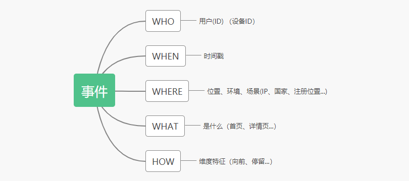

# 埋点

## 概念

所谓埋点是数据领域的专业术语，也是互联网应用里的一个俗称。它的学名应该叫做事件追踪，对应的英文是Event Tracking。

针对特定用户行为或事件进行捕获、处理和发送的相关技术及其实施过程。

## 目的

埋点是为了满足快捷、高效、丰富的数据应用而做的用户行为过程及结果记录。数据埋点是一种常用的数据采集的方法。埋点是数据的来源，采集的数据可以分析网站/APP的使用情况，用户行为习惯等，是建立用户画像、用户行为路径等数据产品的基础。

对于产品来说，用户在你的产品里做了什么、停留了多久、有什么异样，都是可以通过数据埋点来实现监控的。

1. 提高渠道转化：通过用户的操作序列，找到用户流失的节点
2. 改善产品：通过用户行为分析产品是否有问题，例如用户有没有因为设计按钮过多导致用户行为无效等问题，以此发现功能设计缺陷等。
3. 精准客户运营：对客户进行分组（例如有的喜欢打折购买，有的喜欢直接购买等），实现精准营销，发放优惠券等 
4. 完善客户画像：基本属性（性别、年龄、地区等），行为属性（设备操作习惯等） 
5. 数据分析：埋点作为原料放在数据仓库中。提供渠道转化、个性推荐等

## 分类

### 前后端埋点

#### 

## 参考

[埋点](https://www.jianshu.com/p/3e18c16373a2)

