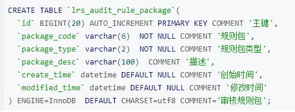
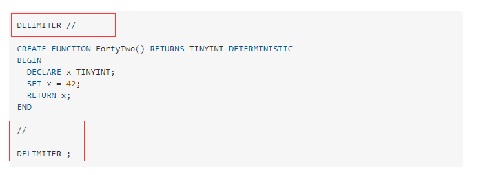

# mysql


## 安装


## 测试

客户端登录测试是否可以连接

```shell
mysql -h 127.0.0.1 -u root -p
```

**补充**: 命令行神器-mycli

```shell
pip install mycli
mycli -u 用户名 -h 主机名 -p 密码 --database 数据库
```


## 使用

### 创建数据库、用户

```mysql
create database nextcloud default charset utf8 collate utf8_general_ci;
grant all privileges on nextcloud.* to 'mass'@'%' identified by 'mass123';
flush privileges;

CREATE USER 'mass'@'%' IDENTIFIED BY 'mass123';

```


## 技巧

### 查看MySql库中所有表的大小和记录数

```mysql
SELECT TABLE_NAME,
       DATA_LENGTH,
       INDEX_LENGTH,
       (DATA_LENGTH + INDEX_LENGTH) AS LENGTH,
       TABLE_ROWS,
       CONCAT(ROUND((DATA_LENGTH + INDEX_LENGTH) / 1024 / 1024,3),'MB') AS total_size
FROM information_schema.TABLES
WHERE TABLE_SCHEMA = 'activiti6ui'
ORDER BY TABLE_ROWS desc;
```


### mysql执行.sql文件

```mysql
source /path/to/s.sql 或者 ./path/to/s.sql
```

### mysql联表更新

在MySQL中，可以在 UPDATE语句 中使用JOIN子句执行跨表更新。MySQL UPDATE JOIN的语法如下：

```mysql
UPDATE T1, T2,
[INNER JOIN | LEFT JOIN] T1 ON T1.C1 = T2. C1
SET T1.C2 = T2.C2, 
    T2.C3 = expr
WHERE condition
```

更详细地看看MySQL UPDATE JOIN语法：

首先，在UPDATE子句之后，指定主表(T1)和希望主表连接表(T2)。

第二，指定一种要使用的连接，即INNER JOIN或LEFT JOIN和连接条件。JOIN子句必须出现在UPDATE子句之后。

第三，要为要更新的T1和/或T2表中的列分配新值。

第四，WHERE子句中的条件用于指定要更新的行。

#### 示例

使用INNER JOIN子句的MySQL UPDATE JOIN示例

```mysql
mysql> select * from employees; -- 更新之前的数据
+--------+---------------+-------------+--------+
| emp_id | emp_name      | performance | salary |
+--------+---------------+-------------+--------+
|      1 | Mary Doe      |           1 |  50000 |
|      2 | Cindy Minsu   |           3 |  65000 |
|      3 | Sue Greenspan |           4 |  75000 |
|      4 | Grace Dell    |           5 | 125000 |
|      5 | Nancy Johnson |           3 |  85000 |
|      6 | John Doe      |           2 |  45000 |
|      7 | Lily Bush     |           3 |  55000 |
+--------+---------------+-------------+--------+
7 rows in set

mysql> UPDATE employees
        INNER JOIN
    merits ON employees.performance = merits.performance 
SET 
    salary = salary + salary * percentage; -- 执行连接更新
Query OK, 6 rows affected
Rows matched: 7  Changed: 6  Warnings: 0

mysql> select * from employees; -- 更新之后的数据
+--------+---------------+-------------+--------+
| emp_id | emp_name      | performance | salary |
+--------+---------------+-------------+--------+
|      1 | Mary Doe      |           1 |  50000 |
|      2 | Cindy Minsu   |           3 |  66950 |
|      3 | Sue Greenspan |           4 |  78750 |
|      4 | Grace Dell    |           5 | 135000 |
|      5 | Nancy Johnson |           3 |  87550 |
|      6 | John Doe      |           2 |  45450 |
|      7 | Lily Bush     |           3 |  56650 |
+--------+---------------+-------------+--------+
7 rows in set
```

**因为省略了 `UPDATE` 语句中的 `WHERE` 子句，所以 `employees`表中的所有记录都被更新。**如果需要 `performance` 等级大于1的员工才更新薪资，那么 `sql` 可以这样写：

```mysql
UPDATE employees
        INNER JOIN
    merits ON employees.performance = merits.performance 
SET 
    salary = salary + salary * percentage
WHERE employees.performance > 1;
```

使用LEFT JOIN的MySQL UPDATE JOIN示例

要计算新员工的工资，不能使用 `UPDATE INNER JOIN` 语句（为什么不能，可参考[sql之left join、right join、inner join的区别](https://www.jianshu.com/p/8edeed16cdd6)），因为它们的绩效数据在 `merits`表中不可用。这就是为什么要使用 `UPDATE LEFT JOIN` 来实现了。
当 `UPDATE LEFT JOIN` 语句在另一个表中没有相应行时，就会更新表中的一行。
例如，可以使用以下语句将新雇员的工资增加1.5％：

```mysql
-- 新加了两名员工，没有绩效考核信息
mysql> SELECT * FROM employees;
+--------+---------------+-------------+--------+
| emp_id | emp_name      | performance | salary |
+--------+---------------+-------------+--------+
|      1 | Mary Doe      |           1 |  50000 |
|      2 | Cindy Minsu   |           3 |  66950 |
|      3 | Sue Greenspan |           4 |  78750 |
|      4 | Grace Dell    |           5 | 135000 |
|      5 | Nancy Johnson |           3 |  87550 |
|      6 | John Doe      |           2 |  45450 |
|      7 | Lily Bush     |           3 |  56650 |
|      8 | Jack William  | NULL        |  43000 |
|      9 | Ricky Bond    | NULL        |  52000 |
+--------+---------------+-------------+--------+
9 rows in set

mysql> UPDATE employees
        LEFT JOIN
    merits ON employees.performance = merits.performance 
SET 
    salary = salary + salary * 0.015
WHERE
    merits.percentage IS NULL;
Query OK, 2 rows affected
Rows matched: 2  Changed: 2  Warnings: 0

mysql> select * from employees;
+--------+---------------+-------------+--------+
| emp_id | emp_name      | performance | salary |
+--------+---------------+-------------+--------+
|      1 | Mary Doe      |           1 |  50000 |
|      2 | Cindy Minsu   |           3 |  66950 |
|      3 | Sue Greenspan |           4 |  78750 |
|      4 | Grace Dell    |           5 | 135000 |
|      5 | Nancy Johnson |           3 |  87550 |
|      6 | John Doe      |           2 |  45450 |
|      7 | Lily Bush     |           3 |  56650 |
|      8 | Jack William  | NULL        |  43645 |
|      9 | Ricky Bond    | NULL        |  52780 |
+--------+---------------+-------------+--------+
9 rows in set
```

#### 附带建表语句

```mysql
CREATE DATABASE IF NOT EXISTS empdb;

USE empdb;
-- create tables
CREATE TABLE merits (
    performance INT(11) NOT NULL,
    percentage FLOAT NOT NULL,
    PRIMARY KEY (performance)
);

CREATE TABLE employees (
    emp_id INT(11) NOT NULL AUTO_INCREMENT,
    emp_name VARCHAR(255) NOT NULL,
    performance INT(11) DEFAULT NULL,
    salary FLOAT DEFAULT NULL,
    PRIMARY KEY (emp_id),
    CONSTRAINT fk_performance FOREIGN KEY (performance)
        REFERENCES merits (performance)
);

-- insert data for merits table
INSERT INTO merits(performance,percentage)
VALUES(1,0),
      (2,0.01),
      (3,0.03),
      (4,0.05),
      (5,0.08);

-- insert data for employees table
INSERT INTO employees(emp_name,performance,salary)      
VALUES('Mary Doe', 1, 50000),
      ('Cindy Minsu', 3, 65000),
      ('Sue Greenspan', 4, 75000),
      ('Grace Dell', 5, 125000),
      ('Nancy Johnson', 3, 85000),
      ('John Doe', 2, 45000),
      ('Lily Bush', 3, 55000);
      
-- --新增两名员工
INSERT INTO employees(emp_name,performance,salary)
VALUES('Jack William',NULL,43000),
      ('Ricky Bond',NULL,52000);

```

### 树形查询

使用自定义存储过程实现，通过父编码查询所有子节点数据。

```mysql
DELIMITER // 
CREATE  FUNCTION `findChildren`(rootId VARCHAR(400)) RETURNS varchar(4000) CHARSET utf8mb4 DETERMINISTIC
BEGIN
  DECLARE sTemp VARCHAR(4000);
  DECLARE sTempChd VARCHAR(4000);
  SET sTemp = '$';
  SET sTempChd = rootId;
  WHILE sTempChd is not null DO
    SET sTemp = CONCAT(sTemp,',',sTempChd);
    SELECT GROUP_CONCAT(id) INTO sTempChd FROM t_core_org
        WHERE FIND_IN_SET(parentid,sTempChd)>0;
  END WHILE;
  RETURN sTemp;
END
//  
DELIMITER ; 
```

### 增加工作日天数

```mysql
SELECT t.CREATEDTIME,
       DATE_ADD(t.CREATEDTIME, INTERVAL 16 DAY)          as simple,
       WEEKDAY(DATE_ADD(t.CREATEDTIME, INTERVAL 16 DAY)) as week,
       DATE_ADD(
               t.CREATEDTIME,
               INTERVAL (16 +
                         IF(
                                     (WEEK(t.CREATEDTIME) <> WEEK(DATE_ADD(t.CREATEDTIME, INTERVAL 16 DAY)))
                                     OR (WEEKDAY(DATE_ADD(t.CREATEDTIME, INTERVAL 16 DAY)) IN (5, 6)),
                                     2,
                                     0) + 16 div 5 * 2)
               DAY
           )                                             AS FinalDate
from t_core_org t;
```


## 函数

### 函数语法

```mysql
CREATE
    [DEFINER = user]
    PROCEDURE [IF NOT EXISTS] sp_name ([proc_parameter[,...]])
    [characteristic ...] routine_body

CREATE
    [DEFINER = user]
    FUNCTION [IF NOT EXISTS] sp_name ([func_parameter[,...]])
    RETURNS type
    [characteristic ...] routine_body

proc_parameter:
    [ IN | OUT | INOUT ] param_name type

func_parameter:
    param_name type

type:
    Any valid MySQL data type

characteristic: {
    COMMENT 'string'
  | LANGUAGE SQL
  | [NOT] DETERMINISTIC
  | { CONTAINS SQL | NO SQL | READS SQL DATA | MODIFIES SQL DATA }
  | SQL SECURITY { DEFINER | INVOKER }
}

routine_body:
    Valid SQL routine statement
```

### 函数调用

```mysql
mysql> delimiter //

mysql> CREATE PROCEDURE citycount (IN country CHAR(3), OUT cities INT)
       BEGIN
         SELECT COUNT(*) INTO cities FROM world.city
         WHERE CountryCode = country;
       END//
Query OK, 0 rows affected (0.01 sec)

mysql> delimiter ;

mysql> CALL citycount('JPN', @cities); -- cities in Japan
Query OK, 1 row affected (0.00 sec)

mysql> SELECT @cities;
+---------+
| @cities |
+---------+
|     248 |
+---------+
1 row in set (0.00 sec)

mysql> CALL citycount('FRA', @cities); -- cities in France
Query OK, 1 row affected (0.00 sec)

mysql> SELECT @cities;
+---------+
| @cities |
+---------+
|      40 |
+---------+
1 row in set (0.00 sec)


mysql> CREATE FUNCTION hello (s CHAR(20))
mysql> RETURNS CHAR(50) DETERMINISTIC
       RETURN CONCAT('Hello, ',s,'!');
Query OK, 0 rows affected (0.00 sec)

mysql> SELECT hello('world');
+----------------+
| hello('world') |
+----------------+
| Hello, world!  |
+----------------+
1 row in set (0.00 sec)

```


### 函数示例

#### 查找子

```mysql
CREATE DEFINER=`root`@`localhost` FUNCTION `empdb`.`findChildren`(rootId VARCHAR(100)) RETURNS varchar(4000) CHARSET utf8mb4
    DETERMINISTIC
BEGIN
  DECLARE sTemp VARCHAR(4000);
  DECLARE sTempChd VARCHAR(4000);
  SET sTemp = '$';
  SET sTempChd = rootId;
  WHILE sTempChd is not null DO
    SET sTemp = CONCAT(sTemp,',',sTempChd);
    SELECT GROUP_CONCAT(id) INTO sTempChd FROM t_core_org
        WHERE FIND_IN_SET(parentid,sTempChd)>0;
  END WHILE;
  RETURN sTemp;
END;
```

#### 获取当前系统时间

```mysql
select now() as Systime;
select current_date as Systime;
select sysdate() as Systime;
```


## 问题

- ERROR 1045 (28000): Access denied for user 'root'@'localhost' (using password: NO/YES)

修改my.in/my.cnf配置文件

　　　　进入mysql安装目录

　　　　编辑my.ini

　　　　在[mysqld]下添加skip-grant-tables，保存即可。


　　使用管理员身份打开命令行

　　①重启mysql：

　　　　systemctl restart mysqld


　　②进入mysql，登录
　　　　mysql -u root -p
　　　　不用输入密码，直接回车（出现Enter Password 也一样直接回车，即可登陆成功）


　　③输入use mysql，修改root的密码：
　　　　update user set authentication_string=password('新密码') where user='root';
　　　　flush privileges;


　　④退出：

　　　　quit;


　　⑤再次重启mysql：

　　　　systemctl restart mysqld


　　⑥测试是否成功就是是否登陆成功咯。
　　　　mysql -u root -p

　　　　Enter Password>'新密码'

- MySQL8服务无法启动，服务没有报告任何错误

免安装版mysql-8.0.15-winx64.zip

按照教程来安装，解压，增加my.ini文件，修改文件内部的地址信息，配置环境变量path，新建data文件夹（注意这里，就是这个位置出错了），以管理员身份运行cmd初始化，mysqld -install，net start mysql，启动mysql。

结果报错：

```shell
D:\develop\mysql\mysql-8.0.15-winx64\bin>net start mysql
mysql 服务正在启动 .
mysql 服务无法启动。

服务没有报告任何错误。

请键入 NET HELPMSG 3534 以获得更多的帮助。

# 删除 data文件夹 ，重新打开管理员身份的cmd
D:\develop\mysql\mysql-8.0.15-winx64\bin>mysqld --initialize --user=mysql --console
2022-01-05T11:53:49.564904Z 0 [System] [MY-013169] [Server] D:\develop\mysql\mysql-8.0.15-winx64\bin\mysqld.exe (mysqld 8.0.15) initializing of server in progress as process 29036
2022-01-05T11:53:52.732704Z 5 [Note] [MY-010454] [Server] A temporary password is generated for root@localhost: =7_8DGtv&gaJ
2022-01-05T11:53:53.906223Z 0 [System] [MY-013170] [Server] D:\develop\mysql\mysql-8.0.15-winx64\bin\mysqld.exe (mysqld 8.0.15) initializing of server has completed

D:\develop\mysql\mysql-8.0.15-winx64\bin>mysqld -install
The service already exists!
The current server installed: D:\develop\mysql\mysql-8.0.15-winx64\bin\mysqld.exe --defaults-file=../my.ini mysql

net start mysql

# 配置文件使用全路径！！！
D:\develop\mysql\mysql-8.0.15-winx64\bin>mysqld --remove
Service successfully removed.

D:\develop\mysql\mysql-8.0.15-winx64\bin>mysqld.exe --install mysql --defaults-file="D:\develop\mysql\mysql-8.0.15-winx64\my.ini"
Service successfully installed.
D:\develop\mysql\mysql-8.0.15-winx64\bin>net stop mysql
mysql 服务正在停止..
mysql 服务已成功停止。


D:\develop\mysql\mysql-8.0.15-winx64\bin>net start mysql
mysql 服务正在启动 .
mysql 服务已经启动成功。

```

- SQL 错误 [1064] [42000]: You have an error in your SQL syntax; check the manual that corresponds to your MySQL server version for the right syntax to use near '' at line 3
    You have an error in your SQL syntax; check the manual that corresponds to your MySQL server version for the right syntax to use near '' at line 3
    You have an error in your SQL syntax; check the manual that corresponds to your MySQL server version for the right syntax to use near '' at line 3

琢磨了半天，原来Mysql解释器一遇到;号时就结束，回车以后就执行了。但是现在并不希望Mysql这么做，因为存储过程中可能 包含很多分号的语句，所以怎么办了，很简单Mysql给我们提供了delimiter关键字，delimiter作用就是把;分号替换成指定的符号，比如//或$$。当再出现//或$$时，Mysql解释器才会执行命令。

- 单引号与反引号区别

在上述的sql语句中，列名称使用的是单引号而不是反引号，所以会就报了这个错误出来。修改后



再次运行就不会报错了，但是有一点需要注意，后面列的注释不能用反引号，因为这只是一个普通字符串，不是MySQL的关键字。

- [CREATE FUNCTION throws SQL Error (1064) (42000)](https://stackoverflow.com/questions/66262647/create-function-throws-sql-error-1064-42000)

添加`delimiter`



- 语法错误

列名称使用的是单引号而不是反引号，所以会就报了这个错误出来。


## 参考

[mysql8 官方文档](https://dev.mysql.com/doc/refman/8.0/en/examples.html)

