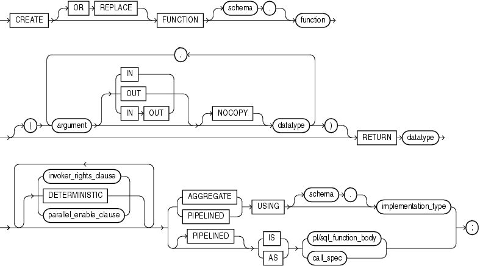
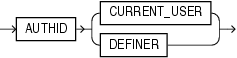
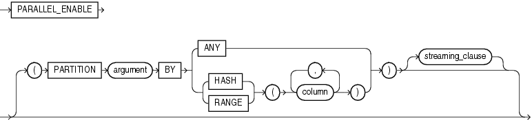
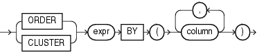
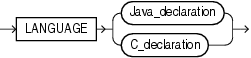
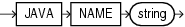
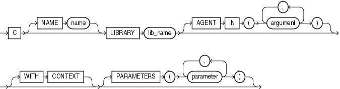
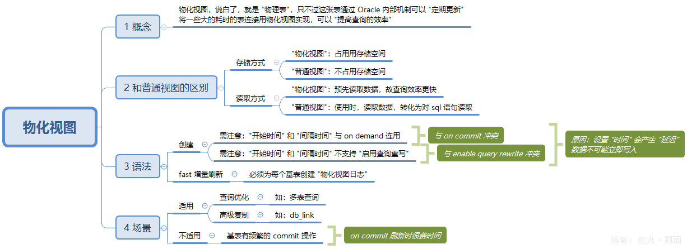

---

title: oracle基本使用
tags:
  - db
  - oracle
  - syntax
  - base
categories:
  - programming
  - db
date: 2022-01-11 09:20:28
---
# oracle 基本使用

## 函数

### 函数语法

*create_function*::=


[Description of the illustration create_function.gif](https://docs.oracle.com/cd/B19306_01/server.102/b14200/img_text/create_function.htm)

([**invoker_rights_clause\* ::=*](https://docs.oracle.com/cd/B19306_01/server.102/b14200/statements_5009.htm#i2182400), [**parallel_enable_clause\*::=*](https://docs.oracle.com/cd/B19306_01/server.102/b14200/statements_5009.htm#i2125846))

[**invoker_rights_clause** ](https://docs.oracle.com/cd/B19306_01/server.102/b14200/statements_5009.htm#i2062250)::=


[Description of the illustration invoker_rights_clause.gif](https://docs.oracle.com/cd/B19306_01/server.102/b14200/img_text/invoker_rights_clause.htm)

[**parallel_enable_clause**](https://docs.oracle.com/cd/B19306_01/server.102/b14200/statements_5009.htm#i2075081)::=


[Description of the illustration parallel_enable_clause.gif](https://docs.oracle.com/cd/B19306_01/server.102/b14200/img_text/parallel_enable_clause.htm)

*streaming_clause*::=


[Description of the illustration streaming_clause.gif](https://docs.oracle.com/cd/B19306_01/server.102/b14200/img_text/streaming_clause.htm)

*call_spec*::=


[Description of the illustration call_spec.gif](https://docs.oracle.com/cd/B19306_01/server.102/b14200/img_text/call_spec.htm)

*Java_declaration*::=


[Description of the illustration Java_declaration.gif](https://docs.oracle.com/cd/B19306_01/server.102/b14200/img_text/Java_declaration.htm)

*C_declaration*::=


[Description of the illustration C_declaration.gif](https://docs.oracle.com/cd/B19306_01/server.102/b14200/img_text/C_declaration.htm)

### 函数示例

```sql
CREATE FUNCTION get_bal(acc_no IN NUMBER) 
   RETURN NUMBER 
   IS acc_bal NUMBER(11,2);
   BEGIN 
      SELECT order_total 
      INTO acc_bal 
      FROM orders 
      WHERE customer_id = acc_no; 
      RETURN(acc_bal); 
    END;
/
```


### 函数中声明临时变量

```sql
CREATE OR REPLACE FUNCTION CASICZS.GETREPORTROOMNAME2(OUTPUTNO IN VARCHAR2, PAYORGNAME IN VARCHAR2,OUTPUTTYPE IN VARCHAR2) RETURN VARCHAR2 IS 

tempSub11 varchar2(1) := SUBSTR(OUTPUTNO, 1, 1);
tempSub111 varchar2(1) := SUBSTR(OUTPUTNO, 11, 1);
tempSub41 varchar2(1) := SUBSTR(OUTPUTNO, 4, 1);
tempSub12 varchar2(2) := SUBSTR(OUTPUTNO, 1, 2);
retval varchar2(64);
BEGIN
	
	IF tempSub11='1' THEN
		retval :='一室';
	ELSIF tempSub11='2' THEN
		IF tempSub111='2' THEN
			retval :='17所联合试验室';
		ELSIF tempSub111='3' THEN
			retval :='窦店联合试验室';
		ELSIF tempSub111='4' THEN
			retval :='成都719联合试验室';
		ELSE retval :='环境与可靠性事业部';
		END IF;
	ELSIF tempSub11='3'  THEN
		retval :='理化分析与无损检测事业部（理化）';
	ELSIF tempSub11='7' THEN
		retval :='理化分析与无损检测事业部（无损）';
	ELSIF tempSub11='4' THEN
		retval :='四室';
	ELSIF tempSub11='5' THEN
		IF tempSub111='2' THEN
			retval :='17所联合试验室';
		ELSIF tempSub111='3' THEN
			retval :='窦店联合试验室';
		ELSIF tempSub111='4' THEN
			retval :='成都719联合试验室';
		ELSE retval :='五室';
		END IF;
	ELSIF tempSub11='8' THEN
		retval :='八室';
	ELSIF tempSub11='9' THEN
		retval :='九室';
	ELSIF tempSub11='T' THEN
		retval :='元器件检测长沙分中心';
	ELSIF tempSub11='C' THEN
		retval :='元器件检测长沙分中心';
		IF SUBSTR(OUTPUTNO,4, 1)='1' THEN
			retval :='元器件检测成都分中心';
		ELSIF tempSub41='2' THEN
			retval :='一室';
		ELSIF tempSub41='3' THEN
			retval :='八室';
		ELSIF tempSub41='4' THEN
			retval :='元器件检测成都分中心';		
		END IF;
	END IF;
	IF PAYORGNAME='北京机电工程总体设计部' THEN
		IF  OUTPUTTYPE='environment' THEN--环境类产值
			IF tempSub12!='2W' THEN
				retval :='四部联合试验室';
			END IF;		
		ELSIF  OUTPUTTYPE='component' THEN
			retval :='四部联合试验室';
		END IF;
	END IF;
RETURN retval;
END GETREPORTROOMNAME2;
```


#### 增加工作日天数

```sql
CREATE OR REPLACE FUNCTION ADD_BUS_DAYS(P_DATE IN DATE
                                                  , P_ADD_NUM IN INTEGER) RETURN DATE AS
    V_CNT     NUMBER;
    V_BUS_DAY DATE := TRUNC(P_DATE);
BEGIN
    SELECT MAX(RNUM)
      INTO V_CNT
      FROM (SELECT ROWNUM RNUM
              FROM ALL_OBJECTS)
     WHERE ROWNUM <= P_ADD_NUM
       AND TO_CHAR(V_BUS_DAY + RNUM, 'DY') NOT IN ('SAT', 'SUN')
       AND NOT EXISTS
         (SELECT 1
            FROM HOLIDAYS
           WHERE HOLIDAY = V_BUS_DAY + RNUM);
    V_BUS_DAY := V_BUS_DAY + V_CNT;
    RETURN V_BUS_DAY;
END ADD_BUS_DAYS;
```


## 视图

### 物化视图

**小提示：要想创建 "物化视图，至少具有 ‘CREATE MATERIALIZED VIEW’ 权限"**

```
-- 权限查询，非 DBA 用户，则使用 user_sys_privs 即可
SELECT * FROM dba_sys_privs t WHERE t.privilege LIKE '%MATERIALIZED%';
grant create materialized view to scott; -- 授权
revoke create materialized view from scott; -- 回收


drop materialized view 物化视图名;

1. 查询物化视图，非 DBA 用户，请查询 all_mviews 或 user_mviews
SELECT *
  FROM dba_mviews t
 WHERE t.owner = 'SCOTT'
   AND t.mview_name = 'MVW_PERSON_INFO';
2. 查询一般视图
SELECT * FROM dba_views;

```



#### 语法

```sql
create materialized view 物化视图名        -- 1. 创建物化视图
build [immediate | deferred] 			  -- 2. 创建方式，默认 immediate
refresh [force | fast | complete | never] -- 3. 物化视图刷新方式，默认 force
on [commit | demand] 					  -- 4. 刷新触发方式
start with 开始时间						  -- 5. 设置开始时间
next 间隔时间				              -- 6. 设置间隔时间
with [primary key | rowid]                -- 7. 类型，默认 primary key
[enable | disable] query rewrite          -- 8. 是否启用查询重写
as	                                      -- 9. 关键字
查询语句;                                  -- 10. select 语句


1. "创建 build" 的方式
	(1) 'immediate'：立即生效，默认。
	(2) 'deferred' : 延迟至第一次 refresh 时才生效
2. "刷新 refresh" 的方式
	(1) force	：默认。如果可以 '快速刷新' 就 '快速刷新'，否则执行 '完全刷新'
	(2) fast	：'快速刷新'。只刷新 '增量' 部分（前提：创建 '物化日志'）
	(3) complete: '完全刷新'。刷新时更新全部数据，包括视图中已经生成的原有数据
	(4) never	: 从不刷新	
3. "触发" (请注意，on demand 中，才需要设置 '开始时间' 和 '间隔时间') -- 冲突
	(1) on commit：基表有 commit 动作时，刷新刷图（"不能跨库执行"）
	(2) on demand：在需要时刷新
			       [1] 根据后面设定的 '开始时间' 和 '结束时间' 进行刷新
			       [2] 手动调用 dbms_mview 包中的过程进行刷新			       
4. 基于基表的 primary key 或 rowid 创建
	(1) 如果是基于 rowid，则不能对基表执行 '分组函数'、'多表连接' 等需要把
	    多个 rowid 合成一行的操作（理由很简单：到底以哪个 rowid 为准呢？）
5. enable query rewrite 启用查询重写（请注意， '开始时间' 和 '间隔时间' 不支持）-- 冲突
	(1) 不支持的理由也很简单。
		所谓的 '重写'，就是讲对基表的查询定位到物化视图上，
		而 '开始时间' 和 '间隔时间' 会造成物化视图上部分数据延迟，所以，不能重写
	(2) 参数: query_rewrite_enabled (可通过 v$parameter 视图查询)
```


#### 示例

##### 创建物化视图：每 3 分钟刷新一次

```sql
CREATE MATERIALIZED VIEW mvw_person_info 
BUILD IMMEDIATE
REFRESH FORCE
ON DEMAND
START WITH SYSDATE
NEXT SYSDATE + 3/1440
AS
SELECT pi.person_no,    
       pi.name,
       pi.create_date
  FROM person_info pi;
```

##### 手动刷新物化视图

```sql
BEGIN
   dbms_mview.refresh(list                 => '视图名',
                      method               => 'fast', -- 增量刷新
                      refresh_after_errors => TRUE);
END;
```

## 技巧

### 联表更新

```sql
-- -- 方法1
UPDATE T2
   SET T2.C =
       (SELECT B FROM T1 WHERE T1.A = T2.A)
 WHERE EXISTS (SELECT 1 FROM T1 WHERE T1.A = T2.A)
-- -- 方法2
update student A  
set (A.name,a.dq) =  
(select B.bname,b.bdq  
from newstudent B  
where B.Bid = A.id  
and A.dq = 10 
)  
where exists (select 1  
from newstudent B  
where B.Bid = A.id  
and A.dq = 10 
);  
-- -- 方法3
MERGE INTO T2
USING T1
ON (T2.A = T1.A)
WHEN MATCHED THEN
  UPDATE SET T2.C = T1.B
```

### 字符串处理

#### 拆分字符串

```sql
SUBSTR(FI.TARGETID,0,INSTR(FI.TARGETID,'$') -1) TABLE,
                       SUBSTR(FI.TARGETID,INSTR(FI.TARGETID,'$') + 1 ) BIZID
```

SUBSTR（string,start_position,[length]）  求子字符串，返回字符串

 解释：string 元字符串

​    start_position  开始位置（从0开始）

​    length 可选项，子字符串的个数

INSTR（string,subString,position,ocurrence）查找字符串位置

解释：string：源字符串

   subString：要查找的子字符串

   position：查找的开始位置

   ocurrence：源字符串中第几次出现的子字符串

## 参考

- [计算工作天数](https://blogs.oracle.com/sql/post/how-to-find-the-next-business-day-and-add-or-subtract-n-working-days-with-sql)
