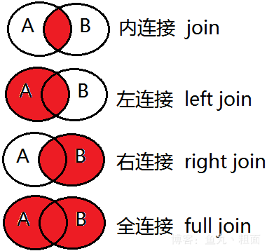
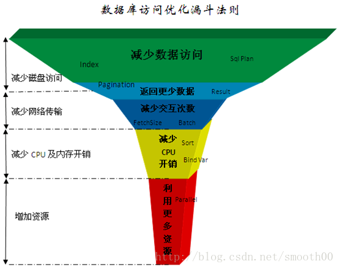
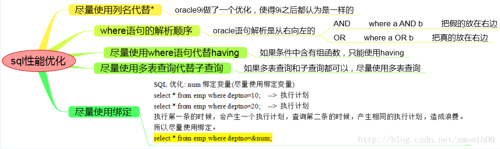
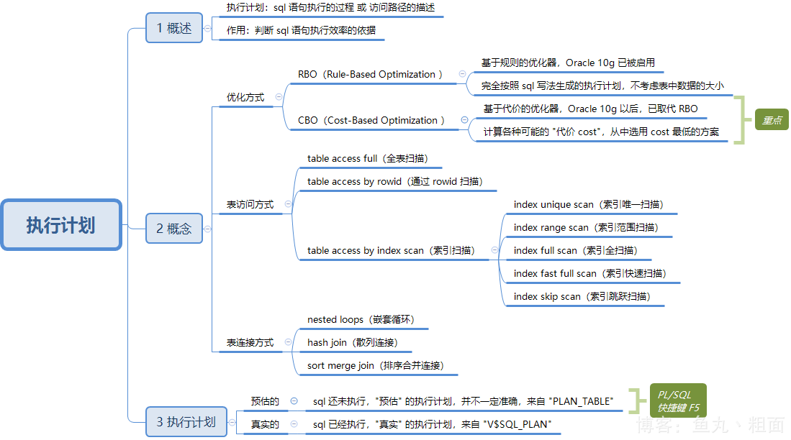
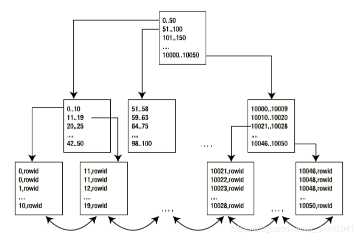

# sql调优


## 概念

### SQL语句执行步骤

语法分析> 语义分析> 视图转换 >表达式转换> 选择优化器 >选择连接方式 >选择连接顺序 >选择数据的搜索路径 >运行“执行计划”。

### Oracle优化器

选用适合的Oracle优化器RULE（基于规则）、 COST（基于成本） 、CHOOSE（选择性）

### 共享 SQL 语句

### 全表扫描 与 索引扫描
### 表连接类型

咱写 sql 语句时，表之间的关联关系

(1) 内连接  inner join，简写 join
(2) 左连接  left  join
(3) 右连接  right join
(4) 全连接  full  join

红色：表连接后的结果集:



### 表连接方式

执行计划里面的表连接方式.

(1) 嵌套循环    nested loops
(2) 哈希连接    hash join
(3) 排序合并连接 sort merge join
(4) 笛卡尔积    cartesian product

Driving Table（驱动表）：执行计划最先执行的那个表 */\*+ leading(t1)\*/* 
Probed Table（匹配表）：与驱动表进行连接的表 

#### nested loops

```
1. 工作原理
   驱动表 t1，有 m 条记录
   匹配表 t2，有 n 条记录

   for i in 1 .. m loop
     for j in 1 .. n loop
       if t1[i].col = t2[j].col then
          匹配成功;
       end if;
     end loop;  
   end loop; 

2. 结论
   (1) T1 表每返回一条记录，都要去 T2 表去轮询一次，得到与其匹配的数据，推送到结果集中
       所以，在嵌套表循环的使用中，必须设置 '返回记录少' 的表作为驱动表
       
   (2) 可以通过以下两点来提高嵌套循环的速度
       第一：尽量提高 T1 表 '取'  记录的速度(T1 表的连接列上创建索引)
       第二：尽量提高 T2 表 '匹配' 记录的速度(T2 表的连接列上创建索引)

3. 示例
   scott.emp  -- 14 条记录
   scott.dept -- 4 条记录

SQL> alter session set statistics_level = all;

SQL> select /*+ leading(d) use_nl(e)*/
            e.*,
            d.*
       from scott.emp  e,
            scott.dept d
      where d.deptno = e.deptno;

SQL> select t.*
       from v$sql t
      where t.sql_text like '%FROM scott.emp  e,%'
      order by t.last_active_time desc;
 
SQL> select * from table(dbms_xplan.display_cursor('c2ckftf2gj7qv',null,'allstats last')); 

-- -- 情况1：以 scott.dept（小表） 为驱动表
-------------------------------------------------------------------------------------
| Id  | Operation          | Name | Starts | E-Rows | A-Rows |   A-Time   | Buffers |
-------------------------------------------------------------------------------------
|   0 | SELECT STATEMENT   |      |      1 |        |     14 |00:00:00.02 |      35 |
|   1 |  NESTED LOOPS      |      |      1 |     14 |     14 |00:00:00.02 |      35 |
|   2 |   TABLE ACCESS FULL| DEPT |      1 |      4 |      4 |00:00:00.02 |       7 |
|*  3 |   TABLE ACCESS FULL| EMP  |      4 |      4 |     14 |00:00:00.01 |      28 |
-------------------------------------------------------------------------------------
Predicate Information (identified by operation id):
---------------------------------------------------
   3 - filter("D"."DEPTNO"="E"."DEPTNO")

Starts  	该 sql 执行的次数
E-Rows  	预计返回的行数
A-Rows  	实际返回的行数。可以和 E-Rows 比对，确定哪一步出现了问题
A-Time 	 	每一步实际执行的时间
Buffers 	每一步实际执行的逻辑读或一致性读
Reads		每一步实际执行的物理读
Writes      每一步实际执行的物理写
OMem		最优执行模式所需的内存评估值
1Mem		one-pass模式所需的内存评估值
Used_Mem	则为当前操作实际执行时消耗的内存
			括号里面为(发生磁盘交换的次数,1次即为One-Pass,大于1次则为Multi_Pass,如果没有使用磁盘，则显示0)


1. 首先，读取 id = 2 的记录，如下：
   读取表 DEPT，读取次数 Starts = 1，实际读取记录数 A-Rows = 4 条

2. 其次，读取 id = 3 的记录，如下：
   读取表 EMP，读取次数 Starts = 4，实际读取记录数（每次） A-Rows = 14 条 

3. 然后，读取 id = 1，将两表进行 '嵌套循环'

4. 最后，读取 id = 0，查询最终结果

-- -- 情况2：同理，以 scott.emp（“大表”） 为驱动表，Starts = 14（id=4），变多了：
--------------------------------------------------------------------------------------------------
| Id  | Operation                    | Name    | Starts | E-Rows | A-Rows |   A-Time   | Buffers |
--------------------------------------------------------------------------------------------------
|   0 | SELECT STATEMENT             |         |      1 |        |     14 |00:00:00.01 |      25 |
|   1 |  NESTED LOOPS                |         |      1 |        |     14 |00:00:00.01 |      25 |
|   2 |   NESTED LOOPS               |         |      1 |     14 |     14 |00:00:00.01 |      11 |
|   3 |    TABLE ACCESS FULL         | EMP     |      1 |     14 |     14 |00:00:00.01 |       7 |
|*  4 |    INDEX UNIQUE SCAN         | PK_DEPT |     14 |      1 |     14 |00:00:00.01 |       4 |
|   5 |   TABLE ACCESS BY INDEX ROWID| DEPT    |     14 |      1 |     14 |00:00:00.01 |      14 |
--------------------------------------------------------------------------------------------------
```

#### hash join

```
SELECT /*+ leading(e) use_hash(d)*/
 e.*,
 d.*
  FROM scott.emp  e,
       scott.dept d
 WHERE d.deptno = e.deptno;

--------------------------------------------------------------------------------------------------
| Id  | Operation                    | Name    | Starts | E-Rows | A-Rows |   A-Time   | Buffers |
--------------------------------------------------------------------------------------------------
|   0 | SELECT STATEMENT             |         |      1 |        |     14 |00:00:00.01 |      25 |
|   1 |  NESTED LOOPS                |         |      1 |        |     14 |00:00:00.01 |      25 |
|   2 |   NESTED LOOPS               |         |      1 |     14 |     14 |00:00:00.01 |      11 |
|   3 |    TABLE ACCESS FULL         | EMP     |      1 |     14 |     14 |00:00:00.01 |       7 |
|*  4 |    INDEX UNIQUE SCAN         | PK_DEPT |     14 |      1 |     14 |00:00:00.01 |       4 |
|   5 |   TABLE ACCESS BY INDEX ROWID| DEPT    |     14 |      1 |     14 |00:00:00.01 |      14 |
--------------------------------------------------------------------------------------------------
```

#### merge

```
SELECT /*+ leading(e) use_merge(d)*/
 e.*,
 d.*
  FROM scott.emp  e,
       scott.dept d
 WHERE d.deptno = e.deptno;

--------------------------------------------------------------------------------------
| Id  | Operation           | Name | Starts | E-Rows | A-Rows |   A-Time   | Buffers |
--------------------------------------------------------------------------------------
|   0 | SELECT STATEMENT    |      |      1 |        |     14 |00:00:00.01 |      14 |
|   1 |  MERGE JOIN         |      |      1 |     14 |     14 |00:00:00.01 |      14 |
|   2 |   SORT JOIN         |      |      1 |     14 |     14 |00:00:00.01 |       7 |
|   3 |    TABLE ACCESS FULL| EMP  |      1 |     14 |     14 |00:00:00.01 |       7 |
|*  4 |   SORT JOIN         |      |     14 |      4 |     14 |00:00:00.01 |       7 |
|   5 |    TABLE ACCESS FULL| DEPT |      1 |      4 |      4 |00:00:00.01 |       7 |
--------------------------------------------------------------------------------------
```


## 思路

**切记，性能优化是无止境的，当性能可以满足需求时即可，不要过度优化**

计算机系统硬件性能从高到代依次为：CPU——Cache(L1-L2-L3)——内存——SSD硬盘——网络——硬盘。

CPU及内存：缓存数据访问、比较、排序、事务检测、SQL解析、函数或逻辑运算；

网络：结果数据传输、SQL请求、远程数据库访问（dblink);

硬盘：数据访问、数据写入、日志记录、大数据量排序、大表连接.




| 优化法则          | 性能提升效 | 优化成本 |
| ----------------- | ---------- | -------- |
| 减少数据访问      | 1~1000     | 低       |
| 返回更少数据      | 1~100      | 低       |
| 减少交互次数      | 1~20       | 低       |
| 减少服务器CPU开销 | 1~5        | 低       |
| 利用更多资源      | @~10       | 高       |

## 减少数据访问

### 创建并使用正确的索引

## 返回更少数据  

### 数据分页处理

客户端分页

应用服务器分页

数据库sql分页

### 只返回需要的字段

## 减少交互次数

### In List

### batch DML

### 设置Fetch Size

### 使用存储过程

## 减少服务器CPU开销  

### 使用绑定变量

### 合理使用排序

可能会发生排序操作的SQL语法：

Order by

Group by

Distinct

Exists子查询

Not Exists子查询

In子查询

Not In子查询

Union（并集），Union All 也是一种并集操作，但是不会发生排序，如果你确认两个数据集不需要执行去除重复数据操作，那请使用Union All 代替Union。

Minus（差集）

Intersect（交集）

Create Index

Merge Join，这是一种两个表连接的内部算法，执行时会把两个表先排序好再连接，应用于两个大表连接的操作。如果你的两个表连接的条件都是等值运算，那可以采用Hash Join来提高性能，因为Hash Join使用Hash 运算来代替排序的操作.

### 减少比较操作

### 大量复杂运算在客户端处理

什么是复杂运算，一般我认为是一秒钟CPU只能做10万次以内的运算。如含小数的对数及指数运算、三角函数、3DES及BASE64数据加密算法等等。

如果有大量这类函数运算，尽量放在客户端处理，一般CPU每秒中也只能处理1万-10万次这样的函数运算，放在数据库内不利于高并发处理.

## 利用更多资源  

### 客户端多进程并行访问

以下是一些如何设置并行数的基本建议：

如果瓶颈在服务器主机，但是主机还有空闲资源，那么最大并行数取主机CPU核数和主机提供数据服务的磁盘数两个参数中的最小值，同时要保证主机有资源做其它任务。

如果瓶颈在客户端处理，但是客户端还有空闲资源，那建议不要增加SQL的并行，而是用一个进程取回数据后在客户端起多个进程处理即可，进程数根据客户端CPU核数计算。

如果瓶颈在客户端网络，那建议做数据压缩或者增加多个客户端，采用map reduce的架构处理。

如果瓶颈在服务器网络，那需要增加服务器的网络带宽或者在服务端将数据压缩后再处理了。

### 数据库并行处理


## 调优项



### from子句-从右往左

ORACLE的解析器按照从右到左的顺序处理FROM子句中的表名，因此FROM子句中写在最后的表(基础表 driving table)将被最先处理。

当ORACLE处理多个表时，会运用排序及合并的方式连接它们，并且是从右往左的顺序处理FROM子句。首先，扫描第一个表(FROM子句中最后的那个表)并对记录进行排序，然后扫描第二个表(FROM子句中倒数第二个表)，最后将所有从第二个表中检索出的记录与第一个表中合适记录进行合并。

只在基于规则的优化器中有效。


####  使用表的别名（Alias）

当在SQL语句中连接多个表时, 请使用表的别名并把别名前缀于每个Column上.这样一来,就可以减少解析的时间并减少那些由Column歧义引起的语法错误。Column歧义指的是由于SQL中不同的表具有相同的Column名,当SQL语句中出现这个Column时,SQL解析器无法判断这个Column的归属。


### where子句-从右往左

Where子句中的连接顺序Oracle采用自下而上或自右向左的顺序解析WHERE子句。根据这个原理,表之间的连接必须写在其他WHERE条件之前，那些可以过滤掉最大数量记录的条件必须写在WHERE子句的末尾

举例：TAB1有 16,384 条记录，TAB2 有 1 条记录

```sql
/*选择TAB2作为基础表 (最好的方法)*/
SELECT COUNT(*) FROM TAB1,TAB2
/*执行时间0.96秒*/

/*选择TAB1作为基础表 (不佳的方法)*/
SELECT COUNT(*) FROM TAB2,TAB1 
/*执行时间26.09秒*/
```

#### 用Where子句替换Having子句

避免使用HAVING子句，HAVING 只会在检索出所有记录之后才对结果集进行过滤。这个处理需要排序、总计等操作。如果能通过WHERE子句限制记录的数目，就能减少这方面的开销。

#### 用EXISTS替换DISTINCT

当提交一个包含对多表信息（比如部门表和雇员表）的查询时，避免在SELECT子句中使用DISTINCT。一般可以考虑用EXIST替换。EXISTS 使查询更为迅速，因为RDBMS核心模块将在子查询的条件一旦满足后，立刻返回结果

#### 用EXISTS替代IN 用NOT EXISTS替代NOT IN

####  用表连接替换EXISTS


#### 尽量使用数字型字段

若只含数值信息的字段尽量不要设计为字符型，这会降低查询和连接的性能，并会增加存储开销。这是因为引擎在处理查询和连 接时会逐个比较字符串中每一个字符，而对于数字型而言只需要比较一次就够了


## 用Explain Plan分析SQL语句

[SQL](https://so.csdn.net/so/search?q=SQL&spm=1001.2101.3001.7020)是一种傻瓜式语言，每一个条件就是一个需求，访问的顺序不同就形成了不同的执行计划。Oracle必须做出选择，一次只能有一种访问路径。***执行计划是一条查询语句在Oracle中的执行过程或访问路径的描述***。



### 访问方式

#### table access full（全表扫描）

- Oracle 会读取表中所有的行，并检查每一行是否满足 where 限制条件。
- 全表扫描时可以使用多块读（一次 I/O 读取多块数据块）操作，提升吞吐量。

- 使用建议：数据量太大的表不建议使用全表扫描，除非本身需要取出的数据较多，占到表数据总量的 5% ~ 10% 或以上。

#### table access by rowid（通过 rowid 扫描）

- rowid：伪列，Oracle 自带的，不会存储 rowid 的值，不能被增、删、改
- 一旦一行数据插入后，则其对应的 rowid 在该行的生命周期内是唯一的，即使发生行迁移，该行的 rowid 值也不变。

#### table access by index scan（索引扫描）



- 在索引块中，既存储每个索引的键值，也存储具有该键值行的 rowid
- 所以索引扫描其实分为两步：
  - 扫描索引得到对应的 rowid
  - 通过 rowid 定位到具体的行读取数据

###### index unique scan（索引唯一扫描）

- 每次至多返回一条记录
- 有下列两种情况（当查询字段有下列约束时）
  - unique
  - primary key

###### index range scan（索引范围扫描）

- 每次至少返回一条记录
- 一般有下列三种情况
  - 在唯一索引列上使用了范围操作符（如：> < >= <= between）
  - 在组合索引上，只使用部分列进行查询（查询时必须包含前导列，否则会走全表扫描）
  - 对非唯一索引列上进行的任何查询

###### index full scan（索引全扫描）

- order by 唯一索引列

###### index fast full scan（索引快速扫描）

- 与 index full scan 类似，只是不进行排序

###### index skip scan（索引跳跃扫描）

- 必须是 组合索引
- 除了前导列（索引中第一列）外的其他列作为条件

### 提示（Hints）

- FULL hint 告诉ORACLE使用全表扫描的方式访问指定表。
- INDEX Hint 告诉ORACLE使用基于索引的扫描方式。
- ROWID hint 告诉ORACLE使用TABLE ACCESS BY ROWID的操作访问表。
- CACHE hint 来告诉优化器把查询结果数据保留在SGA中。

### SQL什么条件会使用索引？

当字段上建有索引时，通常以下情况会使用索引：

INDEX_COLUMN = ?

INDEX_COLUMN > ?

INDEX_COLUMN >= ?

INDEX_COLUMN < ?

INDEX_COLUMN <= ?

INDEX_COLUMN between ? and ?

INDEX_COLUMN in (?,?,...,?)

INDEX_COLUMN like ?||'%'（后导模糊查询）

T1. INDEX_COLUMN=T2. COLUMN1（两个表通过索引字段关联）

### SQL什么条件不会使用索引？

| 查询条件                                                     | 不能使用索引原因                                             |
| :----------------------------------------------------------- | :----------------------------------------------------------- |
| INDEX_COLUMN <> ? INDEX_COLUMN not in (?,?,...,?)            | 不等于操作不能使用索引                                       |
| function(INDEX_COLUMN) = ? INDEX_COLUMN + 1 = ? INDEX_COLUMN \|\| 'a' = ? | 经过普通运算或函数运算后的索引字段不能使用索引               |
| INDEX_COLUMN like '%'\|\|? INDEX_COLUMN like '%'\|\|?\|\|'%' | 含前导模糊查询的Like语法不能使用索引                         |
| INDEX_COLUMN is null                                         | B-TREE索引里不保存字段为NULL值记录，因此IS NULL不能使用索引  |
| NUMBER_INDEX_COLUMN='12345' CHAR_INDEX_COLUMN=12345          | Oracle在做数值比较时需要将两边的数据转换成同一种数据类型，如果两边数据类型不同时会对字段值隐式转换，相当于加了一层函数处理，所以不能使用索引。 |
| a.INDEX_COLUMN=a.COLUMN_1                                    | 给索引查询的值应是已知数据，不能是未知字段值。               |
| 注：经过函数运算字段的字段要使用可以使用函数索引，这种需求建议与DBA沟通。有时候我们会使用多个字段的组合索引，如果查询条件中第一个字段不能使用索引，那整个查询也不能使用索引如：我们company表建了一个id+name的组合索引，以下SQL是不能使用索引的Select * from company where name=?Oracle9i后引入了一种index skip scan的索引方式来解决类似的问题，但是通过index skip scan提高性能的条件比较特殊，使用不好反而性能会更差。 |                                                              |

#### 索引列不能 is null

应尽量避免在 where 子句中对字段进行 null 值判断，否则将导致引擎放弃使用索引而进行全表扫描。

#### 索引列不能 not （如使用 != 或 <> 操作符）

索引只能告诉你什么存在于表中，而不能告诉你什么不存在于表中.

#### 索引列不能使用函数

使用函数将停用索引

#### 等式比较优先于范围比较

```sql
SELECT ENAME FROM EMP
WHERE DEPTNO > 20
AND EMP_CAT = 'A'
```

#### 避免在索引列上使用计算

WHERE子句中，如果索引列是函数的一部分。优化器将不使用索引而使用全表扫描。

如果在 where 子句中使用参数，也会导致全表扫描。因为SQL只有在运行时才会解析局部变量，但优化程序不能将访问计划的选择推迟到运行时；它必须在编译时进行选择。然 而，如果在编译时建立访问计划，变量的值还是未知的，因而无法作为索引选择的输入项。应尽量避免在 where 子句中对字段进行表达式操作，这将导致引擎放弃使用索引而进行全表扫描。

#### 避免在索引列上使用NOT

我们要避免在索引列上使用NOT，NOT会产生在和在索引列上使用函数相同的影响。当ORACLE遇到NOT，它就会停止使用索引转而执行全表扫描。

#### 用 >= 替代

```sql
/*高效SQL*/
SELECT * FROM EMP
WHERE DEPTNO >=4
```

```sql
/*低效SQL*/
SELECT * FROM EMP
WHERE DEPTNO >3
```

两者的区别在于，前者DBMS将直接跳到第一个DEPT等于4的记录，而后者将首先定位到DEPTNO等于3的记录并且向前扫描到第一个DEPT大于3的记录。

#### 用Union替换OR（适用于索引列）

对索引列使用OR将造成全表扫描。注意，以上规则只针对多个索引列有效。

```sql
select id from t where num=10 or Name = 'admin'
可以这样查询：
select id from t where num = 10
union all
select id from t where Name = 'admin'
```


#### 用IN替换OR

####  避免在索引列上使用is null和is not null

```sql
/*低效SQL：（索引失效）*/
SELECT * FROM DEPARTMENT
WHERE DEPT_CODE IS NOT NULL;
```

```sql
/*高效SQL：（索引有效）*/
SELECT * FROM DEPARTMENT
WHERE DEPT_CODE >=0;
```

#### 使用UNION ALL替代UNION

当SQL语句需要UNION两个查询结果集合时，这两个结果集合会以UNION-ALL的方式被合并，然后在输出最终结果前进行排序。如果用UNION ALL替代UNION，这样排序就不是必要了，效率就会因此得到提高。


### DML

#### 使用Truncate而非Delete

- Delete表中记录的时候，Oracle会在Rollback段中保存删除信息以备恢复。Truncate删除表中记录的时候不保存删除信息，不能恢复。因此Truncate删除记录比Delete快，而且占用资源少。
- 删除表中记录的时候，如果不需要恢复的情况之下应该尽量使用Truncate而不是Delete。
- Truncate仅适用于删除全表的记录

#### 尽量多使用COMMIT

COMMIT所释放的资源：

- 回滚段上用于恢复数据的信息.
- 被程序语句获得的锁
- redo log buffer 中的空间
- ORACLE为管理上述3种资源中的内部花费


## oracle 调优过程


```sql
-- -- 获取执行计划
explain plan for select * from dual;

select * from table(dbms_xplan.display());
select * from table( dbms_xplan.display_cursor('&sql_id') );

```


```sql
-- -- 查找对应sql的sql_id
SELECT * FROM v$sql t;
SELECT sql_id,
       sql_text,
       LAST_LOAD_TIME
FROM v$sql
WHERE sql_text LIKE '%本年度小计%'
ORDER BY LAST_LOAD_TIME DESC

-- -- 根据sql_id创建该sql的调优任务
DECLARE
 my_task_name VARCHAR2(50);
 my_sql_id   VARCHAR2(64);
BEGIN
 my_sql_id := '7t59r6bvu83r5';
 my_task_name := DBMS_SQLTUNE.CREATE_TUNING_TASK(
         sql_id    => my_sql_id,
         scope       => 'COMPREHENSIVE',
         time_limit  => 180,
         task_name   => my_sql_id,
         description => 'Task to tune a query on a specified table');
END;

-- -- 执行调优任务
BEGIN
  DBMS_SQLTUNE.EXECUTE_TUNING_TASK( task_name => '7t59r6bvu83r5');
end;

-- -- 查看调优报告
SELECT DBMS_SQLTUNE.REPORT_TUNING_TASK( '7t59r6bvu83r5') from DUAL;

-- -- 调优报告一般建议修改profile文件
BEGIN
	dbms_sqltune.accept_sql_profile(task_name => '7t59r6bvu83r5',
            task_owner => 'CASICZS', replace => TRUE);
end;

-- -- 删除调优任务
BEGIN  dbms_sqltune.drop_tuning_task('my_sql_tuning_&sqlid'); END;

```


## 参考

[Oracle数据库访问性能优化](https://smooth.blog.csdn.net/article/details/79339751)

[Oracle 性能优化总结](https://cloud.tencent.com/developer/article/1559444)

[Oracle 表连接类型及方式详解](https://blog.csdn.net/qq_34745941/article/details/96476848)

