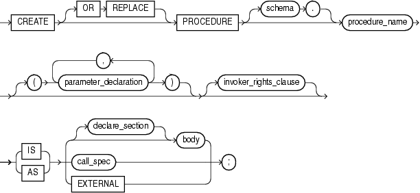
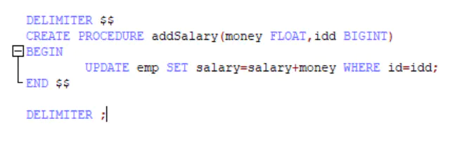

# 存储过程

## 概念

存储过程Procedure是一组为了完成特定功能的SQL语句集合，经编译后存储在数据库中，用户通过指定存储过程的名称并给出参数来执行。

  存储过程中可以包含逻辑控制语句和数据操纵语句，它可以接受参数、输出参数、返回单个或多个结果集以及返回值。

### 与function 区别

`SELECT get_foo(myColumn) FROM  mytable` is not valid if `get_foo()` is a procedure, but you can do that if `get_foo()` is a function. The price is that functions have more limitations than a procedure。

## 创建

```sql
CREATE [OR REPLACE] PROCEDURE procedure_name 
[(parameter_name [IN | OUT | IN OUT] type [, ...])] 
{IS | AS} 
BEGIN 
  < procedure_body > 
END procedure_name; 
```


*create_procedure* ::=


[Description of the illustration create_procedure.gif](https://docs.oracle.com/cd/E11882_01/appdev.112/e25519/img_text/create_procedure.htm)


See:

- ["*body* ::="](https://docs.oracle.com/cd/E11882_01/appdev.112/e25519/block.htm#CJACHDGG)
- ["*call_spec* ::="](https://docs.oracle.com/cd/E11882_01/appdev.112/e25519/create_function.htm#CJADHIEA)
- ["*declare_section* ::="](https://docs.oracle.com/cd/E11882_01/appdev.112/e25519/block.htm#CJAIABJJ)
- ["*parameter_declaration* ::="](https://docs.oracle.com/cd/E11882_01/appdev.112/e25519/parameter_declaration.htm#CJAJDGCC)

*invoker_rights_clause* ::=


[Description of the illustration invoker_rights_clause.gif](https://docs.oracle.com/cd/E11882_01/appdev.112/e25519/img_text/invoker_rights_clause.htm)

### 示例



### 区块，条件，循环

````sql
-- --区块
begin
```
end;

-- -- 条件
if condition then
	statement
else
	statement
end if;

-- -- 循环
while condition DO
	statement
end while;
````


## 调用

调用存储过程：call 存储过程名（）。

## 删除

`DROP PROCEDURE [if exists] 存储过程名;`

## 其他

