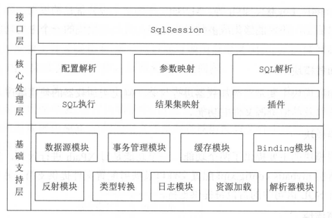
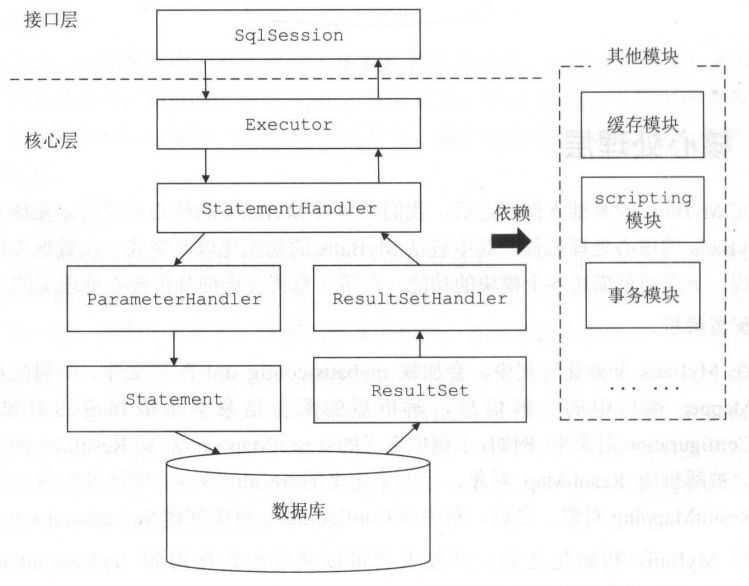
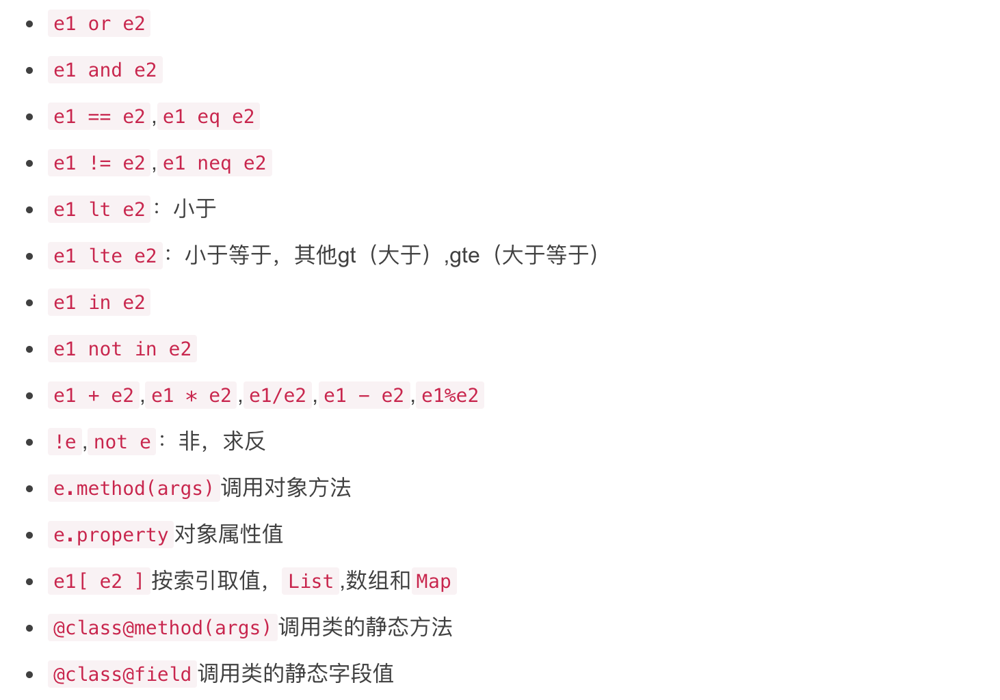

# Mybatis

## 概念

MyBatis 是一款优秀的持久层框架，它支持自定义 SQL、存储过程以及高级映射。MyBatis 免除了几乎所有的 JDBC 代码以及设置参数和获取结果集的工作。MyBatis 可以通过简单的 XML 或注解来配置和映射原始类型、接口和 Java POJO（Plain Old Java Objects，普通老式 Java 对象）为数据库中的记录。

## 整体架构






### 基础支持层

- 反射模块：提供封装的反射 `API`，方便上层调用。
- 类型转换：为简化配置文件提供了别名机制，并且实现了 `Java` 类型和 `JDBC` 类型的互转。
- 日志模块：能够集成多种第三方日志框架。
- 资源加载模块：对类加载器进行封装，提供加载类文件和其它资源文件的功能。
- 数据源模块：提供数据源实现并能够集成第三方数据源模块。
- 事务管理：可以和 `Spring` 集成开发，对事务进行管理。
- 缓存模块：提供一级缓存和二级缓存，将部分请求拦截在缓存层。
- `Binding` 模块：在调用 `SqlSession` 相应方法执行数据库操作时，需要指定映射文件中的 `SQL` 节点，`MyBatis` 通过 `Binding` 模块将自定义 `Mapper` 接口与映射文件关联，避免拼写等错误导致在运行时才发现相应异常。

### 核心处理层

- 配置解析：`MyBatis` 初始化时会加载配置文件、映射文件和 `Mapper` 接口的注解信息，解析后会以对象的形式保存到 `Configuration` 对象中。
- `SQL` 解析与 `scripting` 模块：`MyBatis` 支持通过配置实现动态 `SQL`，即根据不同入参生成 `SQL`。
- `SQL` 执行与结果解析：`Executor` 负责维护缓存和事务管理，并将数据库相关操作委托给 `StatementHandler`，`ParmeterHadler` 负责完成 `SQL` 语句的实参绑定并通过 `Statement` 对象执行 `SQL`，通过 `ResultSet` 返回结果，交由 `ResultSetHandler` 处理。


- 插件：支持开发者通过插件接口对 `MyBatis` 进行扩展。

### 接口层

`SqlSession` 接口定义了暴露给应用程序调用的 `API`，接口层在收到请求时会调用核心处理层的相应模块完成具体的数据库操作。


## 技巧

### Mybatis include入参实现sql可复用

```xml
 <select id="selectById" resultMap="BaseResultMap">
        select
            my.*
        FROM
            sys_user my
        <include refid="test_where"/>
    </select>

    <sql id="test_where">
        WHERE
            my.id = 1
    </sql>
    -- 执行结果：select my.* FROM sys_user my WHERE my.id = 1
```

通过property标签动态传参，使用时用 ${PROPERTY_NAME}.

在 if 等标签和代码段中都可使用.

注意：
mybatis中有两种传入动态参数的方式：#{}和${}
#{} 占位符：对传入的参数会做预编译，也就是会当做字符串来处理

${} 拼接符：对传入的参数不会做任何的处理，也就是说传递什么就是什么
举例：

1. select * from sys_user where id = #{id} and name = #{name}
最后执行的sql：select * from sys_user where id = ‘1’ and name = ‘zhangsan’
2. select * from sys_user where id = ${id} and name = ${name}
最后执行的sql：select * from sys_user where id = 1 and name = zhangsan (这里zhangsan没有单引号，因此会报错。如果需要加单引号，则需要手动在传参时传入。)

### ognl表达式测试

OGNL 是 Object-Graph Navigation Language 的缩写，对象-图行导航语言，语法为：#{ }。

OGNL 作用是在对象和视图之间做数据的交互，可以存取对象的属性和调用对象的方法，通过表达式可以迭代出整个对象的结构图。

MyBatis常用OGNL表达式如下:



```java

       // 构建一个OgnlContext对象
       OgnlContext context = (OgnlContext) Ognl.createDefaultContext(this,
               new DefaultClassResolver(),
               new DefaultTypeConverter(),
               new DefaultMemberAccess(true));

       Map<String,Object> hashMap=new HashMap<>(1);
       hashMap.put("name", "aa");
       context.setRoot(hashMap);
       String expression="name =='aa'";
       try {
           Boolean flag = (Boolean) Ognl.getValue(expression, context, context.getRoot());
           System.out.println(flag);
       } catch (OgnlException e) {
           e.printStackTrace();
       }


```


## 参考

[官档](https://mybatis.org/mybatis-3/zh/getting-started.html)

[github](https://github.com/mybatis/mybatis-3)

[博客1](https://www.cnblogs.com/homejim/)

[mybatis教程](https://blog.51cto.com/legend2011/category5.html)
