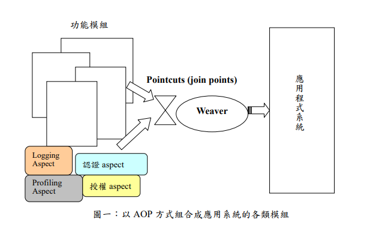

# spring-aop

## 概念

**面向切面的程序设计** （Aspect-oriented programming，AOP，又译作**面向方面的程序设计** 、**剖面导向程序设计** ）是[计算机科学](https://zh.wikipedia.org/wiki/%E8%AE%A1%E7%AE%97%E6%9C%BA%E7%A7%91%E5%AD%A6 "计算机科学")中的一种[程序设计思想](https://zh.wikipedia.org/wiki/%E7%BC%96%E7%A8%8B%E8%8C%83%E5%9E%8B "编程范型")，旨在将[横切关注点](https://zh.wikipedia.org/wiki/%E6%A8%AA%E5%88%87%E5%85%B3%E6%B3%A8%E7%82%B9 "横切关注点")与业务主体进行进一步分离，以提高程序代码的[模块化](https://zh.wikipedia.org/wiki/%E6%A8%A1%E5%9D%97%E5%8C%96%E7%BC%96%E7%A8%8B "模块化编程")程度。通过在现有代码基础上增加额外的通知（Advice）机制，能够对被声明为“切点（Pointcut）”的代码块进行统一管理与装饰，如“对所有方法名以‘set*’开头的方法添加后台日志”。该思想使得开发人员能够将与代码核心业务逻辑关系不那么密切的功能（如日志功能）添加至程序中，同时又不降低业务代码的可读性。面向切面的程序设计思想也是面向切面软件开发的基础。



- Aspect：切面，即一个横跨多个核心逻辑的功能，或者称之为系统关注点；
- Joinpoint：连接点，即定义在应用程序流程的何处插入切面的执行；
- Pointcut：切入点，即一组连接点的集合；
- Advice：增强，指特定连接点上执行的动作；
- Introduction：引介，指为一个已有的Java对象动态地增加新的接口；
- Weaving：织入，指将切面整合到程序的执行流程中；
- Interceptor：拦截器，是一种实现增强的方式；
- Target Object：目标对象，即真正执行业务的核心逻辑对象；
- AOP Proxy：AOP代理，是客户端持有的增强后的对象引用。

## AOP原理

在Java平台上，对于AOP的织入，有3种方式：

1. 编译期：在编译时，由编译器把切面调用编译进字节码，这种方式需要定义新的关键字并扩展编译器，AspectJ就扩展了Java编译器，使用关键字aspect来实现织入；
2. 类加载器：在目标类被装载到JVM时，通过一个特殊的类加载器，对目标类的字节码重新“增强”；
3. 运行期：目标对象和切面都是普通Java类，通过JVM的动态代理功能或者第三方库实现运行期动态织入。

最简单的方式是第三种，Spring的AOP实现就是基于JVM的动态代理。由于JVM的动态代理要求必须实现接口，如果一个普通类没有业务接口，就需要通过[CGLIB](https://github.com/cglib/cglib)或者[Javassist](https://www.javassist.org/)这些第三方库实现。

我们以`LoggingAspect.doAccessCheck()`为例，要把它注入到`UserService`的每个`public`方法中，最简单的方法是编写一个子类，并持有原始实例的引用：

```java
public class UserServiceAopProxy extends UserService {
    private UserService target;
    private LoggingAspect aspect;

    public UserServiceAopProxy(UserService target, LoggingAspect aspect) {
        this.target = target;
        this.aspect = aspect;
    }

    public User login(String email, String password) {
        // 先执行Aspect的代码:
        aspect.doAccessCheck();
        // 再执行UserService的逻辑:
        return target.login(email, password);
    }

    public User register(String email, String password, String name) {
        aspect.doAccessCheck();
        return target.register(email, password, name);
    }

    ...
}
```

这些都是Spring容器启动时为我们自动创建的注入了Aspect的子类，它取代了原始的`UserService`（原始的`UserService`实例作为内部变量隐藏在`UserServiceAopProxy`中）。如果我们打印从Spring容器获取的`UserService`实例类型，它类似`UserService$$EnhancerBySpringCGLIB$$1f44e01c`，实际上是Spring使用CGLIB动态创建的子类，但对于调用方来说，感觉不到任何区别.

 Spring对接口类型使用JDK动态代理，对普通类使用CGLIB创建子类。如果一个Bean的class是final，Spring将无法为其创建子类。


## 示例

```java
@Aspect
@Component
public class LoggingAspect {
    // 在执行UserService的每个方法前执行:
    @Before("execution(public * com.itranswarp.learnjava.service.UserService.*(..))")
    public void doAccessCheck() {
        System.err.println("[Before] do access check...");
    }

    // 在执行MailService的每个方法前后执行:
    @Around("execution(public * com.itranswarp.learnjava.service.MailService.*(..))")
    public Object doLogging(ProceedingJoinPoint pjp) throws Throwable {
        System.err.println("[Around] start " + pjp.getSignature());
        Object retVal = pjp.proceed();
        System.err.println("[Around] done " + pjp.getSignature());
        return retVal;
    }
}
```

观察`doAccessCheck()`方法，我们定义了一个`@Before`注解，后面的字符串是告诉AspectJ应该在何处执行该方法，这里写的意思是：执行`UserService`的每个`public`方法前执行`doAccessCheck()`代码。

再观察`doLogging()`方法，我们定义了一个`@Around`注解，它和`@Before`不同，`@Around`可以决定是否执行目标方法，因此，我们在`doLogging()`内部先打印日志，再调用方法，最后打印日志后返回结果。

在`LoggingAspect`类的声明处，除了用`@Component`表示它本身也是一个Bean外，我们再加上`@Aspect`注解，表示它的`@Before`标注的方法需要注入到`UserService`的每个`public`方法执行前，`@Around`标注的方法需要注入到`MailService`的每个`public`方法执行前后。

紧接着，我们需要给`@Configuration`类加上一个`@EnableAspectJAutoProxy`注解：

```java
@Configuration
@ComponentScan
@EnableAspectJAutoProxy
public class AppConfig {
    ...
}
```

Spring的IoC容器看到这个注解，就会自动查找带有`@Aspect`的Bean，然后根据每个方法的`@Before`、`@Around`等注解把AOP注入到特定的Bean中。执行代码，我们可以看到以下输出：

```bash
[Before] do access check...
[Around] start void com.itranswarp.learnjava.service.MailService.sendRegistrationMail(User)
Welcome, test!
[Around] done void com.itranswarp.learnjava.service.MailService.sendRegistrationMail(User)
[Before] do access check...
[Around] start void com.itranswarp.learnjava.service.MailService.sendLoginMail(User)
Hi, Bob! You are logged in at 2020-02-14T23:13:52.167996+08:00[Asia/Shanghai]
[Around] done void com.itranswarp.learnjava.service.MailService.sendLoginMail(User)
```

## 拦截器类型

顾名思义，拦截器有以下类型：

- @Before：这种拦截器先执行拦截代码，再执行目标代码。如果拦截器抛异常，那么目标代码就不执行了；
- @After：这种拦截器先执行目标代码，再执行拦截器代码。无论目标代码是否抛异常，拦截器代码都会执行；
- @AfterReturning：和@After不同的是，只有当目标代码正常返回时，才执行拦截器代码；
- @AfterThrowing：和@After不同的是，只有当目标代码抛出了异常时，才执行拦截器代码；
- @Around：能完全控制目标代码是否执行，并可以在执行前后、抛异常后执行任意拦截代码，可以说是包含了上面所有功能。

## 使用注解拦截

使用注解实现AOP需要先定义注解，然后使用`@Around("@annotation(name)")`实现装配；

使用注解既简单，又能明确标识AOP装配，是使用AOP推荐的方式.

```java
@Target(METHOD)
@Retention(RUNTIME)
public @interface MetricTime {
    String value();
}

@Component
public class UserService {
    // 监控register()方法性能:
    @MetricTime("register")
    public User register(String email, String password, String name) {
        ...
    }
    ...
}

@Aspect
@Component
public class MetricAspect {
    @Around("@annotation(metricTime)")
    public Object metric(ProceedingJoinPoint joinPoint, MetricTime metricTime) throws Throwable {
        String name = metricTime.value();
        long start = System.currentTimeMillis();
        try {
            return joinPoint.proceed();
        } finally {
            long t = System.currentTimeMillis() - start;
            // 写入日志或发送至JMX:
            System.err.println("[Metrics] " + name + ": " + t + "ms");
        }
    }
}
```

注意`metric()`方法标注了`@Around("@annotation(metricTime)")`，它的意思是，符合条件的目标方法是带有`@MetricTime`注解的方法，因为`metric()`方法参数类型是`MetricTime`（注意参数名是`metricTime`不是`MetricTime`），我们通过它获取性能监控的名称。

有了`@MetricTime`注解，再配合`MetricAspect`，任何Bean，只要方法标注了`@MetricTime`注解，就可以自动实现性能监控.


## 问题

aop的坑，根本上是动态代理的坑。

```java
@Component
public class UserService {
    // 成员变量:
    public final ZoneId zoneId = ZoneId.systemDefault();

    // 构造方法:
    public UserService() {
        System.out.println("UserService(): init...");
        System.out.println("UserService(): zoneId = " + this.zoneId);
    }

    // public方法:
    public ZoneId getZoneId() {
        return zoneId;
    }

    // public final方法:
    public final ZoneId getFinalZoneId() {
        return zoneId;
    }
}

@Component
public class MailService {
    @Autowired
    UserService userService;

    public String sendMail() {
        ZoneId zoneId = userService.zoneId;
        String dt = ZonedDateTime.now(zoneId).toString();
        return "Hello, it is " + dt;
    }
}

@Configuration
@ComponentScan
public class AppConfig {
    public static void main(String[] args) {
        ApplicationContext context = new AnnotationConfigApplicationContext(AppConfig.class);
        MailService mailService = context.getBean(MailService.class);
        System.out.println(mailService.sendMail());
    }
}

// 输出正常
UserService(): init...
UserService(): zoneId = Asia/Shanghai
Hello, it is 2020-04-12T10:23:22.917721+08:00[Asia/Shanghai]
/***************************演示aop的坑************************************/
@Aspect
@Component
public class LoggingAspect {
    @Before("execution(public * com..*.UserService.*(..))")
    public void doAccessCheck() {
        System.err.println("[Before] do access check...");
    }
}

Exception in thread "main" java.lang.NullPointerException: zone
    at java.base/java.util.Objects.requireNonNull(Objects.java:246)
    at java.base/java.time.Clock.system(Clock.java:203)
    at java.base/java.time.ZonedDateTime.now(ZonedDateTime.java:216)
    at com.itranswarp.learnjava.service.MailService.sendMail(MailService.java:19)
    at com.itranswarp.learnjava.AppConfig.main(AppConfig.java:21)

@Component
public class MailService {
    @Autowired
    UserService userService;

    public String sendMail() {
        ZoneId zoneId = userService.zoneId;
        System.out.println(zoneId); // null  用final标注的成员变量为null？
        ...
    }
}

```


## Spring使用CGLIB生成Proxy的原理


第一步，正常创建一个`UserService`的原始实例，这是通过反射调用构造方法实现的，它的行为和我们预期的完全一致；

第二步，通过CGLIB创建一个`UserService`的子类，并引用了原始实例和`LoggingAspect`：

```java
public class UserService$$EnhancerBySpringCGLIB extends UserService {
    UserService target;
    LoggingAspect aspect;

    public UserService$$EnhancerBySpringCGLIB() {
    }

    public ZoneId getZoneId() {
        aspect.doAccessCheck();
        return target.getZoneId();
    }
}
```

为了让调用方获得`UserService`的引用，它必须继承自`UserService`。然后，该代理类会覆写所有`public`和`protected`方法，并在内部将调用委托给原始的`UserService`实例。

出现两个`UserService`实例：

*原始实例* 和 原始实例的代理类实例

那么最终的问题来了：proxy实例的成员变量，也就是从`UserService`继承的`zoneId`，它的值是`null`。

原因在于，`UserService`成员变量的初始化：

```java
public class UserService {
    public final ZoneId zoneId = ZoneId.systemDefault();
    ...
}

```

在`UserService$$EnhancerBySpringCGLIB`中，并未执行。原因是，没必要初始化proxy的成员变量，因为proxy的目的是代理方法。

实际上，成员变量的初始化是在构造方法中完成的。这是我们看到的代码：

```java
public class UserService {
    public final ZoneId zoneId;
    public UserService() {
        super(); // 构造方法的第一行代码总是调用super()
        zoneId = ZoneId.systemDefault(); // 继续初始化成员变量
    }
}
```

然而，对于Spring通过CGLIB动态创建的`UserService$$EnhancerBySpringCGLIB`代理类，它的构造方法中，并未调用`super()`，因此，从父类继承的成员变量，包括`final`类型的成员变量，统统都没有初始化。

Java语言规定，任何类的构造方法，第一行必须调用`super()`，如果没有，编译器会自动加上，怎么Spring的CGLIB就可以搞特殊？

这是因为自动加`super()`的功能是Java编译器实现的，它发现你没加，就自动给加上，发现你加错了，就报编译错误。但实际上，如果直接构造字节码，一个类的构造方法中，不一定非要调用`super()`。Spring使用CGLIB构造的Proxy类，是直接生成字节码，并没有源码-编译-字节码这个步骤.

故： **Spring通过CGLIB创建的代理类，不会初始化代理类自身继承的任何成员变量，包括final类型的成员变量！**


启用了AOP，如何修复？

修复很简单，只需要把直接访问字段的代码，改为通过方法访问：

```java
@Component
public class MailService {
    @Autowired
    UserService userService;

    public String sendMail() {
        // 不要直接访问UserService的成员变量，改用方法间接访问；
        ZoneId zoneId = userService.getZoneId();
        ...
    }
}
```

无论注入的`UserService`是原始实例还是代理实例，`getZoneId()`都能正常工作，因为代理类会覆写`getZoneId()`方法，并将其委托给原始实例：

```java
public class UserService$$EnhancerBySpringCGLIB extends UserService {
    UserService target = ...
    ...

    public ZoneId getZoneId() {
        return target.getZoneId();
    }
}
```

注意到我们还给`UserService`添加了一个`public`+`final`的方法：

```java
@Component
public class UserService {
    ...
    public final ZoneId getFinalZoneId() {
        return zoneId;
    }
}

10:43:09.929 [main] DEBUG org.springframework.aop.framework.CglibAopProxy - Final method [public final java.time.ZoneId xxx.UserService.getFinalZoneId()] cannot get proxied via CGLIB: Calls to this method will NOT be routed to the target instance and might lead to NPEs against uninitialized fields in the proxy instance.
因为被代理的UserService有一个final方法getFinalZoneId()，这会导致其他Bean如果调用此方法，无法将其代理到真正的原始实例，从而可能发生NPE异常。    
```

如果在`MailService`中，调用的不是`getZoneId()`，而是`getFinalZoneId()`，又会出现`NullPointerException`，这是因为，代理类无法覆写`final`方法（这一点绕不过JVM的ClassLoader检查），该方法返回的是代理类的`zoneId`字段，即`null`。

因此，正确使用AOP，我们需要一个避坑指南：

1. 访问被注入的Bean时，总是调用方法而非直接访问字段；
2. 编写Bean时，如果可能会被代理，就不要编写`public final`方法。

这样才能保证有没有AOP，代码都能正常工作。

## 参考

[廖雪峰](https://www.liaoxuefeng.com/wiki/1252599548343744/1310052352786466)

