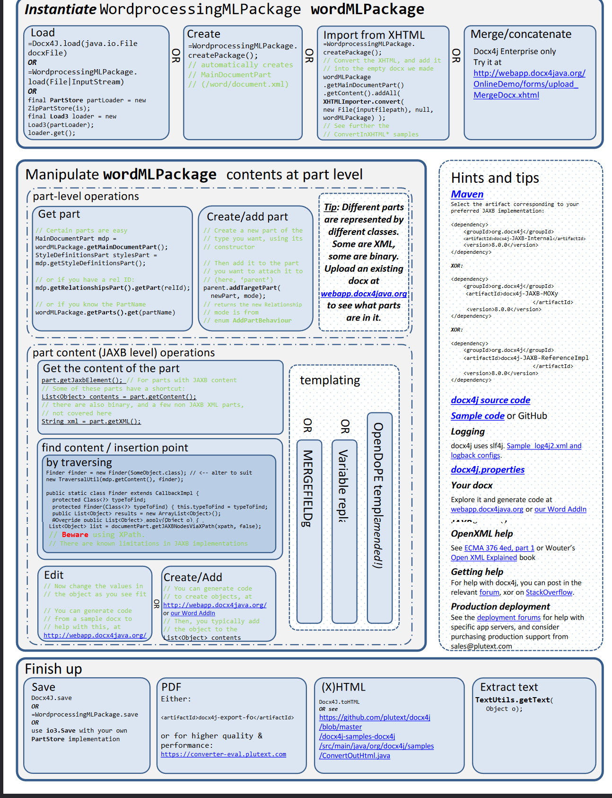

# java-library-docx4j

## intoduction

docx4j is an open source (ASLv2) Java library for creating and manipulating Microsoft Open XML (Word docx, Powerpoint pptx, and Excel xlsx) files.

It is similar to Microsoft's OpenXML SDK, but for Java. docx4j uses JAXB to create the in-memory object representation.

Its emphasis is on power: if the file format supports it, you can do it with docx4j. But first, you'll need to take the time to understand JAXB, and the Open XML file structure

docx4j is a library for working with docx, pptx and xlsx files in Java.  In essence, it can unzip a docx (or 
pptx/xlsx) "package", and parse the XML to create an in-memory representation in Java using developer 
friendly classes (as opposed to DOM or SAX).

Docx4j can read/write docx documents created by or for Word 2007 or later, plus earlier versions which 
have the compatibility pack installed. (Same goes for xlsx spreadsheets and pptx presentations)

## can do

• Open existing docx (from filesystem, SMB/CIFS, WebDAV using VFS), pptx, xlsx 
• Create new docx, pptx, xlsx 
• Programmatically manipulate the above (of course) 
• Save to various media zipped, or unzipped 
• Protection settings 
• Produce/consume  the Flat OPC XML format 
• Do all this on Android. 
Specific to docx4j (as opposed to pptx4j, xlsx4j): 
• Import XHTML 
• Export as (X)HTML or PDF 
• Template substitution; CustomXML binding 
• Mail merge 
• Apply transforms, including common filters 
• Diff/compare documents, paragraphs or sdt (content controls) 
• Font support (font substitution, and use of any fonts embedded in the document) 

# USE

- 合并文档(带分页符)

```java
package com.demo.example.docx4j;

import org.apache.commons.compress.utils.IOUtils;
import org.docx4j.jaxb.Context;
import org.docx4j.openpackaging.contenttype.ContentType;
import org.docx4j.openpackaging.exceptions.Docx4JException;
import org.docx4j.openpackaging.packages.WordprocessingMLPackage;
import org.docx4j.openpackaging.parts.PartName;
import org.docx4j.openpackaging.parts.WordprocessingML.AlternativeFormatInputPart;
import org.docx4j.openpackaging.parts.WordprocessingML.MainDocumentPart;
import org.docx4j.relationships.Relationship;
import org.docx4j.wml.*;

import java.io.*;
import java.nio.file.Path;
import java.util.Iterator;
import java.util.List;

public class MergeUtil {
    private static final String CONTENT_TYPE = "application/vnd.openxmlformats-officedocument.wordprocessingml.document";

    public static InputStream merge(final List<InputStream> inputStreams, Path dest) throws Docx4JException, IOException {

        WordprocessingMLPackage target = null;
        System.out.println(dest.toAbsolutePath().toString());
        int chunkId = 0;
        Iterator<InputStream> it = inputStreams.iterator();
        while (it.hasNext()) {
            InputStream is = it.next();
            if (is != null) {
                if (target == null) {
                    // Copy first document
                    OutputStream os = new FileOutputStream(dest.toFile());
                    os.write(IOUtils.toByteArray(is));
                    os.close();

                    target = WordprocessingMLPackage.load(dest.toFile());
                } else {
                    // Attach the others (Alternative input parts)
                    insertDocx(target.getMainDocumentPart(), IOUtils.toByteArray(is), chunkId++);
                }
            }
        }

        if (target != null) {
            target.save(dest.toFile());
            return new FileInputStream(dest.toFile());
        } else {
            return null;
        }
    }

    private static void insertDocx(MainDocumentPart main, byte[] bytes, int chunkId) {
        try {
            ObjectFactory factory = Context.getWmlObjectFactory();
            // 添加分页符
            Br breakObj = new Br();
            breakObj.setType(STBrType.PAGE);

            P paragraph = factory.createP();
            paragraph.getContent().add(breakObj);
            main.getJaxbElement().getBody().getContent().add(paragraph);
            
            // Create object for p
            AlternativeFormatInputPart afiPart = new AlternativeFormatInputPart(new PartName("/part" + chunkId + ".docx"));
            afiPart.setContentType(new ContentType(CONTENT_TYPE));
            afiPart.setBinaryData(bytes);
            Relationship altChunkRel = main.addTargetPart(afiPart);

            CTAltChunk chunk = factory.createCTAltChunk();
            chunk.setId(altChunkRel.getId());

            main.addObject(chunk);
        } catch (Exception e) {
            e.printStackTrace();
        }
    }
}
```


## cheat sheet



## link

[ Download docx4j](https://www.docx4java.org/downloads.html)

[ Open XML spec documentation ] (http://webapp.docx4java.org/OnlineDemo/ecma376/index.html) 

[docx4j归档](https://www.docx4java.org/docx4j/)

[ecma376](http://webapp.docx4java.org/OnlineDemo/ecma376/WordML/index.html)

View the structure of your docx/xsx/pptx, and generate code via our [webapp](http://webapp.docx4java.org/OnlineDemo/PartsList.html) or for docx, locally with our [Word AddIn](

