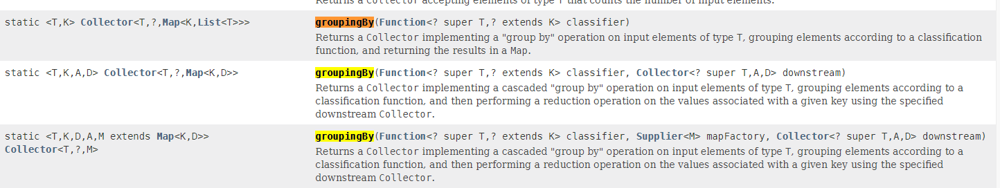

# 背景

# 概念

# 使用

# 技巧

## java8 小技巧保证分组groupingBy后排序不变

### 

```java
// 一个参数
public static <T, K> Collector<T, ?, Map<K, List<T>>>
    groupingBy(Function<? super T, ? extends K> classifier) {
        return groupingBy(classifier, toList());
    }
// 两个参数
public static <T, K, A, D>
    Collector<T, ?, Map<K, D>> groupingBy(Function<? super T, ? extends K> classifier,
                                          Collector<? super T, A, D> downstream) {
        return groupingBy(classifier, HashMap::new, downstream);
    }
// 三个参数
public static <T, K, D, A, M extends Map<K, D>>
    Collector<T, ?, M> groupingBy(Function<? super T, ? extends K> classifier,
                                  Supplier<M> mapFactory,
                                  Collector<? super T, A, D> downstream) {
        Supplier<A> downstreamSupplier = downstream.supplier();
        BiConsumer<A, ? super T> downstreamAccumulator = downstream.accumulator();
        BiConsumer<Map<K, A>, T> accumulator = (m, t) -> {
            K key = Objects.requireNonNull(classifier.apply(t), "element cannot be mapped to a null key");
            A container = m.computeIfAbsent(key, k -> downstreamSupplier.get());
            downstreamAccumulator.accept(container, t);
        };
        BinaryOperator<Map<K, A>> merger = Collectors.<K, A, Map<K, A>>mapMerger(downstream.combiner());
        @SuppressWarnings("unchecked")
        Supplier<Map<K, A>> mangledFactory = (Supplier<Map<K, A>>) mapFactory;

        if (downstream.characteristics().contains(Collector.Characteristics.IDENTITY_FINISH)) {
            return new CollectorImpl<>(mangledFactory, accumulator, merger, CH_ID);
        }
        else {
            @SuppressWarnings("unchecked")
            Function<A, A> downstreamFinisher = (Function<A, A>) downstream.finisher();
            Function<Map<K, A>, M> finisher = intermediate -> {
                intermediate.replaceAll((k, v) -> downstreamFinisher.apply(v));
                @SuppressWarnings("unchecked")
                M castResult = (M) intermediate;
                return castResult;
            };
            return new CollectorImpl<>(mangledFactory, accumulator, merger, finisher, CH_NOID);
        }
    }

//创建数据
 private static List<Person> getPersionList() {
        List<Person> persons = new ArrayList<>();
        for (int i = 1; i <= 40; i++) {
            Random r = new Random();
            Person person = new Person();
            person.setName("abel-" + i);
            person.setSex((int) (Math.random() * 2));
            person.setGroup(String.valueOf(i%2));
            person.setAge(25 + r.nextInt(50));
            persons.add(person);
        }
        return persons;

    }


    /**
     * 有序分组
     */
    private static void groupByTest() {
        List<Person> persons = getPersionList();
        //将list 排序，并按照排序后的结果进行有序分组
        LinkedHashMap<Integer, List<Person>> ageMap = personsSort.stream().sorted(Comparator.comparingInt(Person::getAge)).collect(Collectors.groupingBy(Person::getAge, LinkedHashMap::new, Collectors.toList()));
    }
```


# 参考

