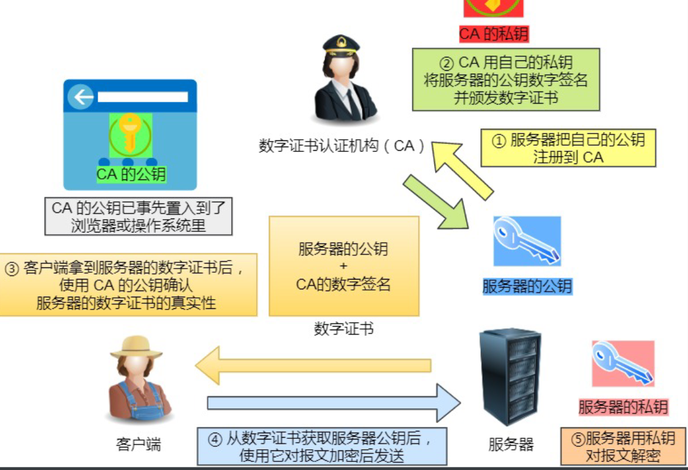
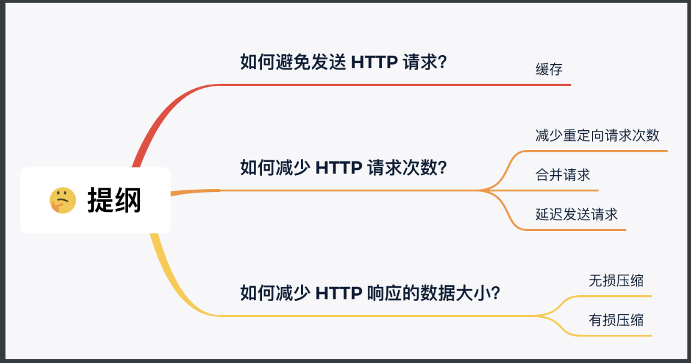
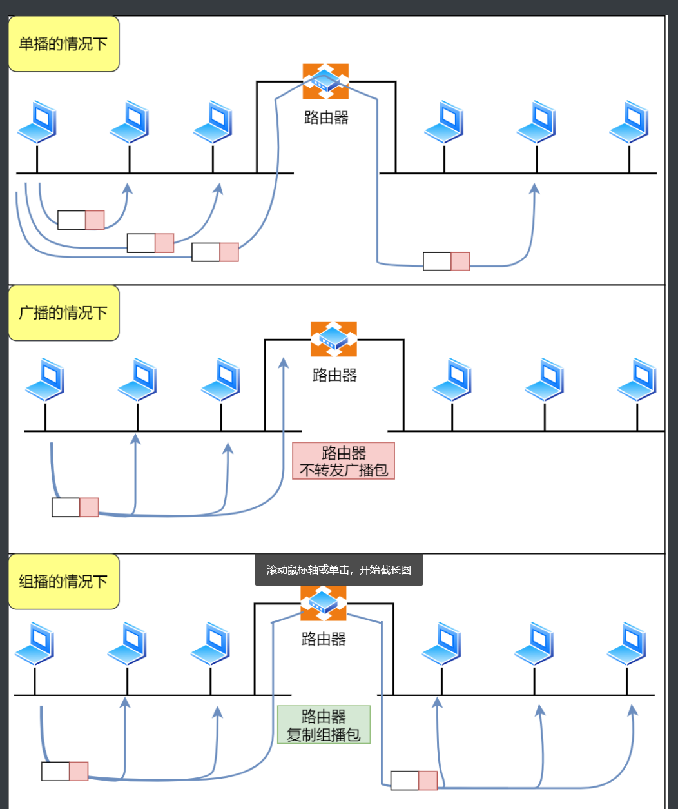
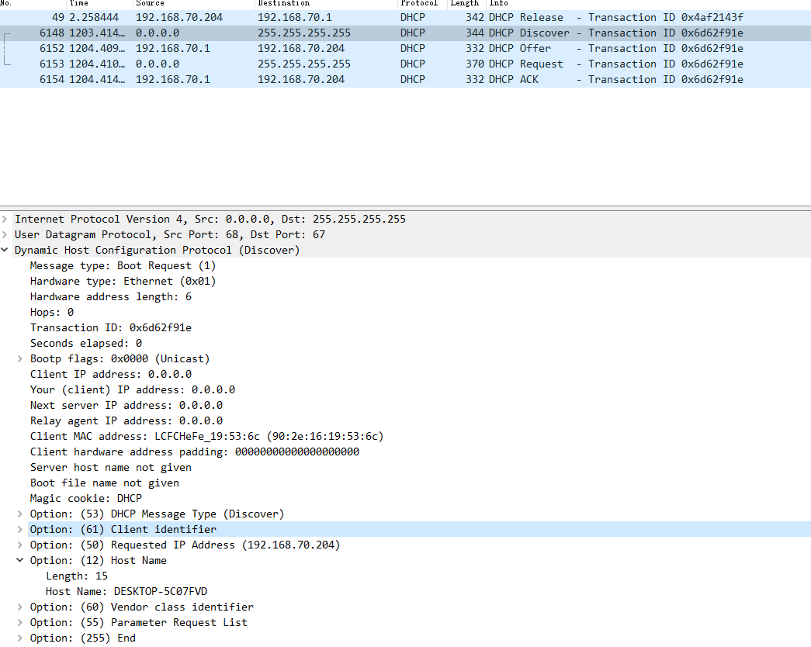
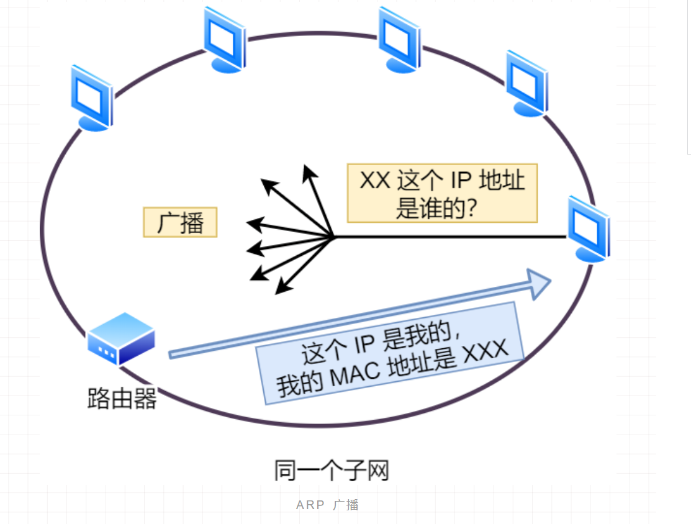

# network

## 概念

- 安全和幂等

在 HTTP 协议里，所谓的「安全」是指请求方法不会「破坏」服务器上的资源。
所谓的「幂等」，意思是多次执行相同的操作，结果都是「相同」的。

GET方法 安全且幂等，POST方法不安全也不幂等。

SSL 是洋文 “Secure Sockets Layer 的缩写，中文叫做「安全套接层」。它是在上世纪 90 年代中期，由网景公司设计的。到了1999年，SSL 因为应用广泛，已经成为互联网上的事实标准。IETF 就在那年把 SSL 标准化。标准化之后的名称改为 TLS（是 “Transport Layer Security” 的缩写），中文叫做 「传输层安全协议」。

## TCP/IP网络模型

对于同一台设备上的进程间通信，有很多种方式，比如有管道、消息队列、共享内存、信号等方式，而对于不同设备上的进程间通信，就需要网络通信，而设备是多样性的，所以要兼容多种多样的设备，就协商出了一套通用的网络协议。

### 应用层（Application Layer）

应用层是工作在操作系统中的用户态，传输层及以下则工作在内核态。

### 传输层（Transport Layer）

在传输层会有两个传输协议，分别是 TCP 和 UDP。
**TCP 的全称叫传输层控制协议（Transmission Control Protocol）**，大部分应用使用的正是 TCP 传输层协议，比如 HTTP 应用层协议。TCP 相比  UDP 多了很多特性，比如流量控制、超时重传、拥塞控制等，这些都是为了保证数据包能可靠地传输给对方。 
UDP 就相对很简单，简单到只负责发送数据包，不保证数据包是否能抵达对方，但它实时性相对更好，传输效率也高。当然，UDP 也可以实现可靠传输，把 TCP 的特性在应用层上实现就可以，不过要实现一个商用的可靠 UDP 传输协议，也不是一件简单的事情。
应用需要传输的数据可能会非常大，如果直接传输就不好控制，因此当传输层的数据包大小超过 MSS（TCP 最大报文段⻓度） ，就要将数据包分块，这样即使中途有一个分块丢失或损坏了，只需要重新这一个分块，而不用重新发送整个数据包。在 TCP 协议中，我们把每个分块称为一个 TCP 段（TCP Segment）

### 网络层（Internet Layer）

网络层最常使用的是 IP 协议（Internet Protocol），IP 协议会将传输层的报文作为数据部分，再加上 IP 包头组装成 IP 报文，如果 IP 报文大小超过 MTU（以太网中一般为 1500 字节）就会再次进行分片，得到一个即将发送到网络的 IP 报文。

需要将 IP 地址分成两种意义：
一个是网络号，负责标识该 IP 地址是属于哪个子网的；
一个是主机号，负责标识同一子网下的不同主机；
怎么分的呢？这需要配合子网掩码才能算出 IP 地址 的网络号和主机号。那么在寻址的过程中，先匹配到相同的网络号，才会去找对应的主机。
除了寻址能力， IP 协议还有另一个重要的能力就是路由。实际场景中，两台设备并不是用一条网线连接起来的，而是通过很多网关、路由器、交换机等众多网络设备连接起来的，那么就会形成很多条网络的路径，因此当数据包到达一个网络节点，就需要通过算法决定下一步走哪条路径。所以，IP 协议的寻址作用是告诉我们去往下一个目的地该朝哪个方向走，路由则是根据「下一个目的地」选择路径。寻址更像在导航，路由更像在操作方向盘。

### 数据链路层（Data Link Layer）

路由器怎么知道这个 IP 地址是哪个设备的呢？
于是，就需要有一个专⻔的层来标识网络中的设备，让数据在一个链路中传输，这就是数据链路层（Data Link Layer），它主要为网络层提供链路级别传输的服务。

每一台设备的网卡都会有一个 MAC 地址，它就是用来唯一标识设备的。路由器计算出了下一个目的地 IP 地址，再通过 ARP 协议找到该目的地的 MAC 地址，这样就知道这个 IP 地址是哪个设备的了。

### 物理层（Physical Layer）

当数据准备要从设备发送到网络时，需要把数据包转换成电信号，让其可以在物理介质中传输，这一层就是物理层（Physical Layer），它主要是为数据链路层提供二进制传输的服务。

## HTTP（HyperText Transfer Protocol）

### 问题

### 释义

HTTP的名字「超文本协议传输」，它可以拆成三个部分：

- 超文本
- 传输
- 协议

「协」字，代表的意思是必须有两个以上的参与者。例如三方协议里的参与者有三个：你、公司、学校三个；租房协议里的参与者有两个：你和房东。
「议」字，代表的意思是对参与者的一种行为约定和规范。例如三方协议里规定试用期期限、毁约金等；租房协议里规定租期期限、每月租金金额、违约如何处理等。

OK，经过了对 HTTP 里这三个名词的详细解释，就可以给出比「超文本传输协议」这七个字更准确更有技术含量
的答案：
HTTP 是一个在计算机世界里专⻔在「两点」之间「传输」文字、图片、音频、视频等「超文本」数据的「约定和规范」。

### 状态码

1xx  类状态码属于提示信息，是协议处理中的一种中间状态，实际用到的比较少。
2xx  类状态码表示服务器成功处理了客户端的请求，也是我们最愿意看到的状态。
「200 OK」是最常⻅的成功状态码，表示一切正常。如果是非 HEAD  请求，服务器返回的响应头都会有 body 数据。
「204 No Content」也是常⻅的成功状态码，与 200 OK 基本相同，但响应头没有 body 数据。

「206 Partial Content」是应用于 HTTP 分块下载或断点续传，表示响应返回的 body 数据并不是资源的全部，而是其中的一部分，也是服务器处理成功的状态。
3xx  类状态码表示客户端请求的资源发送了变动，需要客户端用新的 URL 重新发送请求获取资源，也就是重定向。 
「301 Moved Permanently」表示永久重定向，说明请求的资源已经不存在了，需改用新的 URL 再次访问。
「302 Found」表示临时重定向，说明请求的资源还在，但暂时需要用另一个 URL 来访问。
301 和 302 都会在响应头里使用字段 Location ，指明后续要跳转的 URL，浏览器会自动重定向新的 URL。
「304 Not Modified」不具有跳转的含义，表示资源未修改，重定向已存在的缓冲文件，也称缓存重定向，用于缓存控制。
4xx  类状态码表示客户端发送的报文有误，服务器无法处理，也就是错误码的含义。
「400 Bad Request」表示客户端请求的报文有错误，但只是个笼统的错误。
「403 Forbidden」表示服务器禁止访问资源，并不是客户端的请求出错。
「404 Not Found」表示请求的资源在服务器上不存在或未找到，所以无法提供给客户端。
5xx  类状态码表示客户端请求报文正确，但是服务器处理时内部发生了错误，属于服务器端的错误码。
「500 Internal Server Error」与 400 类型，是个笼统通用的错误码，服务器发生了什么错误，我们并不知道。
「501 Not Implemented」表示客户端请求的功能还不支持，类似“即将开业，敬请期待”的意思。
「502 Bad Gateway」通常是服务器作为网关或代理时返回的错误码，表示服务器自身工作正常，访问后端服务器发生了错误。
「503 Service Unavailable」表示服务器当前很忙，暂时无法响应服务器，类似“网络服务正忙，请稍后重试”的意思。

### 连接

### http三次握手建立连接

建立 TCP 连接需要三次握手：

1. 客户端想要连接服务端时，向服务端发送 SYN message。Message 还包含 sequence number（32位的随机数），ACK 为0，window size、最大 segment 大小。例如，如果 window size 是 2000 bits，最大 segment 大小是 200 bits，则最大可传输 segments 是 10 data。
2. 服务端收到客户端 synchronization request 后，回复客户端 SYN 和 ACK。ACK 数值是收到的 SYN 加一。例如客户端发送的 SYN 是 1000，则服务端回复的 ACK 是 1001。如果服务端也想建立连接，回复中还会包括一个 SYN，这里的 SYN 是另一随机数，与客服端的 SYN 不相同。这一阶段完成时，客户端与服务端的连接已经建立。
3. 收到服务端的 SYN 后，客户端回复 ACK，ACK 值是 SYN 值加一。这一过程完成后，服务端与客户端的连接也建立了起来。

TCP 连接的双方通过三次握手确定 TCP 连接的初始序列号、窗口大小以及最大数据段，这样通信双方就能利用连接中的初始序列号保证双方数据段的不重不漏，通过窗口大小控制流量，并使用最大数据段避免 IP 协议对数据包分片。

换个角度看为什么需要三次握手？客户端和服务端通信前要进行连接，三次握手就是为了确保自己和对方的收发能力是正常的。

1. 第一次握手：客户端发送、服务端接收网络包，服务端可以得出：客户端发送能力、服务端接收能力是正常的。
2. 第二次握手：服务端发送、客户端接收网络包。从客户端的视角来看，我接收到了服务端发送的响应数据包，说明服务端收到了第一次握手时我发出的网络包，且收到请求后进行了响应，这说明服务端的接收、发送能力正常，我的发送、接收能力正常。
3. 第三次握手：客户端发送、服务端接收网络包，这样服务端就能得出结论：客户端的接收、发送能力正常，服务端的发送、接收能力正常。第一次、二次握手后，服务端并不知道客户端的接收能力，以及自己的发送能力是否正常。第三次握手后，这些能力才得以确认。

三次握手后，客户端、服务端才确认了自己的接收、发送能力均是正常的。

### HTTPS四次握手建立连接

SSL/TLS 1.2 需要 4 握手，需要 2 个 RTT 的时延，我文中的图是把每个交互分开画了，实际上把他们合在一起发送，就是 4 次握手。

另外， SSL/TLS 1.3 优化了过程，只需要 1 个 RTT 往返时延，也就是只需要 3 次握手：

SSL/TLS 协议建立的详细流程：

1. ClientHello
   首先，由客户端向服务器发起加密通信请求，也就是 ClientHello  请求。在这一步，客户端主要向服务器发送以下信息：
   （1）客户端支持的 SSL/TLS 协议版本，如 TLS 1.2 版本。
   （2）客户端生产的随机数（ Client Random ），后面用于生产「会话秘钥」。
   （3）客户端支持的密码套件列表，如 RSA 加密算法。
2. SeverHello
   服务器收到客户端请求后，向客户端发出响应，也就是 SeverHello 。服务器回应的内容有如下内容：
   （1）确认 SSL/ TLS 协议版本，如果浏览器不支持，则关闭加密通信。
   （2）服务器生产的随机数（ Server Random ），后面用于生产「会话秘钥」。
   （3）确认的密码套件列表，如 RSA 加密算法。
   （4）服务器的数字证书。
3. 客户端回应
   客户端收到服务器的回应之后，首先通过浏览器或者操作系统中的 CA 公钥，确认服务器的数字证书的真实性。如果证书没有问题，客户端会从数字证书中取出服务器的公钥，然后使用它加密报文，向服务器发送如下信息：
   （1）一个随机数（ pre-master key ）。该随机数会被服务器公钥加密。
   （2）加密通信算法改变通知，表示随后的信息都将用「会话秘钥」加密通信。
   （3）客户端握手结束通知，表示客户端的握手阶段已经结束。这一项同时把之前所有内容的发生的数据做个摘要，用来供服务端校验。

上面第一项的随机数是整个握手阶段的第三个随机数，这样服务器和客户端就同时有三个随机数，接着就用双方协商的加密算法，各自生成本次通信的「会话秘钥」。

4. 服务器的最后回应
   服务器收到客户端的第三个随机数（ pre-master key ）之后，通过协商的加密算法，计算出本次通信的「会话秘钥」。然后，向客户端发生最后的信息：
   （1）加密通信算法改变通知，表示随后的信息都将用「会话秘钥」加密通信。
   （2）服务器握手结束通知，表示服务器的握手阶段已经结束。这一项同时把之前所有内容的发生的数据做个摘要，用来供客户端校验。
   至此，整个 SSL/TLS 的握手阶段全部结束。接下来，客户端与服务器进入加密通信，就完全是使用普通的 HTTP 协议，只不过用「会话秘钥」加密内容。

### HTTP/1.1、HTTP/2、HTTP/3 演变

#### HTTP

##### 缺点

- 无状态（优缺点），无法完成关联性操作。-Cookie技术
- 短连接
- 不安全
  - 明文传输，容易泄露信息
  - 篡改，无法保证数据完整性
  - 伪造，无法验证通信方身份

#### HTTP/1.1改善

##### 长连接

期 HTTP/1.0 性能上的一个很大的问题，那就是每发起一个请求，都要新建一次 TCP 连接（三次握手），而且是串行请求，做了无谓的 TCP 连接建立和断开，增加了通信开销。

HTTP/1.1 提出了⻓连接的通信方式，也叫持久连接。这种方式的好处在于减少了 TCP 连接的重复建立和断开所造成的额外开销，**减轻了服务器端的负载**。

持久连接的特点是，只要任意一端没有明确提出断开连接，则保持 TCP 连接状态。

##### 管道传输

即可在同一个 TCP 连接里面，客户端可以发起多个请求，只要第一个请求发出去了，不必等其回来，就可以发第二个请求出去，可以**减少整体的响应时间**

**问题**：但是服务器还是按照顺序，先回应 A 请求，完成后再回应 B 请求。要是前面的回应特别慢，后面就会有许多请求排队等着。这称为「队头堵塞」。

##### HTTP 与 HTTPS 有哪些区别？

1. HTTP 是超文本传输协议，信息是明文传输，存在安全⻛险的问题。HTTPS 则解决 HTTP 不安全的缺陷，在 TCP 和 HTTP 网络层之间加入了 SSL/TLS 安全协议，使得报文能够加密传输。
2. HTTP 连接建立相对简单， TCP 三次握手之后便可进行 HTTP 的报文传输。而 HTTPS 在 TCP 三次握手之后，还需进行 SSL/TLS 的四次握手过程，才可进入加密报文传输。
3. HTTP 的端口号是 80，HTTPS 的端口号是 443。
4. HTTPS 协议需要向 CA（证书权威机构）申请数字证书，来保证服务器的身份是可信的。

##### HTTPS 解决了 HTTP 的哪些问题？

HTTP 由于是明文传输，所以安全上存在以下三个⻛险：

- 窃听⻛险，比如通信链路上可以获取通信内容，用户号容易没。
- 篡改⻛险，比如强制植入垃圾广告，视觉污染，用户眼容易瞎。
- 冒充⻛险，比如冒充淘宝网站，用户钱容易没。

TTPS 在 HTTP 与 TCP 层之间加入了 SSL/TLS  协议，可以很好的解决了上述的⻛险：

- 信息加密：交互信息无法被窃取，但你的号会因为「自身忘记」账号而没。
- 校验机制：无法篡改通信内容，篡改了就不能正常显示，但百度「竞价排名」依然可以搜索垃圾广告。
- 身份证书：证明淘宝是真的淘宝网，但你的钱还是会因为「剁手」而没。

HTTPS 是如何解决上面的三个⻛险的？

- 混合加密的方式实现信息的机密性，解决了窃听的⻛险。
- 摘要算法的方式来实现完整性，它能够为数据生成独一无二的「指纹」，指纹用于校验数据的完整性，解决了篡改的⻛险。
- 将服务器公钥放入到数字证书中，解决了冒充的⻛险

###### 混合加密

HTTPS 采用的是对称加密和非对称加密结合的「混合加密」方式：
 - 在通信建立前采用非对称加密的方式交换「会话秘钥」，后续就不再使用非对称加密。
 - 在通信过程中全部使用对称加密的「会话秘钥」的方式加密明文数据。
采用「混合加密」的方式的原因：
 - 对称加密只使用一个密钥，运算速度快，密钥必须保密，无法做到安全的密钥交换。
 - 非对称加密使用两个密钥：公钥和私钥，公钥可以任意分发而私钥保密，解决了密钥交换问题但速度慢。

###### 摘要算法

###### 数字证书

客户端先向服务器端索要公钥，然后用公钥加密信息，服务器收到密文后，用自己的私钥解密。
这就存在些问题，如何保证公钥不被篡改和信任度？

这里就需要借助第三方权威机构 CA  （数字证书认证机构），将服务器公钥放在数字证书（由数字证书认证机构颁发）中，只要证书是可信的，公钥就是可信的。

##### 其他改善方法

###### 合并请求

- 有的网⻚会含有很多小图片、小图标，有多少个小图片，客户端就要发起多少次请求。那么对于这些小图片，我们可以考虑使用 CSS Image Sprites  技术把它们合成一个大图片，这样浏览器就可以用一次请求获得一个大图片，然后再根据 CSS 数据把大图片切割成多张小图片。
- 还有服务端使用 webpack  等打包工具将 js、css 等资源合并打包成大文件，也是能达到类似的效果。
- 还可以将图片的二进制数据用 base64  编码后，以 URL 的形式潜入到 HTML 文件，跟随 HTML 文件一并发送。

###### 延迟发送请求

- 请求网⻚的时候，没必要把全部资源都获取到，而是只获取当前用户所看到的⻚面资源，当用户向下滑动⻚面的时候，再向服务器获取接下来的资源，这样就达到了延迟发送请求的效果。

###### 减小数据大小

无损压缩：无损压缩是指资源经过压缩后，信息不被破坏，还能完全恢复到压缩前的原样，适合用在文本文件、程序可执行文件、程序源代码。霍夫曼编码、gzip。

有损压缩：有损压缩主要将次要的数据舍弃，牺牲一些质量来减少数据量、提高压缩比，这种方法经常用于压缩多媒体数据，比如音频、视频、图片。q 质量因子， H264、H265。

##### HTTP/1.0缺点

- 请求 / 响应头部（Header）未经压缩就发送，首部信息越多延迟越大。只能压缩 Body  的部分；
- 发送冗⻓的首部。每次互相发送相同的首部造成的浪费较多；
- 服务器是按请求的顺序响应的，如果服务器响应慢，会招致客户端一直请求不到数据，也就是队头阻塞；
- 没有请求优先级控制；
- 请求只能从客户端开始，服务器只能被动响应。

#### HTTP/2改善

HTTP/2 协议是基于 HTTPS 的，所以 HTTP/2 的**安全性也是有保障的**。

##### 头部压缩

HTTP/2 会压缩头（Header）如果你同时发出多个请求，他们的头是一样的或是相似的，那么，协议会帮你消除重复的部分。
这就是所谓的 HPACK  算法：在客户端和服务器同时维护一张头信息表，所有字段都会存入这个表，生成一个索引号，以后就不发送同样字段了，只发送索引号，这样就提高速度了。

##### 二进制格式

HTTP/2 不再像 HTTP/1.1 里的纯文本形式的报文，而是全面采用了二进制格式，头信息和数据体都是二进制，并且统称为帧（frame）：头信息帧和数据帧。

收到报文后，无需再将明文的报文转成二进制，而是直接解析二进制报文，这**增加了数据传输的效率**

##### 数据流

HTTP/2 的数据包不是按顺序发送的，同一个连接里面连续的数据包，可能属于不同的回应。因此，必须要对数据包做标记，指出它属于哪个回应。
每个请求或回应的所有数据包，称为一个数据流（ Stream ）。每个数据流都标记着一个独一无二的编号，其中规定客户端发出的数据流编号为奇数， 服务器发出的数据流编号为偶数。
客户端还可以指定数据流的优先级。优先级高的请求，服务器就先响应该请求。

##### 多路复用

HTTP/2 是可以在一个连接中并发多个请求或回应，而不用按照顺序一一对应。
移除了 HTTP/1.1 中的串行请求，不需要排队等待，也就不会再出现「队头阻塞」问题，**降低了延迟，大幅度提高了连接的利用率**。
举例来说，在一个 TCP 连接里，服务器收到了客户端 A 和 B 的两个请求，如果发现 A 处理过程非常耗时，于是就回应 A 请求已经处理好的部分，接着回应 B 请求，完成后，再回应 A 请求剩下的部分。

##### 服务器推送

HTTP/2 还在一定程度上改善了传统的「请求 - 应答」工作模式，服务不再是被动地响应，也可以主动向客户端发送消息。
举例来说，在浏览器刚请求 HTML 的时候，就提前把可能会用到的 JS、CSS 文件等静态资源主动发给客户端，**减少延时的等待**，也就是服务器推送（Server Push，也叫 Cache Push）。

##### HTTP/2缺陷

HTTP/2 主要的问题在于，多个 HTTP 请求在复用一个 TCP 连接，下层的 TCP 协议是不知道有多少个 HTTP 请求的。所以一旦发生了丢包现象，就会触发 TCP 的重传机制，这样在一个 TCP 连接中的所有的 HTTP 请求都必须等待这个丢了的包被重传回来。
HTTP/1.1 中的管道（ pipeline）传输中如果有一个请求阻塞了，那么队列后请求也统统被阻塞住了。
HTTP/2 多个请求复用一个TCP连接，一旦发生丢包，就会阻塞住所有的 HTTP 请求。

#### HTTP/3改善

这都是基于 TCP 传输层的问题，所以 HTTP/3 把 HTTP 下层的 TCP 协议改成了 UDP！

UDP 发生是不管顺序，也不管丢包的，所以不会出现 HTTP/1.1 的队头阻塞 和 HTTP/2 的一个丢包全部重传问题。
UDP 是不可靠传输的，但基于 UDP 的 QUIC 协议 可以实现类似 TCP 的可靠性传输。

- QUIC 有自己的一套机制可以保证传输的可靠性的。当某个流发生丢包时，只会阻塞这个流，其他流不会受到影响。
- TLS3 升级成了最新的 1.3  版本，头部压缩算法也升级成了 QPack 。
- HTTPS 要建立一个连接，要花费 7 次交互，先是建立三次握手，然后是 TLS/1.3  的四次握手。QUIC 直接把以往的 TCP 和 TLS/1.3  的 7 次交互合并成了 3 次，**减少了交互次数**。

所以， QUIC 是一个在 UDP 之上的伪 TCP + TLS + HTTP/2 的多路复用的协议。

## TCP

## IP

实现主机与主机之间的通信，也叫点对点（end to end）通信.MAC 的作⽤则是实现「直连」的两个设备 之间通信，⽽ IP 则负责在「没有直连」的两个⽹络之间进⾏通信传输。

源IP地址和⽬标IP地址在传输过程中是不会变化的，只有源 MAC 地址和⽬标 MAC ⼀直在变化.

### ⽆分类地址 CIDR(无类域间路由（Classless Inter-Domain Routing，CIDR）)

正因为 IP 分类存在许多缺点，所以后⾯提出了⽆分类地址的⽅案，即 CIDR 。
这种⽅式不再有分类地址的概念，32 ⽐特的 IP 地址被划分为两部分，前⾯是⽹络号，后⾯是主机号。怎么划分⽹络号和主机号的呢？
表示形式 a.b.c.d/x ，其中 /x 表示前 x 位属于⽹络号， x 的范围是 0 ~ 32 ，这就使得 IP 地址更加具有灵活性。
⽐如 10.100.122.2/24，这种地址表示形式就是 CIDR，/24 表示前 24 位是⽹络号，剩余的 8 位是主机号.

### 本地地址（环回地址）

环回地址是不会流向⽹络的。

环回地址是在同⼀台计算机上的程序之间进⾏⽹络通信时所使⽤的⼀个默认地址。

 计算机使⽤⼀个特殊的 IP 地址 127.0.0.1 作为环回地址。与该地址具有相同意义的是⼀个叫做 localhost 的主机 名。使⽤这个 IP 或主机名时，数据包不会流向⽹络。

### IPV6

#### 标识

IPv4 地址⻓度共 32 位，是以每 8 位作为⼀组，并⽤点分⼗进制的表示⽅式。

 IPv6 地址⻓度是 128 位，是以每 16 位作为⼀组，每组⽤冒号 「:」 隔开。 

如果出现连续的 0 时还可以将这些 0 省略，并⽤两个冒号 「::」隔开。但是，⼀个 IP 地址中只允许出现⼀次两个 连续的冒号。 

#### 包结构

### 相关协议

#### DNS 域名解析

#### ARP与RARP协议

#### DHCP（Dynamic Host Configuration Protocol，动态主机配置协议）

DHCP，Dynamic Host Configuration Protocol，动态主机配置协议，简单来说就是主机获取IP地址的过程，属于应用层协议。
DHCP采用UDP的68（客户端）和67（服务器）端口进行通信。

DHCP过程主要为DHCP Discover-->DHCP Offer-->DHCP Request-->DHCP Ack四个过程。

C:\Users\25433>ipconfig /release

C:\Users\25433>ipconfig /renew

可以发现，DHCP 交互中，**全程都是使用 UDP 广播通信**。

用的是广播，那如果 DHCP 服务器和客户端不是在同一个局域网内，路由器又不会转发广播包，那不是每个网络都要配一个 DHCP 服务器？

所以，为了解决这一问题，就出现了 **DHCP 中继代理**。有了 DHCP 中继代理以后，**对不同网段的 IP 地址分配也可以由一个 DHCP 服务器统一进行管理。**

DHCP 客户端会向 DHCP 中继代理发送 DHCP 请求包，⽽ DHCP 中继代理在收到这个⼴播包以后，再以单播 的形式发给 DHCP 服务器。 

服务器端收到该包以后再向 DHCP 中继代理返回应答，并由 DHCP 中继代理将此包⼴播给 DHCP 客户端 。 

因此，DHCP 服务器即使不在同⼀个链路上也可以实现统⼀分配和管理IP地址。

#### NAT网络地址转换

#### ICMP

ICMP 全称是 **Internet Control Message Protocol**，也就是**互联网控制报文协议**。

`ICMP` 主要的功能包括：**确认 IP 包是否成功送达目标地址、报告发送过程中 IP 包被废弃的原因和改善网络设置等。**

在 `IP` 通信中如果某个 `IP` 包因为某种原因未能达到目标地址，那么这个具体的原因将**由 ICMP 负责通知**。

ICMP 包头的**类型**字段，大致可以分为两大类：

- 一类是用于诊断的查询消息，也就是「**查询报文类型**」
- 另一类是通知出错原因的错误消息，也就是「**差错报文类型**」

在**选项数据**中，`ping` 还会存放发送请求的时间值，来计算往返时间，说明路程的长短。

a. 网络不可达代码为 0

IP 地址是分为网络号和主机号的，所以当路由器中的路由器表匹配不到接收方 IP 的网络号，就通过 ICMP 协议以**网络不可达**（`Network Unreachable`）的原因告知主机。

自从不再有网络分类以后，网络不可达也渐渐不再使用了。

b. 主机不可达代码为 1

当路由表中没有该主机的信息，或者该主机没有连接到网络，那么会通过 ICMP 协议以**主机不可达**（`Host Unreachable`）的原因告知主机。

c. 协议不可达代码为 2

当主机使用 TCP 协议访问对端主机时，能找到对端的主机了，可是对端主机的防火墙已经禁止 TCP 协议访问，那么会通过 ICMP 协议以**协议不可达**的原因告知主机。

d. 端口不可达代码为 3

当主机访问对端主机 8080 端口时，这次能找到对端主机了，防火墙也没有限制，可是发现对端主机没有进程监听 8080 端口，那么会通过 ICMP 协议以**端口不可达**的原因告知主机。

e. 需要进行分片但设置了不分片位代码为 4

发送端主机发送 IP 数据报时，将 IP 首部的**分片禁止标志位**设置为`1`。根据这个标志位，途中的路由器遇到超过 MTU 大小的数据包时，不会进行分片，而是直接抛弃。

随后，通过一个 ICMP 的不可达消息类型，**代码为 4** 的报文，告知发送端主机。

> 原点抑制消息（ICMP Source Quench Message） —— 类型 `4`

在使用低速广域线路的情况下，连接 WAN 的路由器可能会遇到网络拥堵的问题。

`ICMP` 原点抑制消息的目的就是**为了缓和这种拥堵情况**。

当路由器向低速线路发送数据时，其发送队列的缓存变为零而无法发送出去时，可以向 IP 包的源地址发送一个 ICMP **原点抑制消息**。

收到这个消息的主机借此了解在整个线路的某一处发生了拥堵的情况，从而增大 IP 包的传输间隔，减少网络拥堵的情况。

然而，由于这种 ICMP 可能会引起不公平的网络通信，一般不被使用。

> 重定向消息（ICMP Redirect Message） —— 类型 `5`

如果路由器发现发送端主机使用了「不是最优」的路径发送数据，那么它会返回一个 ICMP **重定向消息**给这个主机。

在这个消息中包含了**最合适的路由信息和源数据**。这主要发生在路由器持有更好的路由信息的情况下。路由器会通过这样的 ICMP 消息告知发送端，让它下次发给另外一个路由器。

> 超时消息（ICMP Time Exceeded Message） —— 类型 `11`

IP 包中有一个字段叫做 `TTL` （`Time To Live`，生存周期），它的**值随着每经过一次路由器就会减 1，直到减到 0 时该 IP 包会被丢弃。**

此时，IP 路由器将会发送一个 ICMP **超时消息**给发送端主机，并通知该包已被丢弃。

设置 IP 包生存周期的主要目的，是为了在路由控制遇到问题发生循环状况时，避免 IP 包无休止地在网络上被转发。

ICMP 时间超过消息

此外，有时可以用 TTL 控制包的到达范围，例如设置一个**较小的 TTL 值**。

##### ping

在规定的时候间内，源主机如果没有接到 ICMP 的应答包，则说明目标主机不可达；如果接收到了 ICMP 回送响应消息，则说明目标主机可达。

此时，源主机会检查，用当前时刻减去该数据包最初从源主机上发出的时刻，就是 ICMP 数据包的时间延迟。

ping 这个程序是**使用了 ICMP 里面的 ECHO REQUEST（类型为 8 ） 和 ECHO REPLY （类型为 0）**。

##### traceroute

有一款充分利用 ICMP **差错报文类型**的应用叫做 `traceroute`（在UNIX、MacOS中是这个命令，而在Windows中对等的命令叫做 tracert ）

它的原理就是利用 IP 包的生存期限 从 1 开始按照顺序递增的同时发送 UDP 包，强制接收 ICMP 超时消息的一种方法。

比如，将 TTL 设置 为 1，则遇到第一个路由器，就牺牲了，接着返回 ICMP 差错报文网络包，类型是时间超时。

接下来将 TTL 设置为 2，第一个路由器过了，遇到第二个路由器也牺牲了，也同意返回了 ICMP 差错报文数据包，如此往复，直到到达目的主机。

这样的过程，traceroute 就可以拿到了所有的路由器 IP。

traceroute 在发送 `UDP` 包时，会填入一个**不可能的端口号**值作为 UDP 目标端口号（大于 `3000` ）。当目的主机，收到 UDP 包后，会返回 ICMP 差错报文消息，但这个差错报文消息的类型「**端口不可达**」。

所以，**当差错报文类型是端口不可达时，说明发送方发出的 UDP 包到达了目的主机**。

#### IGMP 因特网组管理协议

## 示例

#### 当键入网址后，到网页显示，其间发生了什么？？？

1. url

2. dns

3. tcp

4. ip路由

在网络包传输的过程中，**源 IP 和目标 IP 始终是不会变的，一直变化的是 MAC 地址**，因为需要 MAC 地址在以太网内进行**两个设备**之间的包传输。

## 参考

[计算机网络微课堂视频](https://www.bilibili.com/video/BV1c4411d7jb?p=1)

