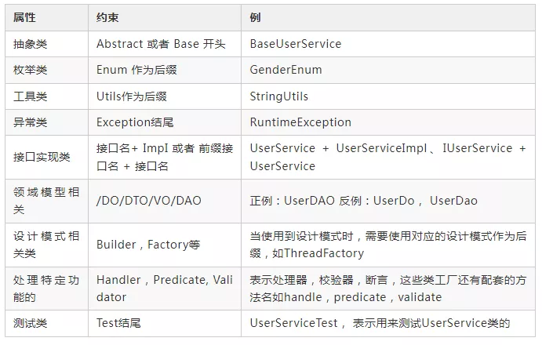
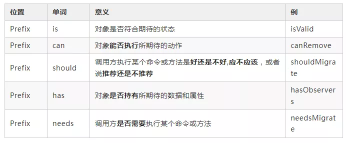
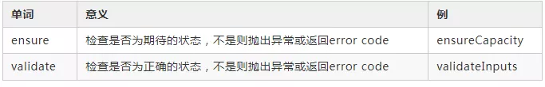
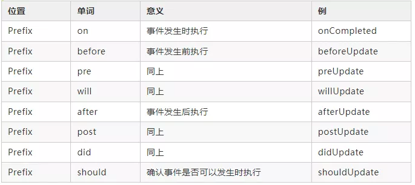
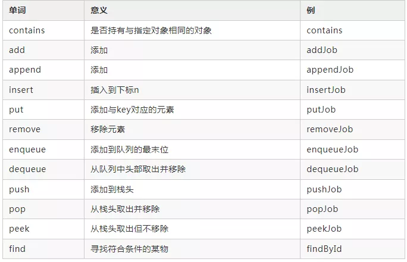
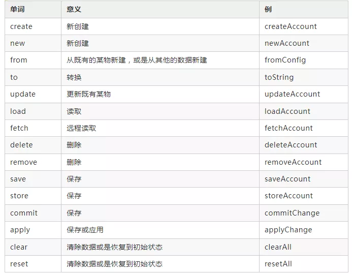
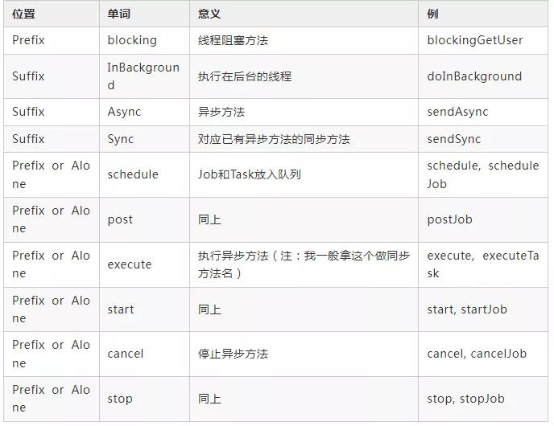

# 命名

命名目的都是为了让代码和工程师进行对话，增强代码的可读性，可维护性。优秀的代码往往能够见名知意。

## 技巧

- 结合上下文简化名称
- 做有意义的区分
- 名副其实，见名知意

## 类接口命名-名词或形容词

## 方法命名-动词

### 布尔命名

### 检查命名

### 回调命名

### 集合相关命名

### 数据相关命名

### 异步命名

## 成对动词

| 单词           | 意义              |
| -------------- | ----------------- |
| get获取        | set 设置          |
| add 增加       | remove 删除       |
| create 创建    | destory 移除      |
| start 启动     | stop 停止         |
| open 打开      | close 关闭        |
| read 读取      | write 写入        |
| load 载入      | save 保存         |
| create 创建    | destroy 销毁      |
| begin 开始     | end 结束          |
| backup 备份    | restore 恢复      |
| import 导入    | export 导出       |
| split 分割     | merge 合并        |
| inject 注入    | extract 提取      |
| attach 附着    | detach 脱离       |
| bind 绑定      | separate 分离     |
| view 查看      | browse 浏览       |
| edit 编辑      | modify 修改       |
| select 选取    | mark 标记         |
| copy 复制      | paste 粘贴        |
| undo 撤销      | redo 重做         |
| insert 插入    | delete 移除       |
| add 加入       | append 添加       |
| clean 清理     | clear 清除        |
| index 索引     | sort 排序         |
| find 查找      | search 搜索       |
| increase 增加  | decrease 减少     |
| play 播放      | pause 暂停        |
| launch 启动    | run 运行          |
| compile 编译   | execute 执行      |
| debug 调试     | trace 跟踪        |
| observe 观察   | listen 监听       |
| build 构建     | publish 发布      |
| input 输入     | output 输出       |
| encode 编码    | decode 解码       |
| encrypt 加密   | decrypt 解密      |
| compress 压缩  | decompress 解压缩 |
| pack 打包      | unpack 解包       |
| parse 解析     | emit 生成         |
| connect 连接   | disconnect 断开   |
| send 发送      | receive 接收      |
| download 下载  | upload 上传       |
| refresh 刷新   | synchronize 同步  |
| update 更新    | revert 复原       |
| lock 锁定      | unlock 解锁       |
| check out 签出 | check in 签入     |
| submit 提交    | commit 交付       |
| push 推        | pull 拉           |
| expand 展开    | collapse 折叠     |
| begin 起始     | end 结束          |
| backup 备份    | restore 恢复      |
| import 导入    | export 导出       |
| split 分割     | merge 合并        |
| inject 注入    | extract 提取      |
| attach 附着    | detach 脱离       |
| bind 绑定      | separate 分离     |
| view 查看      | browse 浏览       |
| edit 编辑      | modify 修改       |
| select 选取    | mark 标记         |
| copy 复制      | paste 粘贴        |
| undo 撤销      | redo 重做         |
| insert 插入    | delete 移除       |
| add 加入       | append 添加       |
| clean 清理     | clear 清除        |
| index 索引     | sort 排序         |
| find 查找      | search 搜索       |
| increase 增加  | decrease 减少     |
| play 播放      | pause 暂停        |
| launch 启动    | run 运行          |
| compile 编译   | execute 执行      |
| debug 调试     | trace 跟踪        |
| observe 观察   | listen 监听       |
| build 构建     | publish 发布      |
| input 输入     | output 输出       |
| encode 编码    | decode 解码       |
| encrypt 加密   | decrypt 解密      |
| compress 压缩  | decompress 解压缩 |
| pack 打包      | unpack 解包       |
| parse 解析     | emit 生成         |
| connect 连接   | disconnect 断开   |
| send 发送      | receive 接收      |
| download 下载  | upload 上传       |
| refresh 刷新   | synchronize 同步  |
| update 更新    | revert 复原       |
| lock 锁定      | unlock 解锁       |
| check out 签出 | check in 签入     |
| submit 提交    | commit 交付       |
| push 推        | pull 拉           |
| expand 展开    | collapse 折叠     |
| begin 起始     | end 结束          |
| start 开始     | finish 完成       |
| enter 进入     | exit 退出         |
| abort 放弃     | quit 离开         |
| obsolete 废弃  | depreciate 废旧   |
| collect 收集   | aggregate 聚集    |

## 参考

[优雅整洁的 Java 代码命名技巧，风之极·净化](https://mp.weixin.qq.com/s?__biz=MzI3NzE0NjcwMg==&mid=2650173625&idx=3&sn=bbe8c97f567a00d2918df407eb38104f&chksm=f3686d98c41fe48ec1e107b3307aa15c6a192c92a2784c9f581f4eccef56e68adca9da3d25b0&mpshare=1&scene=23&srcid=0111rqalgZQLBQX0BAotr3Zd&sharer_sharetime=1641902112932&sharer_shareid=450e5e3783339f39628477cbd9d0f327#rd)

