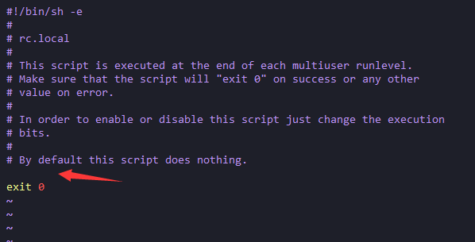
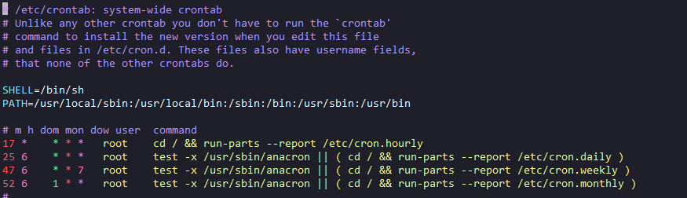

# python


## 使用

### Python开机自动运行

假如Python自启动[脚本](https://www.linuxcool.com/)为`auto.py`。那么用root权限编辑以下文件：

```
sudo vim /etc/rc.local
```

> 如果没有`rc.local`请看[这篇文章](https://www.cnblogs.com/selfcs/p/11543735.html)



在exit 0上面编辑启动脚本的[命令](https://www.linuxcool.com/)

```
/usr/bin/python3 /home/selfcs/auto.py > /home/selfcs/auto.log
```

最后重启Linux,脚本就能自动运行并打印日志了

### 让Python脚本定时启动

用root权限编辑以下文件

```
sudo vim /etc/crontab
```



在文件末尾添加以下[命令](https://www.linuxcool.com/)

```
2 * * * * root /usr/bin/python3 /home/selfcs/auto.py > /home/selfcs/auto.log
```

以上代码的意思是每隔两分钟执行一次脚本并打印日志。

### python搭建简易文件服务器

```bash
/usr/bin/python3 -m http.server --directory=/home/dxshelley/downloads/ 9090 > /home/dxshelley/log/pythonserver.log
```

