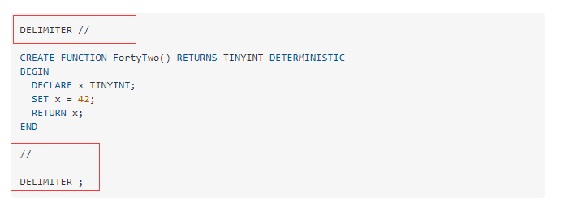

# 存储过程


## 创建存储过程

### mysql

```mysql
CREATE DEFINER=`root`@`localhost` FUNCTION `empdb`.`findChildren`(rootId VARCHAR(100)) RETURNS varchar(4000) CHARSET utf8mb4
    DETERMINISTIC
BEGIN
  DECLARE sTemp VARCHAR(4000);
  DECLARE sTempChd VARCHAR(4000);
  SET sTemp = '$';
  SET sTempChd = rootId;
  WHILE sTempChd is not null DO
    SET sTemp = CONCAT(sTemp,',',sTempChd);
    SELECT GROUP_CONCAT(id) INTO sTempChd FROM t_core_org
        WHERE FIND_IN_SET(parentid,sTempChd)>0;
  END WHILE;
  RETURN sTemp;
END;
```

## 问题

- [CREATE FUNCTION throws SQL Error (1064) (42000)](https://stackoverflow.com/questions/66262647/create-function-throws-sql-error-1064-42000)

添加`delimiter`



- 语法错误

列名称使用的是单引号而不是反引号，所以会就报了这个错误出来。
