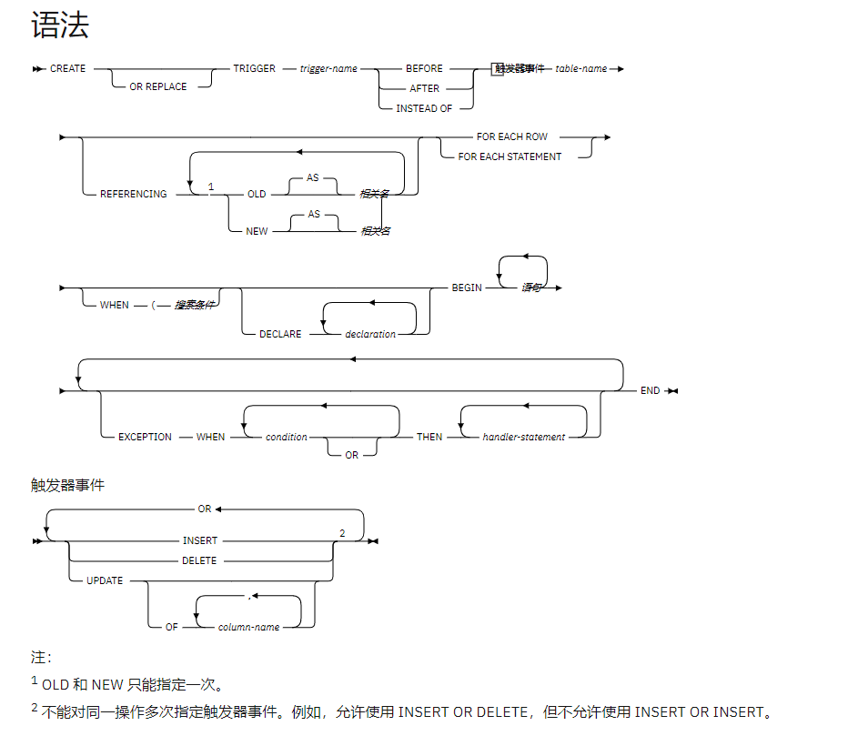

# 触发器

## 概念

触发器是具有名称的数据库对象，它封装并定义一组要在响应对表执行的插入、更新或删除操作时执行的操作。

触发器在数据库里以独立的对象存储，它与存储过程和函数不同的是，存储过程与函数需要用户显示调用才执行，而触发器是由一个事件来启动运行。即触发器是当某个事件发生时自动地隐式运行。并且，触发器不能接收参数。所以运行触发器就叫触发或点火（firing）。

 触发器的这种特性可以协助应用在数据库端确保数据的完整性 , 日志记录 , 数据校验等操作。

## 分类

行级触发器和语句级触发器

行级触发器对于触发事件所影响的每一行触发一次。例如，如果将删除定义为特定表的触发事件，并且单个 DELETE 语句从该表中删除五行，那么触发器会触发五次，即，对每一行触发一次。

语句级触发器仅对每个语句触发一次。在使用以上示例的情况下，如果将删除定义为特定表的触发事件，并且单个 DELETE 语句从该表中删除五行，那么触发器会触发一次。不能对 BEFORE 触发器或 INSTEAD OF 触发器指定语句级触发器粒度。

## 触发器变量

NEW 和 OLD 是特殊变量，您可以将其与 PL/SQL 触发器配合使用，而不必显式地定义这些变量。

NEW 是一个伪记录名，它引用行级触发器中的插入和更新操作的新表行。它的用法是 :NEW.column，其中 column 是表中对其定义此触发器的列的名称。
在行级前触发器中使用时，:NEW.column 的初始内容是所要插入的新行中的列值或者要替换旧行的行中的列值。
在行级后触发器中使用时，新列值已存储在表中。
当删除操作激活触发器时，该触发器中使用的 :NEW.column 为 null。
在触发器代码块中，可以像使用任何其他变量一样使用 :NEW.column。如果在行级前触发器的代码块中将值赋予 :NEW.column，那么所插入或更新的行将使用所赋予的值。

OLD 是一个伪记录名，它引用行级触发器中的更新和删除操作的旧表行。它的用法是 :OLD.column，其中 column 是表中对其定义此触发器的列的名称。
在行级前触发器中使用时，:OLD.column 的初始内容是所要删除的行中的列值或者要被新行替换的旧行中的列值。
在行级后触发器中使用时，旧列值已不再存储在表中。
当插入操作激活触发器时，该触发器中使用的 :OLD.column 为 null。
在触发器代码块中，可以像使用任何其他变量一样使用 :OLD.column。如果在行级前触发器的代码块中将值赋予 :OLD.column，那么所赋予的值不会影响触发器的操作。

| 特性 | INSERT | UPDATE | DELETE |
| ---- | ------ | ------ | ------ |
| OLD  | NULL   | 实际值 | 实际值 |
| NEW  | 实际值 | 实际值 | NULL   |


## 触发器事件谓词

只能在触发器中使用触发器事件谓词 UPDATING、DELETING 和 INSERTING 来识别已激活该触发器的事件。

阅读语法图跳过直观语法图
DELETING
INSERTING
UPDATING
DELETING
如果删除操作已激活触发器，那么为 True。否则，为 False。
INSERTING
如果插入操作已激活触发器，那么为 True。否则，为 False。
UPDATING
如果更新操作已激活触发器，那么为 True。否则，为 False。
在 WHEN 子句或 PL/SQL 语句中，可将这些谓词指定为单个搜索条件，也可将它们指定为复合搜索条件内的布尔因子。

  ORACLE 提供三个参数INSERTING, UPDATING,DELETING 用于判断触发了哪些操作。mysql无,一个触发器的trigger_time 只能是一种，所以不需要。

## 创建触发器



```mysql
-- mysql 触发器语法
-- delimiter空格//, 表示声明结束符为//
DELIMITER //
CREATE
	[DEFINER = { user | CURRENT_USER }]
	TRIGGER trigger_name
	trigger_time trigger_event
	ON tbl_name FOR EACH ROW
	trigger_body
-- 重新声明结束符为分号
DELIMITER;

trigger_time: { BEFORE | AFTER }
trigger_event: { INSERT | UPDATE | DELETE }
```

- `DELIMITER //`：MySQL 默认分隔符是`;` 但在触发器中，我们使用 `//` 表示触发器的开始与结束。但是像上面的语法中 '触发器的要执行的功能' 的完整内容是begin开始到end结尾, 其中begin和end中间的内容是完整的sql语句,会涉及到分号.
   因为默认结束符是分号,如果不修改结束符,那么mysql一遇到分号，它就要自动执行,触发器创建语句就会执行不完整,从而报错.
   所以像这样的语句, 就需要事先把delimiter换成其它符号
- `FOR EACH ROW`：这句表示只要满足触发器触发条件，触发器都会被执行，也就是说带上这个参数后，触发器将监测每一行对关联表操作的代码，一旦符合条件，触发器就会被触发。
- `trigger_body`子句 包含要触发执行的SQL语句。可以是任何合法的语句，包括复合语句(需要使用BEGIN … END结构)，流控制语句(if、case、while、loop、for、repeat、leave、iterate)，变量声明(declare)以及指派(set)，异常处理声明，允许条件声明，但是这里的语句受的限制和函数的一样。

**注意**：

- 创建触发器可能需要有CREATE TRIGGER权限.

```mysql
grant create trigger on `database_naem`.`table_name` to `user_name`@`ip_address`;
revoke create trigger on `database_naem`.`table_name` from `user_name`@`ip_address`;
```

- 不能对一个表创建具有相同的触发事件和触发时间的多个触发器（例如mysql）
-  OLD与NEW
  在触发器的SQL语句中，可以关联表中的任何列，通过使用OLD和NEW列名来标识，如OLD.col_name、NEW.col_name。OLD.col_name关联现有的行的一列在被更新或删除前的值。NEW.col_name关联一个新行的插入或更新现有的行的一列的值。
  对于INSERT语句，只有NEW是合法的。否则会报错：ERROR 1363 (HY000): There is no OLD row in on INSERT trigger
  对于DELETE语句，只有OLD是合法的。否则会报错：ERROR 1363 (HY000): There is no NEW row in on DELETE trigger
  对于UPDATE语句，NEW和OLD可以同时使用。

```sql
-- oracle 触发器语法
CREATE [OR REPLACE] TRIGGER trigger_name
INSTEAD OF
{INSERT | DELETE | UPDATE [OF column [, column …]]}
[OR {INSERT | DELETE | UPDATE [OF column [, column …]]}...]
ON [schema.] view_name --只能定义在视图上
[REFERENCING {OLD [AS] old | NEW [AS] new| PARENT as parent}]
[FOR EACH ROW ] --因为INSTEAD OF触发器只能在行级上触发,所以没有必要指定
[WHEN condition]
PL/SQL_block | CALL procedure_name;
```

```sql
-- -- oracle 触发器
create or replace trigger DO_AUDIT_LHTS_OUTPUT
after update
on T_CASIC_LHTS_OUTPUT 
for each ROW
WHEN (NEW .sjfy IS NOT NULL)
BEGIN
    if :NEW.sjfy != :OLD.sjfy then
        INSERT	INTO	audit_log	values(AUDIT_LOG_SEQ.NEXTVAL,:OLD.id,:OLD.sjfy,:NEW.sjfy,NULL,sysdate);
    END if;
END;

create or replace trigger  DEPARTMENTS_BIU
    before insert or update on T_CASIC_LHTS_OUTPUT
    for each row
begin
	if inserting and :new.sjfy is null then
		:new.sjfy := 0;
    end if;
end;

-- -- 使用触发器实现默认自增主键
create sequence simple_employees_seq;

create table SIMPLE_EMPLOYEES (  
  empno             number primary key,  
  name              varchar2(50) not null,  
  job               varchar2(50)
  );

create or replace trigger SIMPLE_EMPLOYEES_BIU_TRIG
    before insert or update on SIMPLE_EMPLOYEES
    for each row
begin
    if inserting and :new.empno is null then
        :new.empno := simple_employees_seq.nextval;
    end if;
end;
```

## 删除触发器

`drop trigger trigger-name`

## 查看触发器

```mysql
mysql> SHOW TRIGGERS  like '%ttlsa%';  触发器名称匹配%ttlsa%
*************************** 1. row ***************************
             Trigger: ttlsa_users_ai
               Event: INSERT
               Table: ttlsa_users
           Statement: insert into ttlsa_users3 (uid,userinfo) values(NEW.uid,json_object(NEW.uid, NEW.username, NEW.password))
              Timing: AFTER
             Created: NULL
            sql_mode: NO_ENGINE_SUBSTITUTION
             Definer: root@127.0.0.1
character_set_client: utf8
collation_connection: utf8_general_ci
  Database Collation: latin1_swedish_ci
*************************** 2. row ***************************
             Trigger: ttlsa_users_au
               Event: UPDATE
               Table: ttlsa_users
           Statement: update ttlsa_users3 set userinfo=json_object(NEW.uid, NEW.username, NEW.password) where uid=OLD.uid
              Timing: AFTER
             Created: NULL
            sql_mode: NO_ENGINE_SUBSTITUTION
             Definer: root@127.0.0.1
character_set_client: utf8
collation_connection: utf8_general_ci
  Database Collation: latin1_swedish_ci
2 rows in set (0.00 sec)
mysql> SHOW TRIGGERS; 列出所有
mysql> SHOW TRIGGERS  from database_name;  列出数据库的触发器
mysql> SHOW CREATE TRIGGER trigger_name;    查看创建触发器
mysql> SELECT * FROM information_schema.triggers WHERE trigger_name= '触发器名称';
*************************** 1. row ***************************
               Trigger: ttlsa_users_ai
              sql_mode: NO_ENGINE_SUBSTITUTION
SQL Original Statement: CREATE DEFINER=`root`@`127.0.0.1` trigger ttlsa_users_ai after insert on ttlsa_users for each row insert into ttlsa_users3 (uid,userinfo) values(NEW.uid,json_object(NEW.uid, NEW.username, NEW.password))
  character_set_client: utf8
  collation_connection: utf8_general_ci
    Database Collation: latin1_swedish_ci
1 row in set (0.01 sec)
```


## 触发器执行顺序

触发器建立的一般是**InnoDB**数据库，上面要使用的表也是**要事务支持**的。

1. 如果BEFORE触发器执行失败，SQL无法正确执行。
2. SQL执行失败时，AFTER型触发器不会触发。
3. AFTER类型的触发器执行失败，SQL会回滚。

## 触发器异常情况

(1)如果BEFORE触发程序失败，不执行相应行上的操作。

(2)仅当BEFORE触发程序（如果有的话）和行操作均已成功执行，才执行AFTER触发程序。
(3) 如果在BEFORE或AFTER触发程序的执行过程中出现错误，将导致调用触发程序的整个语句的失败。
(4)对于事务性表，如果触发程序失败（以及由此导致的整个语句的失败），该语句所执行的所有更改将回滚。对于非事务性表，不能执行这类回滚，因而，即使语句失败，失败之前所作的任何更改依然有效

## 触发器示例

以下示例显示行级别的前触发器，对于每个隶属于部门 30 的新职员，在将该职员的记录插入到 EMP 表之前，此触发器会计算该职员的佣金。它还记录异常表中任何增幅超出 50% 的薪水增长情况：

```sql
CREATE TABLE emp (
    name            VARCHAR2(10),
    deptno          NUMBER,
    sal             NUMBER,
    comm            NUMBER
)
/

CREATE TABLE exception (
    name            VARCHAR2(10),
    old_sal         NUMBER,
    new_sal         NUMBER
)
/

CREATE OR REPLACE TRIGGER emp_comm_trig
    BEFORE INSERT OR UPDATE ON emp
    FOR EACH ROW 
BEGIN      
    IF (:NEW.deptno = 30 and INSERTING) THEN
        :NEW.comm := :NEW.sal * .4;
    END IF;      

    IF (UPDATING and (:NEW.sal - :OLD.sal) > :OLD.sal * .5) THEN
       INSERT INTO exception VALUES (:NEW.name, :OLD.sal, :NEW.sal);
    END IF;      
END   /
```

```mysql
-- 创建基本表结构-mysql
create table customers(
customer_id BIGINT PRIMARY KEY, 
customer_name VARCHAR(50), 
level VARCHAR(50) 
) ENGINE=INNODB;


Insert into customers (customer_id, customer_name, level )values('1','Jack Ma','BASIC');
Insert into customers (customer_id, customer_name, level )values('2','Robin Li','BASIC');
Insert into customers (customer_id, customer_name, level )values('3','Pony Ma','VIP');
Select * from customers;

CREATE TABLE customer_status
(
  customer_id    BIGINT PRIMARY KEY,
  status_notes   VARCHAR(50)
)
ENGINE = INNODB;
CREATE TABLE sales
(
  sales_id       BIGINT PRIMARY KEY,
  customer_id    BIGINT,
  sales_amount   DOUBLE
)
ENGINE = INNODB;
CREATE TABLE audit_log
(
  log_id            BIGINT PRIMARY KEY AUTO_INCREMENT,
  sales_id          BIGINT,
  previous_amount   DOUBLE,
  new_amount        DOUBLE,
  updated_by        VARCHAR(50),
  updated_on        DATETIME
)
ENGINE = INNODB;

-- 触发器1
DELIMITER //
CREATE TRIGGER validate_sales_amount
BEFORE INSERT
ON sales
FOR EACH ROW
IF NEW.sales_amount>10000 THEN
SIGNAL SQLSTATE '45000'
SET MESSAGE_TEXT = "你输入的销售总额超过 10000 元。";
END IF//
DELIMITER ;

Insert into sales(sales_id, customer_id, sales_amount) values('1','1','12000');
select * from sales t;
-- 触发器2
DELIMITER //
CREATE TRIGGER customer_status_records
AFTER INSERT
ON customers
FOR EACH ROW
Insert into customer_status(customer_id, status_notes) VALUES(NEW.customer_id, '账户创建成功')//
DELIMITER ;


select * from customer_status cs ;
Insert into customers (customer_id, customer_name, level )values('4','Xing Wang','VIP');

-- 触发器3
DELIMITER //
CREATE TRIGGER validate_customer_level
BEFORE UPDATE
ON customers
FOR EACH ROW
IF OLD.level='VIP' THEN
SIGNAL SQLSTATE '45000'
SET MESSAGE_TEXT = 'VIP 级别客户不能降级为普通级别客户';
END IF //
DELIMITER ;

select * from customers;
Update customers set level='BASIC' where customer_id='3';
Update customers set level='VIP' where customer_id='2';

-- -- 触发器4
DELIMITER //
CREATE TRIGGER log_sales_updates
AFTER UPDATE
ON sales
FOR EACH ROW
Insert into audit_log(sales_id, previous_amount, new_amount, updated_by, updated_on) VALUES (NEW.sales_id,OLD.sales_amount, NEW.sales_amount,(SELECT USER()), NOW() )//
DELIMITER ;

Insert into sales(sales_id, customer_id, sales_amount) values('5', '2','8000');

select * from sales;
select * from audit_log al ;
Update sales set sales_amount='9000' where sales_id='5';

SHOW TRIGGERS \G;
```


## 问题

- oracle触发器编译错误PLS-00103

错误：PLS-00103: Encountered the symbol "" when expecting one of the following:

     begin case declare exit for goto if loop mod null pragma
     raise return select update while with <an identifier>
     <a double-quoted delimited-identifier> <a bind variable> <<
     close current delete fetch lock insert open rollback
     savepoint set sql execute commit forall merge pipe
行：5
文本：　　select TABLE1_SE.nextval into: NEW.id from dual;

这个错误很容易解决,删除语句中的空格,使用tab键进行分隔。

- 在一个dml文件里面，写了三个存储过程。都是用declare声明的，执行报错PLS-00103。

发现两个declare语句之间有个换行。编写存储过程时，它会自动填充空格，空格会有问题的，所以就空格去除，或者在一个sql结束位置加上结束符 ‘/’ 也可。问题解决

- Oracle最无奈错误PLS-00103

在其他语言中甚至SQL通用语言中**判断语句**大多数使用的都是**`elseif`**或**`else if`**此类关键词，但Oracle真的很特别，他的判断语句竟是**`elsif`**，所以这个错误只是**`elsif`**写错:laughing:

## 参考

[oracle代码库](https://livesql.oracle.com/apex/f?p=590:49:0::NO:RP,49:P49_TYPES:T)

[示例](https://livesql.oracle.com/apex/livesql/file/content_GLNSLDW2FR6FA5GUSWJUBPCEJ.html)

