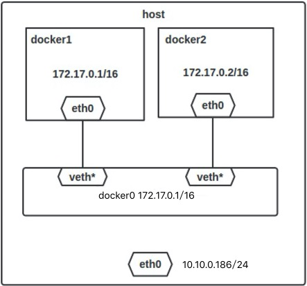
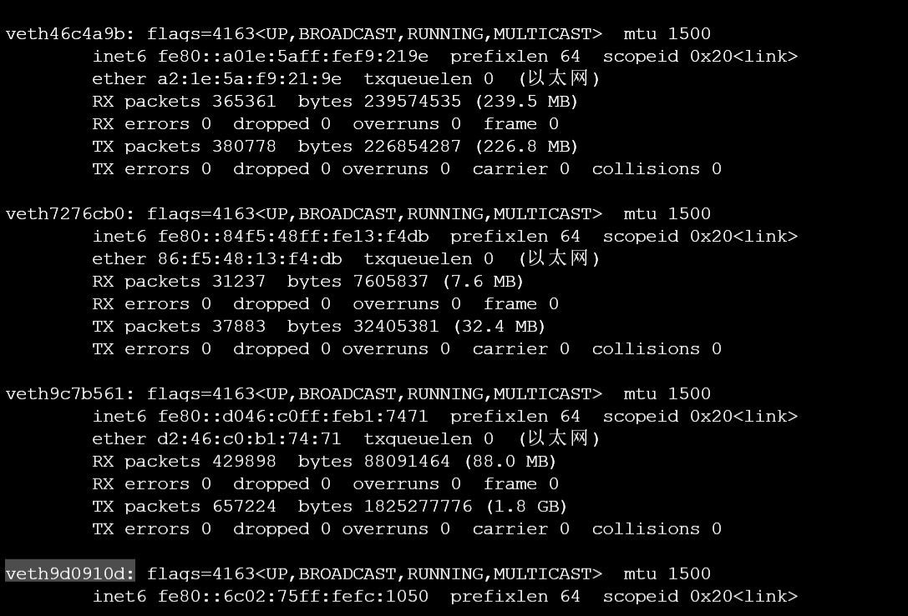
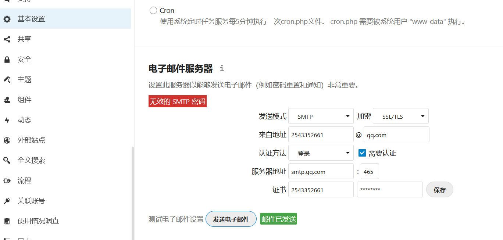
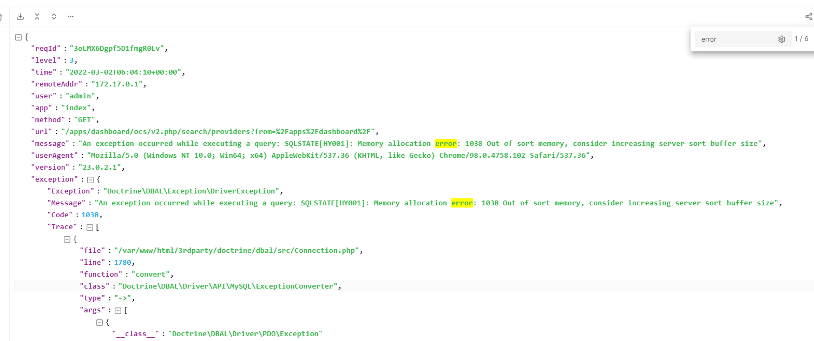

# docker

## 概念

## 安装

## 卸载

```bash
# 查看相关软件
dpkg -l | grep docker
# 卸载相关软件
apt-get remove docker-ce-cli docker-ce
apt-get autoremove # 会自动卸载containerd.io等一干软件。
```


## 配置

## 国内源

通用的方法就是编辑`/etc/docker/daemon.json`：


```json
{
  "registry-mirrors" : [
    "http://registry.docker-cn.com",
    "http://docker.mirrors.ustc.edu.cn",
    "http://hub-mirror.c.163.com"
  ],
  "insecure-registries" : [
    "registry.docker-cn.com",
    "docker.mirrors.ustc.edu.cn"
  ],
  "debug" : true,
  "experimental" : true
}
```

然后重启docker的daemon即可。

### 网络配置

> Docker 容器的网络默认与宿主机、与其他容器都是相互隔离,本文主要介绍 Docker 高级网络功能。

安装 Docker 时，它会自动创建三个网络，bridge（创建容器默认连接到此网络）、 none 、host

 ```bash
 dxshelley@dxshelley:~$ docker network ls
 NETWORK ID     NAME      DRIVER    SCOPE
 e717c6efd3ef   bridge    bridge    local
 412bdc3c52f4   host      host      local
 fae05e35fcf4   my-net    bridge    local
 59dafd69063f   none      null      local
 dxshelley@dxshelley:~$
 ```

- host：容器将不会虚拟出自己的网卡，配置自己的 IP 等，而是使用宿主机的IP和端口。
- none：该模式关闭了容器的网络功能。
- bridge(默认)：此模式会为每一个容器分配、设置 IP 等，并将容器连接到一个 docker0 虚拟网桥，通过 docker0 网桥以及 Iptables nat 表配置与宿主机通信。
- Container：创建的容器不会创建自己的网卡，配置自己的 IP，而是和一个指定的容器共享 IP、端口范围。

众所周知，Docker 使用了 Linux 的 Namespaces 技术来进行资源隔离，如 PID Namespace 隔离进程，Mount Namespace 隔离文件系统，Network Namespace 隔离网络等。

一个 Network Namespace 提供了一份独立的网络环境，包括网卡、路由、Iptable 规则等都与其他的 Network Namespace 隔离。

一个 Docker 容器一般会分配一个独立的 Network Namespace。用host网络，是和宿主机共用一个 Network Namespace。容器将不会虚拟出自己的网卡，配置自己的 IP 等，而是使用宿主机的 IP 和端口。


**当 Docker server 启动时，会在主机上创建一个名为 docker0 的虚拟网桥，此主机上启动的 Docker 容器会连接到这个虚拟网桥上。**

虚拟网桥的工作方式和物理交换机类似，这样主机上的所有容器就通过交换机连在了一个二层网络中。

接下来就要为容器分配 IP 了，Docker 会从 RFC1918 所定义的私有 IP 网段中，选择一个和宿主机不同的IP地址和子网分配给 docker0，连接到 docker0 的容器就从这个子网中选择一个未占用的 IP 使用。

如一般 Docker 会使用 172.17.0.0/16 这个网段，并将 172.17.0.1/16 分配给 docker0 网桥（在主机上使用 ifconfig 命令是可以看到 docker0 的，可以认为它是网桥的管理接口，在宿主机上作为一块虚拟网卡使用）。



1. 在主机上创建一对虚拟网卡 veth pair 设备。veth 设备总是成对出现的，它们组成了一个数据的通道，数据从一个设备进入，就会从另一个设备出来。因此，veth 设备常用来连接两个网络设备。
2. Docker 将 veth pair 设备的一端放在新创建的容器中，并命名为 eth0。另一端放在主机中，以 veth65f9 这样类似的名字命名，并将这个网络设备加入到 docker0 网桥中，可以通过 brctl show 命令查看。



```bash
dxshelley@dxshelley:~$ docker network inspect bridge 
[
    {
        "Name": "bridge",
        "Id": "e717c6efd3efaa647e13e624c9f5f01283ccc204d623f976a146186f703501a3",
        "Created": "2022-03-01T14:35:04.316360758+08:00",
        "Scope": "local",
        "Driver": "bridge",
        "EnableIPv6": false,
        "IPAM": {
            "Driver": "default",
            "Options": null,
            "Config": [
                {
                    "Subnet": "172.17.0.0/16",
                    "Gateway": "172.17.0.1"
                }
            ]
        },
        "Internal": false,
        "Attachable": false,
        "Ingress": false,
        "ConfigFrom": {
            "Network": ""
        },
        "ConfigOnly": false,
        "Containers": {
            "b04b01b20b018e5aa25c34dfefc0b2a5304c6055e9c3af24c6a2880cc96b0bbe": {
                "Name": "nextcloud",
                "EndpointID": "fbd04b39c2876d965899348960c13acea1dd8c453d4a35775684759670789219",
                "MacAddress": "02:42:ac:11:00:02",
                "IPv4Address": "172.17.0.2/16",
                "IPv6Address": ""
            },
            "c6d7013531830f8ad2a31d57bae90e3f74df87a0280cc3e2bb1e8212782658df": {
                "Name": "dev-portainer",
                "EndpointID": "e4883cf65a945bd71d28ae40e155d79bafe92a05dea6d4513479d56ed9b12f51",
                "MacAddress": "02:42:ac:11:00:04",
                "IPv4Address": "172.17.0.4/16",
                "IPv6Address": ""
            },
            "c87ec1659daee7bbf0fd64f9c9332f9d5ace5056fdcf263d46d771e6dac40634": {
                "Name": "nextcloud-mysql",
                "EndpointID": "e719ddd3f2b8881623b0cb52b79da4d0655901a1716bed28a3ff2ed598ba8614",
                "MacAddress": "02:42:ac:11:00:05",
                "IPv4Address": "172.17.0.5/16",
                "IPv6Address": ""
            },
            "ec618b79c65504774808db0ba7b516494689fd93252c9e870d5bce4b64ff07bf": {
                "Name": "mysql",
                "EndpointID": "a64c9aa289bb338b40e973e3f207e52eb3c4b4a2336e14bb40582ea8e9415fec",
                "MacAddress": "02:42:ac:11:00:03",
                "IPv4Address": "172.17.0.3/16",
                "IPv6Address": ""
            }
        },
        "Options": {
            "com.docker.network.bridge.default_bridge": "true",
            "com.docker.network.bridge.enable_icc": "true",
            "com.docker.network.bridge.enable_ip_masquerade": "true",
            "com.docker.network.bridge.host_binding_ipv4": "0.0.0.0",
            "com.docker.network.bridge.name": "docker0",
            "com.docker.network.driver.mtu": "1500"
        },
        "Labels": {}
    }
]
dxshelley@dxshelley:~$ 
```

这些选项只有在 `docker run` 执行时使用，因为它是针对容器的特性内容

* -h HOSTNAME` 或 `--hostname=HOSTNAME` 配置容器主机名` 
* --link=CONTAINER_NAME:ALIAS` 添加到另一个容器的连接` 
* --net=bridge|none|container:NAME_or_ID|host` 配置容器的桥接模式` 
* -p SPEC` 或 `--publish=SPEC` 映射容器端口到宿主主机` 
* -P or --publish-all=true|false` 映射容器所有端口到宿主主机

#### 自定义网络

```bash
# 创建桥接网络
dxshelley@dxshelley:~$ docker network create -d bridge my-net
dxshelley@dxshelley:~$ ifconfig
br-fae05e35fcf4: flags=4099<UP,BROADCAST,MULTICAST>  mtu 1500
        inet 172.18.0.1  netmask 255.255.0.0  broadcast 172.18.255.255
        ether 02:42:03:fa:b0:2d  txqueuelen 0  (以太网)
        RX packets 0  bytes 0 (0.0 B)
        RX errors 0  dropped 0  overruns 0  frame 0
        TX packets 0  bytes 0 (0.0 B)
        TX errors 0  dropped 0 overruns 0  carrier 0  collisions 0

dxshelley@dxshelley:~$ docker run -it --rm --name busybox2 --network my-net busybox sh
/ # 
/ # ping busybox1;
PING busybox1 (172.18.0.2): 56 data bytes
64 bytes from 172.18.0.2: seq=0 ttl=64 time=0.316 ms
64 bytes from 172.18.0.2: seq=1 ttl=64 time=0.220 ms
64 bytes from 172.18.0.2: seq=2 ttl=64 time=0.209 ms

dxshelley@dxshelley:~$ docker run -it --rm --name busybox1 --network my-net busybox sh
/ # 
/ # ping busybox2;
PING busybox2 (172.18.0.3): 56 data bytes
64 bytes from 172.18.0.3: seq=0 ttl=64 time=0.128 ms
64 bytes from 172.18.0.3: seq=1 ttl=64 time=0.236 ms

dxshelley@dxshelley:~$ docker container ls
CONTAINER ID   IMAGE                     COMMAND                  CREATED              STATUS              PORTS                                                  NAMES
14df2e882228   busybox                   "sh"                     About a minute ago   Up About a minute                                                          busybox2
12257fefefe3   busybox                   "sh"                     About a minute ago   Up About a minute                     
# busybox1 容器和 busybox2 容器建立了互联关系
```


## 使用


## 进入容器

`docker exec -it [CONTAINER ID] bash `

### 镜像导出导入

```bash
#将镜像存储
docker save nginx:latest > /root/docker-images/nginx.tar
#导入镜像文件
docker load --input /root/docker-images/nginx.tar
#通过符号的方式来导入
docker load < /root/docker-images/nginx.tar
```

### 可视化Portainer

```bash
docker run -d -p 9000:9000 -v /root/portainer:/data -v /var/run/docker.sock:/var/run/docker.sock --name dev-portainer portainer/portainer
```


### 安装gitlab

```bash
# 设置gitlab宿主机目录
export GITLAB_HOME=/home/pi/docker/gitlab

# 未成功
sudo docker run --detach \
  --hostname gitlab.example.com \
  --publish 4443:443 --publish 8082:80 --publish 2222:22 \
  --name gitlab \
  --restart always \
  --volume $GITLAB_HOME/config:/etc/gitlab \
  --volume $GITLAB_HOME/logs:/var/log/gitlab \
  --volume $GITLAB_HOME/data:/var/opt/gitlab \
  --shm-size 256m \
  gitlab/gitlab-ce:latest

```


### mysql

```bash
# 设置mysql宿主机目录
export MYSQL_HOME=/home/pi/docker/mysql

sudo docker run -p 3306:3306 --name mysql -v $MYSQL_HOME/conf:/etc/mysql/conf.d -v $MYSQL_HOME/data:/var/lib/mysql -e MYSQL_ROOT_PASSWORD=123456 -d mysql:5.7

# 备份数据
$ docker exec some-mysql sh -c 'exec mysqldump --all-databases -uroot -p"$MYSQL_ROOT_PASSWORD"' > /some/path/on/your/host/all-databases.sql
# 导入库
$ docker exec -i some-mysql sh -c 'exec mysql -uroot -p"$MYSQL_ROOT_PASSWORD"' < /some/path/on/your/host/all-databases.sql

```


### nextcloud

```bash
$ docker run -d \
	-p5555:80 \
	-v nextcloud:/var/www/html \
	-v apps:/var/www/html/custom_apps \
	-v config:/var/www/html/config \
	-v data:/var/www/html/data \
	-v theme:/var/www/html/themes/<YOUR_CUSTOM_THEME> \
	-link mysql:mysql
	nextcloud
```


注：By default, this container uses SQLite for data storage but the Nextcloud setup wizard (appears on first run) allows connecting to an existing MySQL/MariaDB or PostgreSQL database. You can also link a database container, e. g. `--link my-mysql:mysql`, and then use `mysql` as the database host on setup. More info is in the docker-compose section.

```bash
$ docker run -d \
    -v nextcloud:/var/www/html \
    -v apps:/var/www/html/custom_apps \
    -v config:/var/www/html/config \
    -v data:/var/www/html/data \
    --link mysql:mysql
    nextcloud
```

<<<<<<< HEAD
#### 开启缩略图

使用时会发现，Nextcloud 上传的视频不能生成缩略图。其实 Nextcloud 本身支持生成视频缩略图，需要安装 ffm­peg 并修改配置：

http://ffmpeg.org/download.html

```
docker exec -it nextcloud bash
apt update
apt install ffmpeg

cd /usr/bin
ln -s /usr/local/ffmpeg-4.4/ffprobe ffprobe
ln -s /usr/local/ffmpeg-4.4/ffmpeg ffmpeg
ln -s /usr/local/ffmpeg-4.4/ffplay ffplay
```

停止 NextCloud 容器，再修改 /var/www/html/con­fig/con­fig.php 配置文件，添加：

=======
#### 配置邮箱


>>>>>>> b243b69759d2d1d54560d6c87508122a6e7d9c8c


```
'enable_previews' => true,
'enabledPreviewProviders' =>
array (
  0 => 'OC\\Preview\\Image',
  1 => 'OC\\Preview\\Movie',
  2 => 'OC\\Preview\\TXT',
),
```

再次启动容器即可生效。

### nginx

```bash
docker run -d -p 80:80 -p 443:443 --name nginx --restart=always -e TZ="Asia/Shanghai" -v /docker/nginx/html:/usr/share/nginx/html -v /docker/nginx/conf/nginx:/etc/nginx/ -v /docker/nginx/log:/var/log/nginx nginx

docker search nginx
docker pull nginx
docker run -d -p 80:80  --name nginx01 nginx
docker exec -it nginx01 /bin/bash
whereis nginx

```


### 自启动docker

```bash
docker container update --restart=always nginx
```


### vim 编辑器的下载与安装

在使用 docker容器时，有时候里边没有安装vim，运行vim命令时提示说：vim: command not found.

```bash
apt-get update
apt-get install vim
```

### 宿主与docker互相拷贝文件

```bash
pi@raspberrypi:~/docker/mysql $ docker cp mysql:/etc/mysql/my.cnf ./
```


### 安装aria2和webgui

```bash
docker run -d   --name aria2-pro   --restart unless-stopped   --log-opt max-size=1m   -e PUID=1000   -e PGID=1000   -e UMASK_SET=022   -e RPC_SECRET=mass123   -e RPC_PORT=6800   -p 6800:6800   -e LISTEN_PORT=6888   -p 6888:6888   -p 6888:6888/udp   -v $PWD/aria2-config:/config   -v $PWD/downloads:/downloads   p3terx/aria2-pro

docker run -d  --name ariang  --log-opt max-size=1m  --restart unless-stopped  -p 6880:6880  p3terx/ariang
```

### 安装elasticsearch

`docker run --name elasticsearch -p 9200:9200 -p 9300:9300 -e "discovery.type=single-node" -d elasticsearch`


### 安装gogs

```bash
export GOGS_HOME=/home/pi/docker/gogs

docker pull gogs/gogs-rpi

docker run -d --name=gogs -p 3022:22 -p 3080:3000 -v $GOGS_HOME/gogs:/data gogs/gogs-rpi
```


## 日志

### Docker 引擎日志

Docker 引擎日志一般是交给了 Upstart(Ubuntu 14.04) 或者 systemd (CentOS 7, Ubuntu 16.04)。前者一般位于 /var/log/upstart/docker.log 下，后者我们一般 通过 `journalctl -u docker` 来进行查看。

| 系统                   | 日志位置                                                     |
| ---------------------- | ------------------------------------------------------------ |
| Ubuntu(14.04)          | `/var/log/upstart/docker.log`                                |
| Ubuntu(16.04)          | `journalctl -u docker.service`                               |
| CentOS 7/RHEL 7/Fedora | `journalctl -u docker.service`                               |
| CoreOS                 | `journalctl -u docker.service`                               |
| OpenSuSE               | `journalctl -u docker.service`                               |
| OSX                    | `~/Library/Containers/com.docker.docker/Data/com.docker.driver.amd64-linux/log/d?ocker.log` |
| Debian GNU/Linux 7     | `/var/log/daemon.log`                                        |
| Debian GNU/Linux 8     | `journalctl -u docker.service`                               |
| Boot2Docker            | `/var/log/docker.log`                                        |

### 容器日志


## 问题


### docker info 报错

ERROR: Got permission denied while trying to connect to the Docker daemon socket

```bash
sudo groupadd docker
sudo usermod -aG docker ${USER}
# 执行如下命令或重新登录
su -s ${USER}
```

### Pi Image docker info warnings - No kernel memory limit support #303

https://github.com/me-box/databox/issues/303

### nextcloud始终起不来报错

问题描述：


问题原因：mysql内存溢出，需要增加缓存容量。



解决方案：

先找到nextcloud 的输出日志定位问题。

```bash
C:\Users\25433>docker exec -it  nextcloud /bin/bash
root@cc91dc46ad6d:/var/www/html#
root@cc91dc46ad6d:/var/www/html#
root@cc91dc46ad6d:/var/www/html# ls -l data/nextcloud.log 
-rw-r----- 1 www-data www-data 10277735 Mar  2 06:25 data/nextcloud.log
root@cc91dc46ad6d:/var/www/html# 
```


### How to fix this?

In order to fix this error, we can either optimize the query or increase the sort_buffer_size.

To increase the sort_buffer_size, we open the /etc.mysql/my.cnf and add the following lines:

```
sort_buffer_size = 1024 k
```

After we modify the parameter, we restart the MySQL service:

```
systemctl restart mysqld
```

In addition, we raise it 4 M using the following command in MySQL:

```
mysql> SET GLOBAL sort_buffer_size = 1024 * 1024 * 4;
```


## 参考

[nextcloud 集成 onlyoffice](https://www.linuxbabe.com/docker/onlyoffice-nextcloud-integration-docker)


[docker文档-nextcloud](https://github.com/docker-library/docs/blob/master/nextcloud/README.md)


[docker教程](https://yeasy.gitbook.io/docker_practice/install/ubuntu)


[nextcloud安装教程](https://hellogitlab.com/CI/docker/nextcloud_in_docker.html#_1-docker%E5%9B%BD%E5%86%85%E9%95%9C%E5%83%8F%E9%85%8D%E7%BD%AE)


[nextcloud sqlite转mysql版](https://fanfpy.top/index.php/archives/70/#comments)

[使用Docker搭建MySQL服务](https://www.cnblogs.com/sablier/p/11605606.html)

[docker修改mysql配置文件后，无法启动mysql容器](https://blog.51cto.com/u_15278282/2932029)

<<<<<<< HEAD
[docker info 报错](https://www.digitalocean.com/community/questions/how-to-fix-docker-got-permission-denied-while-trying-to-connect-to-the-docker-daemon-socket)
=======


[Linux 编译安装ffmpeg](https://blog.csdn.net/weixin_44517656/article/details/110131015)


[Nextcloud 管理员手册](http://support.websoft9.com/docs/nextcloud/zh/admin-services.html)

>>>>>>> 51d1933c4d2ecf90e3494e0fdea0be79eb271ddb
