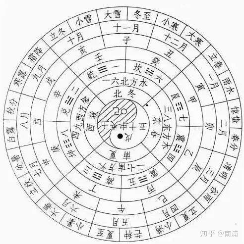
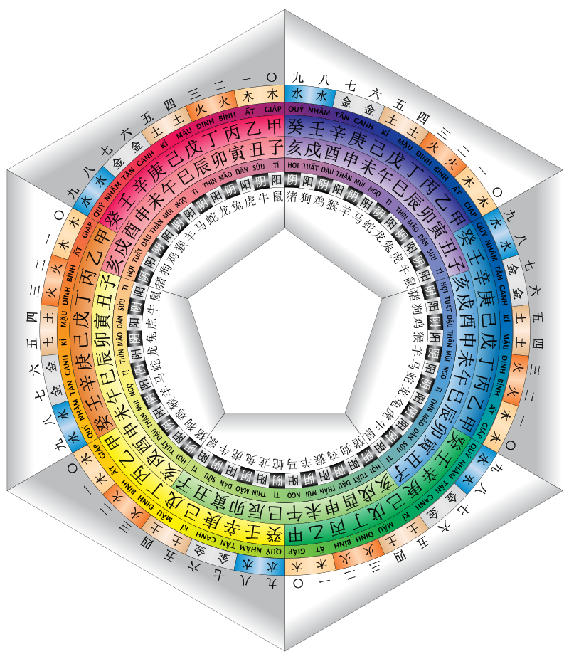
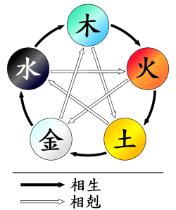

# 天文历法

## 阴历 与 阳历

阳历，也叫[太阳历](https://www.zhihu.com/search?q=太阳历&search_source=Entity&hybrid_search_source=Entity&hybrid_search_extra={"sourceType"%3A"answer"%2C"sourceId"%3A1143916739})，制定的基础是地球绕太阳公转的运动周期：地球绕太阳一圈，就是一年。现在我们用的“[公历](https://www.zhihu.com/search?q=公历&search_source=Entity&hybrid_search_source=Entity&hybrid_search_extra={"sourceType"%3A"answer"%2C"sourceId"%3A1143916739})”，就是太阳历的一种。

[阴历](https://www.zhihu.com/search?q=阴历&search_source=Entity&hybrid_search_source=Entity&hybrid_search_extra={"sourceType"%3A"answer"%2C"sourceId"%3A1143916739})被称作“月亮历”，是依据月亮的变化来修订的历法。月亮每经历一次从圆到缺的循环，就是一个月。

而农历实际上是一种兼顾太阳历和月亮历的历法，叫作[阴阳历](https://www.zhihu.com/search?q=阴阳历&search_source=Entity&hybrid_search_source=Entity&hybrid_search_extra={"sourceType"%3A"answer"%2C"sourceId"%3A1143916739})。这才是中国古人一直沿用的历法，也是我们现在经常说的“阴历”（其实叫错了……）

补充：农历为什么不是阴历

在中国古代，一开始是使用阴历的，毕竟看月亮比看太阳还是方便不少。但是祖先们的主要岗位职能是种地，而月亮就不能提供农作物生长所需要的热量，这时看太阳就显得尤其的重要。另外，阴历的一年大约354天，与[太阳周期](https://www.zhihu.com/search?q=太阳周期&search_source=Entity&hybrid_search_source=Entity&hybrid_search_extra={"sourceType"%3A"answer"%2C"sourceId"%3A1143916739})（阳历）的一年差了11天，这样就会慢慢产生一些差异。一年两年可能还没什么感觉，可是过着过着，大家就从冬天过年变成了夏天过年，而且原本应该春天播种，也会因为这个差异顺延到秋天，这日子就没法过了。

于是勤劳智慧的祖先们又把阴历与阳历结合在一起，加上了闰月，创造出了农历。

农历是根据太阳和月亮的运行确定的，根据月亮确定每个月，根据太阳确定一年，所以农历不是阴历或阳历，农历是阴阳历。节气根据太阳确定是为了指导农业生产，这和农不农历没有冲突。

所谓的阳历就是公历，与二十四节气无关，真正按二十四节气计日的历法只有干支历，是黄帝创造并开始使用的，十二个节气日分别为十二个月的头一天，中气日在月中，如立春日为正月第一天，惊蛰日为二月第一天，清明日为三月第一天，…，八字，算命，择吉日都在使用这种干支历，也叫“老黄历”。

## 四季

农历 正月/二月/三月为春季，分别称为 孟春/仲春/季春。

农历 四月/五月/六月为夏季，分别称为 孟夏/仲夏/季夏。

农历 七月/八月/九月为秋季，同理。

农历 十月/十一月/十二月为冬季，同理。

## 二十四节气

24节气的确立既不是根据我们现在所说的阳历，也不是阴历来制定的，**而是根据当初的干支历**。

**古人把地球绕太阳运行的轨道命名为“黄道”，也称“日道”，将黄道等比例分成24份，之间相隔15° ，就形成了24个节气。**二十四个节气，代表着地球在“黄道”上的二十四个不同位置。而每个节气，都表示着气候、物候、时候，这“三候”的不同变化。

春：立春/雨水——二月；惊蛰/春分——三月；清明/谷雨——四月；

夏：立夏/小满——五月；芒种/夏至——六月；小暑/大暑——七月；

秋：立秋/处暑——八月；白露/秋分——九月；寒露/霜降——十月；

冬：立冬/小雪—十一月；大雪/冬至—十二月；小寒/大寒——一月；

春雨惊春清谷天

夏满芒夏暑相连

秋处露秋寒霜降

冬雪雪冬小大寒

**立** 表示一年四季中每个季节的开始，立春/立夏/立秋/立冬合为**四立**；

**至** 表示极/最的意思。夏至/冬至表示夏天/冬天的到来。夏至北半球白昼最长；冬至北半球白昼最短；

**分** 表示平分的意思。春分/秋分表示昼夜等长。平分昼夜。

## 天干地支纪年法

**天干地支**是[十干](https://zh.wikipedia.org/wiki/天干)与[十二支](https://zh.wikipedia.org/wiki/地支)的合称、简通称为**十天干十二地支**，由两者经一定的[组合方式](https://zh.wikipedia.org/wiki/組合數學)搭配成六十对，为一个周期，循环往复，称为**[六十甲子](https://zh.wikipedia.org/wiki/還曆)**或**六十花甲子年**。

古代[中国](https://zh.wikipedia.org/wiki/中國)用以记录年、月、日、时。

### 阴阳五行方位与天干地支

|      | 木   | 火   | 土   | 金   | 水   |
| ---- | ---- | ---- | ---- | ---- | ---- |
| 阳   | 甲   | 丙   | 戊   | 庚   | 壬   |
| 阴   | 乙   | 丁   | 巳   | 辛   | 癸   |
|      | 东   | 南   | 中   | 西   | 北   |

### 干支纪年

原则要求天干与地支配对使用，两两相配，始于甲子，终于癸亥，六十为一循环。

根据干支的构成条件，其循环周期必然是天干数和地干数的最小公倍数。而60正是10和12的最小公倍数。

| [1甲子](https://zh.wikipedia.org/wiki/甲子)  | [2乙丑](https://zh.wikipedia.org/wiki/乙丑)  | [3丙寅](https://zh.wikipedia.org/wiki/丙寅)  | [4丁卯](https://zh.wikipedia.org/wiki/丁卯) | [5戊辰](https://zh.wikipedia.org/wiki/戊辰) | [6己巳](https://zh.wikipedia.org/wiki/己巳) | [7庚午](https://zh.wikipedia.org/wiki/庚午) | [8辛未](https://zh.wikipedia.org/wiki/辛未) | [9壬申](https://zh.wikipedia.org/wiki/壬申) | [10癸酉](https://zh.wikipedia.org/wiki/癸酉) |
| -------------------------------------------- | -------------------------------------------- | -------------------------------------------- | ------------------------------------------- | ------------------------------------------- | ------------------------------------------- | ------------------------------------------- | ------------------------------------------- | ------------------------------------------- | -------------------------------------------- |
| [11甲戌](https://zh.wikipedia.org/wiki/甲戌) | [12乙亥](https://zh.wikipedia.org/wiki/乙亥) | [13丙子](https://zh.wikipedia.org/wiki/丙子) | [丁丑](https://zh.wikipedia.org/wiki/丁丑)  | [戊寅](https://zh.wikipedia.org/wiki/戊寅)  | [己卯](https://zh.wikipedia.org/wiki/己卯)  | [庚辰](https://zh.wikipedia.org/wiki/庚辰)  | [辛巳](https://zh.wikipedia.org/wiki/辛巳)  | [壬午](https://zh.wikipedia.org/wiki/壬午)  | [20癸未](https://zh.wikipedia.org/wiki/癸未) |
| [21甲申](https://zh.wikipedia.org/wiki/甲申) | [乙酉](https://zh.wikipedia.org/wiki/乙酉)   | [丙戌](https://zh.wikipedia.org/wiki/丙戌)   | [丁亥](https://zh.wikipedia.org/wiki/丁亥)  | [戊子](https://zh.wikipedia.org/wiki/戊子)  | [己丑](https://zh.wikipedia.org/wiki/己丑)  | [庚寅](https://zh.wikipedia.org/wiki/庚寅)  | [辛卯](https://zh.wikipedia.org/wiki/辛卯)  | [壬辰](https://zh.wikipedia.org/wiki/壬辰)  | [30癸巳](https://zh.wikipedia.org/wiki/癸巳) |
| [31甲午](https://zh.wikipedia.org/wiki/甲午) | [乙未](https://zh.wikipedia.org/wiki/乙未)   | [丙申](https://zh.wikipedia.org/wiki/丙申)   | [丁酉](https://zh.wikipedia.org/wiki/丁酉)  | [戊戌](https://zh.wikipedia.org/wiki/戊戌)  | [己亥](https://zh.wikipedia.org/wiki/己亥)  | [庚子](https://zh.wikipedia.org/wiki/庚子)  | [辛丑](https://zh.wikipedia.org/wiki/辛丑)  | [壬寅](https://zh.wikipedia.org/wiki/壬寅)  | [40癸卯](https://zh.wikipedia.org/wiki/癸卯) |
| [41甲辰](https://zh.wikipedia.org/wiki/甲辰) | [乙巳](https://zh.wikipedia.org/wiki/乙巳)   | [丙午](https://zh.wikipedia.org/wiki/丙午)   | [丁未](https://zh.wikipedia.org/wiki/丁未)  | [戊申](https://zh.wikipedia.org/wiki/戊申)  | [己酉](https://zh.wikipedia.org/wiki/己酉)  | [庚戌](https://zh.wikipedia.org/wiki/庚戌)  | [辛亥](https://zh.wikipedia.org/wiki/辛亥)  | [壬子](https://zh.wikipedia.org/wiki/壬子)  | [50癸丑](https://zh.wikipedia.org/wiki/癸丑) |
| [51甲寅](https://zh.wikipedia.org/wiki/甲寅) | [乙卯](https://zh.wikipedia.org/wiki/乙卯)   | [丙辰](https://zh.wikipedia.org/wiki/丙辰)   | [丁巳](https://zh.wikipedia.org/wiki/丁巳)  | [戊午](https://zh.wikipedia.org/wiki/戊午)  | [己未](https://zh.wikipedia.org/wiki/己未)  | [庚申](https://zh.wikipedia.org/wiki/庚申)  | [辛酉](https://zh.wikipedia.org/wiki/辛酉)  | [壬戌](https://zh.wikipedia.org/wiki/壬戌)  | [60癸亥](https://zh.wikipedia.org/wiki/癸亥) |

由序号得到对应干支是很容易的，序号除以10的余数就是天干的序数（如果余数是0，则为最后一个天干癸），序号除以12的余数就是地支的序数（如果余数是0，则为最后一个地支亥）。比如37号干支，因为37 mod 10=7（mod表示取余数），对应的天干是庚，37 mod 12=1，对应的地支是子，所以37号干支就是庚子。显然，一个整数除以10的余数就是它的个位数，这就使求天干更方便了。

而由干支推它的序号，也不困难。这其实就是一个同余方程组的求解问题，我们用初等数论中的中国剩余定理就可以解决。比如要算**戊午**的序号是多少，根据上面由序号得到对应干支的原理，很容易得到如下方程组：

{ x mod 10 = 5
{ x mod 12 = 7．

其中x是待求的干支序号。根据中国剩余定理，有：

x ≡ 6 * 5 - 5 * 7 (mod 60) = 55，

即戊午的序号是55．这和上面的对照表的是一致的。一般地，若天干的序号为m，地支的序号为n，则干支的序号为：

x ≡ 6m - 5n (mod 60)                           (1)

简单点说，如果6m-5n的结果是正数，这个数就是干支的序号；如果是负数，把它加上60就是干支的序号。

#### 干支纪年转西历

[天干](https://zh.wikipedia.org/wiki/天干)用序号1至10表示甲到癸，[地支](https://zh.wikipedia.org/wiki/地支)用1至12对应子到亥。

天干用序号1至10表示甲到癸，地支用1至12对应子到亥。

6×天干 - 5×地支+3（或1983）+60n = 西历年份
即，设Year是西元后某个年份，H（heaven的首字母）是Year的天干（甲=1, 乙=2, 丙=3,....., 癸=10），E（earth的首字母）是Year的地支（子=1, 丑=2, 寅=3,....., 亥=12），则

#### 西历转干支纪年

#### 公元后纪年换算公式：

将西元后年分减3，再除以10，所得余数即为第几个天干（余0则视为第10个）；将西元后年分减3，再除以12，所得余数即为第几个地支（余0则视为第12个）。

|      |  0   |  1   |  2   |  3   |  4   |  5   |  6   |  7   |  8   |  9   |  10  |  11  | 12   |
| :--: | :--: | :--: | :--: | :--: | :--: | :--: | :--: | :--: | :--: | :--: | :--: | :--: | ---- |
| 天干 |  癸  |  甲  |  乙  |  丙  |  丁  |  戊  |  己  |  庚  |  辛  |  壬  |  癸  |      |      |
| 地支 |  亥  |  子  |  丑  |  寅  |  卯  |  辰  |  巳  |  午  |  未  |  申  |  酉  |  戌  | 亥   |

- 例如：公元1995年

1995-3=1992，1992除以10的余数是2，所以是第2个天干——乙，1992除以12的余数是0，所以是第12个地支——亥，故公元1995年为乙亥年。

- 再如：公元1861年

1861-3=1858，1858除以10的余数是8，所以是第8个天干——辛，1858除以12的余数是10，所以是第10个地支——酉，故公元1861年为辛酉年。

##### 年份尾数与天干关系

|      |  0   |  1   |  2   |  3   |  4   |  5   |  6   |  7   |  8   |  9   |      |      |      |
| :--: | :--: | :--: | :--: | :--: | :--: | :--: | :--: | :--: | :--: | :--: | :--: | :--: | ---- |
| 天干 |  癸  |  辛  |  壬  |  癸  |  甲  |  乙  |  丙  |  丁  |  戊  |  己  |      |      |      |
| 地支 |  亥  |  子  |  丑  |  寅  |  卯  |  辰  |  巳  |  午  |  未  |  申  |      |      |      |

**公元前纪年与干支纪年的换算表:**

|      |  0   |  1   |  2   |  3   |  4   |  5   |  6   |  7   |  8   |  9   |  10  |  11  |
| :--: | :--: | :--: | :--: | :--: | :--: | :--: | :--: | :--: | :--: | :--: | :--: | :--: |
| 天干 |  辛  |  庚  |  己  |  戊  |  丁  |  丙  |  乙  |  甲  |  癸  |  壬  |  辛  |  庚  |
| 地支 |  酉  |  申  |  未  |  午  |  巳  |  辰  |  卯  |  寅  |  丑  |  子  |  亥  |  戌  |

如：公元前155年

尾数5对应天干中的“丙”； 155除以12得余数11，对应地支中的“戌”。该年为丙戌年。 公元前8年则为癸丑年；公元前2年为己未年。

### 干支纪月

年上起月的歌诀，《五虎遁月歌》：甲己之年丙作初，乙庚之岁戊为头，丙辛岁首从庚起，丁壬壬位顺流行，若问戊癸何方法，甲寅之上好推求。

具体的推算如下表[[9\]](https://zh.wikipedia.org/wiki/干支#cite_note-9)：

| 月地支 |                         节气段                         |                    中气                    | 近似夏历月份 | 近似西历月份 | 甲或己年 | 乙或庚年 | 丙或辛年 | 丁或壬年 | 戊或癸年 |
| :----: | :----------------------------------------------------: | :----------------------------------------: | :----------: | :----------: | :------: | :------: | :------: | :------: | :------: |
|  寅月  | [立春](https://zh.wikipedia.org/wiki/立春)至惊蛰前一日 | [雨水](https://zh.wikipedia.org/wiki/雨水) |     正月     |     2月      |  丙寅月  |  戊寅月  |  庚寅月  |  壬寅月  |  甲寅月  |
|  卯月  | [惊蛰](https://zh.wikipedia.org/wiki/惊蛰)至清明前一日 | [春分](https://zh.wikipedia.org/wiki/春分) |     二月     |     3月      |  丁卯月  |  己卯月  |  辛卯月  |  癸卯月  |  乙卯月  |
|  辰月  | [清明](https://zh.wikipedia.org/wiki/清明)至立夏前一日 | [谷雨](https://zh.wikipedia.org/wiki/谷雨) |     三月     |     4月      |  戊辰月  |  庚辰月  |  壬辰月  |  甲辰月  |  丙辰月  |
|  巳月  | [立夏](https://zh.wikipedia.org/wiki/立夏)至芒种前一日 | [小满](https://zh.wikipedia.org/wiki/小满) |     四月     |     5月      |  己巳月  |  辛巳月  |  癸巳月  |  乙巳月  |  丁巳月  |
|  午月  | [芒种](https://zh.wikipedia.org/wiki/芒种)至小暑前一日 | [夏至](https://zh.wikipedia.org/wiki/夏至) |     五月     |     6月      |  庚午月  |  壬午月  |  甲午月  |  丙午月  |  戊午月  |
|  未月  | [小暑](https://zh.wikipedia.org/wiki/小暑)至立秋前一日 | [大暑](https://zh.wikipedia.org/wiki/大暑) |     六月     |     7月      |  辛未月  |  癸未月  |  乙未月  |  丁未月  |  己未月  |
|  申月  | [立秋](https://zh.wikipedia.org/wiki/立秋)至白露前一日 | [处暑](https://zh.wikipedia.org/wiki/处暑) |     七月     |     8月      |  壬申月  |  甲申月  |  丙申月  |  戊申月  |  庚申月  |
|  酉月  | [白露](https://zh.wikipedia.org/wiki/白露)至寒露前一日 | [秋分](https://zh.wikipedia.org/wiki/秋分) |     八月     |     9月      |  癸酉月  |  乙酉月  |  丁酉月  |  己酉月  |  辛酉月  |
|  戌月  | [寒露](https://zh.wikipedia.org/wiki/寒露)至立冬前一日 | [霜降](https://zh.wikipedia.org/wiki/霜降) |     九月     |     10月     |  甲戌月  |  丙戌月  |  戊戌月  |  庚戌月  |  壬戌月  |
|  亥月  | [立冬](https://zh.wikipedia.org/wiki/立冬)至大雪前一日 | [小雪](https://zh.wikipedia.org/wiki/小雪) |     十月     |     11月     |  乙亥月  |  丁亥月  |  己亥月  |  辛亥月  |  癸亥月  |
|  子月  | [大雪](https://zh.wikipedia.org/wiki/大雪)至小寒前一日 | [冬至](https://zh.wikipedia.org/wiki/冬至) |    十一月    |     12月     |  丙子月  |  戊子月  |  庚子月  |  壬子月  |  甲子月  |
|  丑月  | [小寒](https://zh.wikipedia.org/wiki/小寒)至立春前一日 | [大寒](https://zh.wikipedia.org/wiki/大寒) |    十二月    |     1月      |  丁丑月  |  己丑月  |  辛丑月  |  癸丑月  |  乙丑月  |

### 干支纪日

太过复杂。

### 干支纪时

| 时辰地支 | [UTC+8](https://zh.wikipedia.org/wiki/UTC%2B8) | 甲或己日 | 乙或庚日 | 丙或辛日 | 丁或壬日 | 戊或癸日 |
| :------: | :--------------------------------------------: | :------: | :------: | :------: | :------: | :------: |
|   子时   |                   23时至1时                    |  甲子时  |  丙子时  |  戊子时  |  庚子时  |  壬子时  |
|   丑时   |                    1时至3时                    |  乙丑时  |  丁丑时  |  己丑时  |  辛丑时  |  癸丑时  |
|   寅时   |                    3时至5时                    |  丙寅时  |  戊寅时  |  庚寅时  |  壬寅时  |  甲寅时  |
|   卯时   |                    5时至7时                    |  丁卯时  |  己卯时  |  辛卯时  |  癸卯时  |  乙卯时  |
|   辰时   |                    7时至9时                    |  戊辰时  |  庚辰时  |  壬辰时  |  甲辰时  |  丙辰时  |
|   巳时   |                   9时至11时                    |  己巳时  |  辛巳时  |  癸巳时  |  乙巳时  |  丁巳时  |
|   午时   |                   11时至13时                   |  庚午时  |  壬午时  |  甲午时  |  丙午时  |  戊午时  |
|   未时   |                   13时至15时                   |  辛未时  |  癸未时  |  乙未时  |  丁未时  |  己未时  |
|   申时   |                   15时至17时                   |  壬申时  |  甲申时  |  丙申时  |  戊申时  |  庚申时  |
|   酉时   |                   17时至19时                   |  癸酉时  |  乙酉时  |  丁酉时  |  己酉时  |  辛酉时  |
|   戌时   |                   19时至21时                   |  甲戌时  |  丙戌时  |  戊戌时  |  庚戌时  |  壬戌时  |
|   亥时   |                   21时至23时                   |  乙亥时  |  丁亥时  |  己亥时  |  辛亥时  |  癸亥时  |

## 阴阳

阴 与 阳

## 五行

五行中每一行都有不同性能。“木曰曲直”，意思是木具有生长、升发之特性；“火曰炎上”，是火具有发热、向上之特性；“土曰稼穑”，是指土具有种植[庄稼](https://zh.wikipedia.org/wiki/庄稼)，生化万物之特性；“金曰从革”，是金具有肃杀、变革之特性；“水曰润下”，是水具有滋润、向下之特性。古人基于此种认识，将宇宙间各种事物分别归属于五行，因此在概念上，已经不是木、火、土、金、水本身，而是一大类在特性上可相比拟之各种事物、现象所共有之抽象性能。

## 六气

风/寒/暑/湿/燥/火

## 参考

[二十四节气](https://www.zhihu.com/question/343040368)

[年份推断干支纪年和纪日](http://blog.sina.com.cn/s/blog_487ab9d5010007f9.html)

