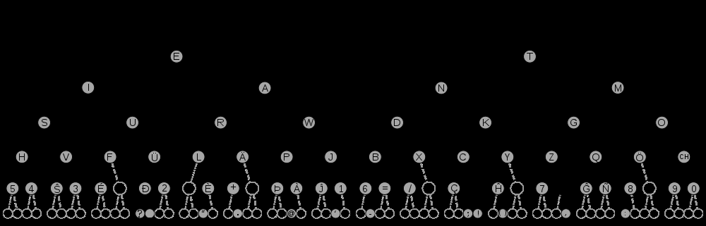

# 摩斯密码

## 概念

> **摩尔斯电码**（英语：Morse code）是一种时通时断的信号代码，通过不同的排列顺序来表达不同的[英文字母](https://zh.wikipedia.org/wiki/英文字母)、[数字](https://zh.wikipedia.org/wiki/数字)和[标点符号](https://zh.wikipedia.org/wiki/标点符号)。是由美国[发明家](https://zh.wikipedia.org/wiki/發明家)[萨缪尔·摩尔斯](https://zh.wikipedia.org/wiki/萨缪尔·摩尔斯)及其助手[艾尔菲德·维尔](https://zh.wikipedia.org/wiki/艾尔菲德·维尔)在1836年发明。
>
> 摩尔斯电码是一种早期的[数字化](https://zh.wikipedia.org/wiki/數位化)通信形式，但是它不同于现代只使用0和1两种状态的[二进制](https://zh.wikipedia.org/wiki/二进制)代码，它的代码包括五种：
>
> 1. [点](https://zh.wikipedia.org/wiki/点)（`·`）：1
> 2. [划](https://zh.wikipedia.org/wiki/連接號)（`-`）：111
> 3. [字符](https://zh.wikipedia.org/wiki/字符)内部的停顿（在点和划之间）：0
> 4. 字符之间的停顿：000
> 5. [单词](https://zh.wikipedia.org/wiki/单词)之间的停顿：0000000
>
> —— 引自维基百科

一般来说，任何一种能把书面字符用可变长度的信号表示的编码方式都可以称为摩尔斯电码。但现在这一术语只用来特指两种表示[英语](https://zh.wikipedia.org/wiki/英语)字母和符号的摩尔斯电码：美式摩尔斯电码被使用在有线电报通信系统；今天还在使用的国际摩尔斯电码则只使用点和划。

电报公司根据要发的信的长度收费。商业代码精心设计了五个字符组成一组的代码，做为一个单词发送。比如：

- BYOXO（Are you trying to crawl out of it? 准备好接收了吗？）；

- LIOUY（Why do you not answer my question? 为什么不回复？）；

- AYYLU（Not clearly coded, repeat more clearly. 编码不清楚，请清楚重复）。

  这些五个字符的简语可以用摩尔斯电码单独发送。有些简语后来在现代的网络上常用，如CUL（See you later. 再见）。	

## 现代国际摩尔斯电码

现代国际摩尔斯电码是由Friedrich Clemens Gerke在1848年发明的，用在[德国](https://zh.wikipedia.org/wiki/德国)的[汉堡](https://zh.wikipedia.org/wiki/汉堡市)和[库克斯港](https://zh.wikipedia.org/wiki/库克斯港)之间的电报通信。1865年之后在少量修改之后由国际电报大会在巴黎标准化，后来由[国际电信联盟](https://zh.wikipedia.org/wiki/国际电信联盟)统一定名为国际摩尔斯电码。


### 谐音记忆法

A-

B

C

D

E

F

G

H

I

J

K

L

M

N

O

P

Q

R

S

T

U

V

W

X

Y

Z

### 二叉树表示




## 时间控制和表示方法

有两种“符号”用来表示字符：点（`·`）和划（`-`），或叫“滴”（dit）和“答”（dah）。点的长度决定了发报的速度，并且被当作发报时间参考。下面是时间控制的图示：

```
-- --- ·-· ··· ·    /    -·-· --- -·· ·
M   O    R     S    E   (空格)   C     O    D   E
```

这里，“`-`”表示划，“`·`”表示点。这是上面消息的准确发报时间（`=`表示有信号，`.`代表无信号，每个为一个点的长度）：

```
===.===...===.===.===...=.===.=...=.=.=...=.......===.=.===.=...===.===.===...===.=.=...=
   ^           ^        ^       ^             ^
   |           划       点       |          单词间隔
点划间隔                     字符间隔
```

划一般是三个点的长度；点划之间的间隔是一个点的长度；字符之间的间隔是三个点的长度；单词之间的间隔是七个点的长度。

初学者往往被教导发送点划间隔短小、短而快的字符，并且在符号和单词之间夸大间隔时间。比较起来，这种方式更加容易学会。

熟悉摩尔斯码的人之间经常像这样说话或拼写（其中，“长音 / Dah”是发“awe”的音）：

```
  --     ---       ·-·      ···    · /    -·-·        ---      -··   ·
 DahDah DahDahDah DiDahDit DiDiDit Dit, DahDiDahDit DahDahDah DahDiDi Di.
```

## 特殊符号（统一符号）

这是一些有特殊意义的点划组合。它们由二个或多个字母的摩尔斯电码连成一个使用，这样可以省去正常时把它们做为两个字母发送所必须的中间间隔时间。

|                   符号                   |     代码     |                 意义                 |
| :--------------------------------------: | :----------: | :----------------------------------: |
|                  AAAAA                   | `·-·-·-·-·-` |    调用信号，表示“我有消息发送”。    |
|                 AAA（.）                 |   `·-·-·-`   |       表示“本句完，接下一句”。       |
|                    HH                    |  `········`  |    表示“有错，从上一字重新开始”。    |
|                 AR（+）                  |   `·-·-·`    |           表示“消息结束”。           |
|                 AS（&）                  |   `·-···`    |                等待。                |
|                  TTTTT                   |   `-----`    |      表示“我正在接收你的消息”。      |
|                    K                     |    `-·-`     |  表示“我已准备好，请开始发送消息”。  |
|                    T                     |     `-`      |           表示“字收到了”。           |
|                 IMI（?）                 |   `··--··`   | 表示“请重复你的电码，我不是很明白”。 |
|                    R                     |    `·-·`     |          表示“消息已收到”。          |
|                    SK                    |   `···-·-`   |        表示终止（联系结束）。        |
|                 BT（=）                  |   `-···-`    |               分隔符。               |
| [SOS](https://zh.wikipedia.org/wiki/SOS) | `···---···`  |              求救信号。              |

## 常用缩写

缩写和统一符号不同，缩写保留着字符中间的间隔，它们并没有被连成一个使用。

|                             缩写                             |                          全写                           |                             注释                             |
| :----------------------------------------------------------: | :-----------------------------------------------------: | :----------------------------------------------------------: |
|                              AA                              |                        All after                        |                           某字以后                           |
|                              AB                              |                       All before                        |                            字以前                            |
|                             ARRL                             |               American Radio Relay League               |                      美国无线电中继联盟                      |
|                             ABT                              |                          About                          |                             大约                             |
|                             ADS                              |                         Address                         |                             地址                             |
|                             AGN                              |                          Again                          |                            再一次                            |
|                             ANT                              |                         Antenna                         |                             天线                             |
|                              BN                              |                       All between                       |                            ……之间                            |
|                             BUG                              |                    Semiautomatic key                    |                          半自动关键                          |
|                              C                               |                           Yes                           |                            是，好                            |
|                             CBA                              |                    Callbook address                     |                           呼号手册                           |
|                             CFM                              |                         Confirm                         |                             确认                             |
|                             CLG                              |                         Calling                         |                             调用                             |
| [CQ](https://zh.wikipedia.org/w/index.php?title=CQ_(呼叫)&action=edit&redlink=1) |                   Calling any station                   |                         调用任意台站                         |
|                             CUL                              |                      See you later                      |                             再见                             |
|                             CUZ                              |                         Because                         |                             因为                             |
|                              CW                              |                     Continuous wave                     |                            连续波                            |
|                              CX                              |                       Conditions                        |                             状况                             |
|                              CY                              |                          Copy                           |                             抄收                             |
|                              DE                              |                          From                           |                             来自                             |
|                              DX                              |  Distance (sometimes refers to long distance contact)   |                    距离（有时指长程通联）                    |
|                              ES                              |                           And                           |                          （和；且）                          |
|                              FB                              |            Fine business (Analogous to "OK")            |                         类似于“确定”                         |
|                             FCC                              |            Federal Communications Commission            | （美国）[联邦通信委员会](https://zh.wikipedia.org/wiki/联邦通信委员会) |
|                             FER                              |                           For                           |                             为了                             |
|                             FREQ                             |                        Frequency                        |                             频率                             |
|                              GA                              |    Good afternoon or Go ahead (depending on context)    |                 午安；请发报（依上下文而定）                 |
|                              GE                              |                      Good evening                       |                             晚安                             |
|                              GM                              |                      Good morning                       |                             早安                             |
|                             GND                              |                Ground (ground potential)                |                        地面（地电位）                        |
|                             GUD                              |                          Good                           |                              好                              |
|                              HI                              |                        Laughter                         |                              笑                              |
|                              HR                              |                          Here                           |                             这里                             |
|                              HV                              |                          Have                           |                              有                              |
|                             LID                              |                           Lid                           |                             覆盖                             |
|                             MILS                             |                      Milliamperes                       |                            毫安培                            |
|                             NIL                              |                         Nothing                         |                         无收信，空白                         |
|                              NR                              |                         Number                          |                          编号，第……                          |
|                              OB                              |                         Old boy                         |                            老大哥                            |
|                              OC                              |                        Old chap                         |                            老伙计                            |
|                              OM                              |   Old man (any male amateur radio operator is an OM)    |     前辈，老手（男性）（任何男性业余无线电操作员都是OM）     |
|                              OO                              |                    Official Observer                    |                          官方观察员                          |
|                              OP                              |                        Operator                         |                            操作员                            |
|                              OT                              |                        Old timer                        |                            老前辈                            |
|                             OTC                              |                     Old timers club                     |                          老手俱乐部                          |
|                             OOTC                             |                   Old old timers club                   |                        资深老手俱乐部                        |
|                             PSE                              |                         Please                          |                              请                              |
|                             PWR                              |                          Power                          |                             功率                             |
|                             QCWA                             |          Quarter Century Wireless Association           | [四分之一世界无线电协会](https://zh.wikipedia.org/w/index.php?title=四分之一世界無線電協會&action=edit&redlink=1) |
|                              R                               | Received,Roger or decimal point (depending on context)  |                 收到；小数点（依上下文而定）                 |
|                             RCVR                             |                        Receiver                         |                            接收机                            |
|                             RPT                              |         Repeat or report (depending on context)         |                  重复；报告（依上下文而定）                  |
|                             RST                              | Signal report format (Readability-Signal Strength-Tone) |               信号报告格式（可读性信号强度音）               |
|                             RTTY                             |                      Radioteletype                      |                           无线电传                           |
|                              RX                              |                         Receive                         |                             接收                             |
|                             SAE                              |                 Self addressed envelope                 |         回邮信（即已填写自己地址以便对方回信的信封）         |
|                             SASE                             |            Self addressed, stamped envelope             |                       带邮票的回邮信封                       |
|                             SED                              |                          Said                           |                              说                              |
|                             SEZ                              |                          Says                           |                              说                              |
|                             SIG                              |                         Signal                          |                             信号                             |
|                             SIGS                             |                         Signals                         |                             信号                             |
|                             SKED                             |                        Schedule                         |                            行程表                            |
|                              SN                              |                          Soon                           |                       很快；不久的将来                       |
|                             SRI                              |                          Sorry                          |                             抱歉                             |
|                             STN                              |                         Station                         |                             台站                             |
|                             TEMP                             |                       Temperature                       |                             温度                             |
|                             TMW                              |                        Tomorrow                         |                             明天                             |
|                             TNX                              |                         Thanks                          |                             谢谢                             |
|                              TU                              |                        Thank you                        |                            谢谢你                            |
|                              TX                              |                        Transmit                         |                             发射                             |
|                              U                               |                           You                           |                              你                              |
|                              UR                              |          Your or you're (depending on context)          |                  你的；你是（依上下文而定）                  |
|                             URS                              |                          Yours                          |                             你的                             |
|                              VY                              |                          Very                           |                           非常；很                           |
|                             WDS                              |                          Words                          |                              词                              |
|                             WKD                              |                         Worked                          |                             工作                             |
|                              WL                              |                      Will or Well                       |                   将会；好（依上下文而定）                   |
|                             WUD                              |                          Would                          |                             将会                             |
|                              WX                              |                         Weather                         |                             天气                             |
|                             XMTR                             |                       Transmitter                       |                            发射机                            |
|                             XYL                              |                          Wife                           |                             妻子                             |
|                              YL                              |             Young lady (used of any female)             |                女报务员（称呼任何女性报务员）                |
|                              73                              |                      Best regards                       |                             致敬                             |
|                              88                              |                     Love and kisses                     |                             吻别                             |
|                              99                              |                         go way                          |                        走开（非友善）                        |
