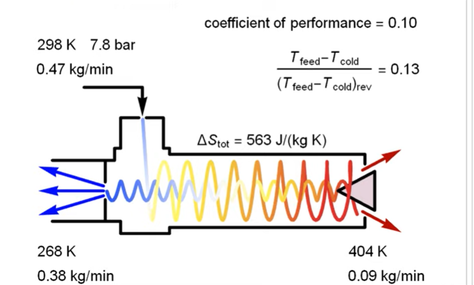

# 格物致知

## 衣

## 食

## 住

- 灯芯

毛细现象

毛细现象（又称毛细管作用）是指液体在细管状物体或多孔物体内部，由“液体与物体间附着力”和“因液体分子间内聚力而产生的表面张力”组合而成，令液体在不需施加外力的情况下，流向细管状物体或细缝的现象；该现象可以令液体克服地心引力而上升。此属于一种液体界面现象。

常见的是液体和固体之间的附着力大于液体本身内聚力的情况，如：布料、毛笔、多孔物体吸水、蜡油沿着棉线上升。而毛细管本身则是内径等于或小于1毫米的细管，主要用于医事检验及建筑材料上，一般非专业人员反而较少见。（注：植物根部吸收的水分能够经由茎内维管束上升，除了利用毛细现象外，最主要的原因是蒸散作用）。

- 水缸-管子-送水

虹吸（siphon或syphon）是一种流体力学现象，可以不借助泵而抽吸液体。处于较高位置的液体充满一根倒U形的管状结构（称为虹吸管）之后，开口于更低的位置。虹吸管两端液体的重量差距造成液体压力差距，液体压力差能够推动液体越过最高点，向低端排放。

中国九龙杯原理

## 行

- 撒盐除雪的原理

  撒盐除雪是利用了盐的可溶性、吸潮性和盐水的低冰点等特点，当盐撒在雪上的时候，由于盐的可溶性和吸潮性，使得盐会吸收雪表面的水分，从而使盐开始溶化，成为溶液侵蚀雪层。当盐与雪一同溶化成盐水后，由于盐水的凝固温度比水低，因此盐水很难结冰形成冰层，这就是撒盐除雪的原理。

## 物理

### 声

### 光

### 热

#### 涡流管

### 电

### 力
